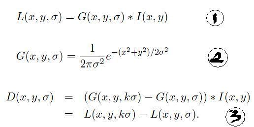

## 自我介绍
> 【配图】
> 背景 opencv + 机器人
>  大标题：OpenCV在机器人中的应用-课程导言
> 1Z实验室 LOGO  阿凯 头像

大家好，我是1Z实验室的阿凯。本期是OpenCV在机器人中的应用-课程导言部分。本期视频简单介绍了什么是opencv，小白在入门opencv中常见的问题，还有我们整套教程的教学理念。

> TODO  三句话，广告语
>
> 推广课程

## 机器人与计算机视觉
> 【配图】
> 左：机器人+视觉
> 右：动图  巡线小车，色块追踪小车，机械臂色块抓取
>
> 见视频素材

对于机器人来讲，视觉信息是非常重要的。如果你想制作巡线小车，色块追踪小车，机械臂色块抓取等有趣的机器人制作，那么计算机视觉是你必须要学习的知识。
本课程的核心教学目标 是带你入门计算机视觉（Python-OpenCV），掌握比较常用的计算机视觉的算法与工具，同时将其应用在机器人领域，完成有趣的机器人应用。
只要你有Python基础就可以跟随我们的脚步，开启你的计算机视觉之旅。

## OpenCV是个啥 ？
> 【配图】 opencv logo， 多个平台OS， 多种语言

OpenCV最初由Intel公司开源，是目前用户基数最大的计算机视觉库。
OpenCV是跨平台的，无论你的操作系统是Window，linux还是mac，都可以使用opencv进行图像处理。OpenCV的底层实现是基于C/C++的，同时opencv也提供了多种语言接口（例如Python，Java，Ruby，Matlab等等）。我们的教程是基于python-opencv的，因为对于小白来讲python-opencv可以说是最简单易用的啦。

## 都有那些坑在等待你？

### 没有合适的教程
> 【配图】 
> 1.博客 杂乱  2. opencv入门 代码 浅 3.专业书籍，公式 脑壳疼 

> TODO 博客 配图 (配图缩小)

> 公式

网上关于opencv的博客其实还是很多的，但是博客的问题在于内容杂乱而且不系统。

我看过一些opencv的入门教程，但是给人的整体感觉就是侧重代码讲解，内容比较宽泛但是不讲原理，深度比较浅，读完感觉自己还是只会API。

另外，我也看过计算机视觉的书，但是偏学术，公式很多，一片一片的公式着实让人脑壳疼，很难耐着性子读完。

### 缺乏项目参考
> 【配图】代码的海洋  没有注释  头晕
>
> 

其实像github（开源软件代码仓库）上面有很多结合opencv与机器人的开源代码，但是对于刚入门的新手来讲，只有代码但缺乏文档的代码是很难啃的，而且大部分的开源项目连注释都没有，读起来费时费力。
另外也没有人告诉你为什么在项目里最终采用了这个算法，你无从得知在整个项目中遇到了哪些问题。

### 学习周期长

> 【配图】 长路漫漫  学习opencv需要走的路
> 以颜色识别为例子，举例说明

python-opencv比较简单易用，但是你需要一定python科学计算的技术储备（例如 Numpy，Matplotlib等），还需要花精力学一些opencv中跟图像处理无关的API，比如opencv中的HighGUI组件（写上位机用的）。 
**从开始学习到可以做项目，让人感觉路途漫漫无期，让很多人望而却步抑或是半途而废。**

## 1ZLab的教学理念
> TODO 配图 超人 拯救世界
>
> 

希望我之前列的坑没有让你心生畏惧。不要怕，我们1Z实验室的理念就是**Make Things Easy 让事情变得简单**。为了让更多的同学可以入门opencv，体验计算机视觉带来的乐趣，我们将侧重计算机视觉在机器人领域的应用。

> 【配图】颜色识别 黑盒子 输入 ，输出 识别效果  伪码

开始入门的时候，你可以把算法当作黑盒子，不需要关注底层实现细节，我们会封装这些算法（dirty work），对于用户来讲，可能就是几行代码的事情。当然也会用比较通俗的方式讲解算法背后的原理，只不过你不要花很多精力在一些细节上。同时我们也用opencv的HighGUI组件开发了一些上位机工具，可以实现可视化调参，简化实现流程。这些上位机工具的代码我们也做了逐行注释，如果有需要的话你也可以自行修改。

**详细的API文档** 此外，视频教程还有配套的文本教程，API讲解与数学原理讲解都非常详细，树状的文本结构，可以方便你检索需要的内容。没必要从头阅读，需要哪个功能就去查一下。

>【配图】配套文本教程截图

**项目实战** 我们将课程中所学的计算机视觉的知识结合机器人完成综合的项目，同时也让你可以在实际运行环境里面去检验算法是否有效。

> 【配图】PPT 动图：巡线小车，色块追踪小车，机械臂色块抓取。

## 用户导流

> 【配图】
二维码 推广

扫码加入QQ学习交流群 
 我会在群里答疑，欢迎各位同学给我们提供宝贵的意见反馈。

>【配音】
尾声。。。
1Z实验室，**make things easy**

