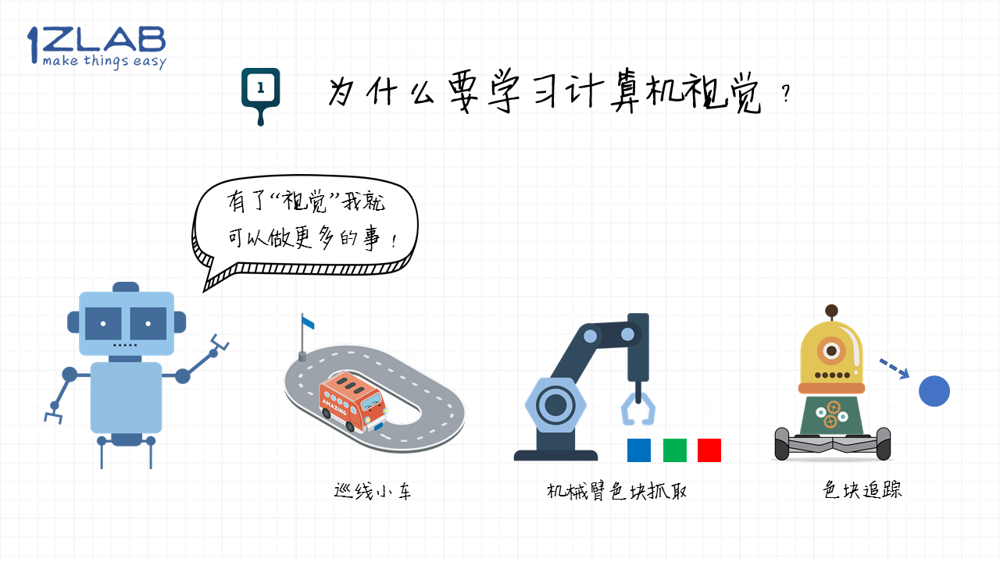
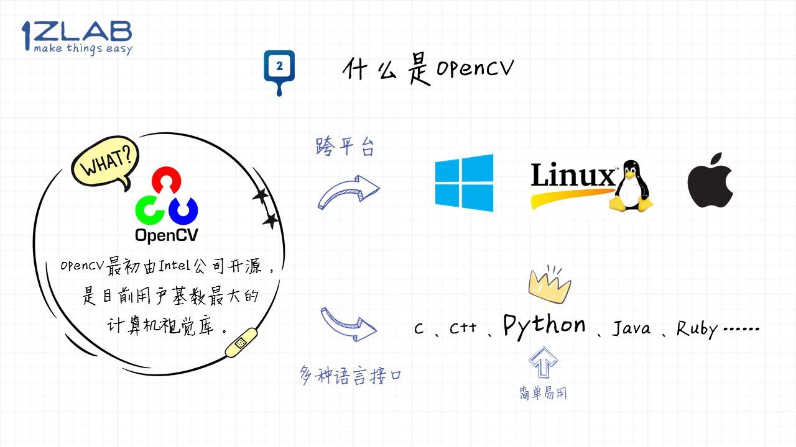
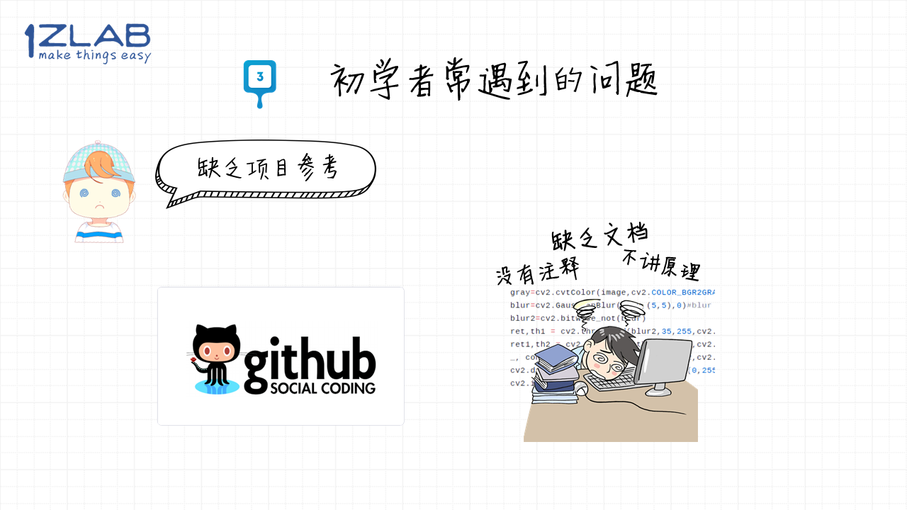

# 课程导言-OpenCV基础教程

## 导引

大家好，我是1Z实验室的阿凯。本期是**写给机器人爱好者的OpenCV基础教程**的课程导言部分。

## 目录

本期视频简单介绍了:

1. [为什么要学习计算机视觉](#为什么要学习计算机视觉)
2. [OpenCV是个啥](#OpenCV是个啥)
3. [初学者常遇到的问题](#初学者常遇到的问题)
4. [本套教程的教学理念](#本套教程的教学理念)

## 为什么要学习计算机视觉

对于机器人来讲，视觉信息是非常重要的, 有了它机器人就可以做很多事情。

如果你想制作巡线小车，机械臂色块抓取， 色块追踪小车的话，那么计算机视觉是你必须要学习的知识。

## 教学目标

本课程的核心教学目标 是**带你入门计算机视觉（Python-OpenCV），掌握比较常用的计算机视觉的算法与工具，同时将其应用在机器人领域，完成有趣的机器人应用。**

**只要你有Python基础就可以跟随我们的脚步，开启你的计算机视觉之旅**

## OpenCV是个啥

OpenCV最初由Intel公司开源，是目前用户基数最大的计算机视觉库。

1. **跨平台**

    OpenCV是跨平台的，无论你的操作系统是Window，linux还是mac os，都可以使用opencv进行图像处理。

2. **多种语言接口** 

   OpenCV的底层实现是基于C/C++的，同时opencv也提供了**多种语言接口**（例如Python，Java，Ruby，Matlab等等）。

**我们的教程是基于python-opencv的，因为对于小白来讲python-opencv可以说是最简单易用的啦。**

另外因为Python是脚本语言，交互式命令行可以方便你调试算法。

## 初学者常遇到的问题

### 问题1没有合适的教程

对于小白来讲， 找到一个合适的教程， 就像有人在领路一样， 可以让你更快的入门。但是，目前的教程跟博客， 有时候未必可以满足需求。

1. **博客**

   网上关于opencv的博客其实还是很多的，但是博客的问题在于**内容杂乱而且不系统**。

2. **OpenCV入门教程**

   我看过一些opencv的入门教程，但是给人的整体感觉就是**侧重代码讲解**，内容比较宽泛但是**原理讲解非常少**，深度比较浅，读完感觉自己还是**只会API**。

3. **专业书籍**

   另外，我也看过计算机视觉的书，但是偏学术，公式很多，一片一片的公式着实让人脑壳疼，很难耐着性子读完。

> PS: 这也是为什么我要自己写一本OpenCV的教程啦。

### 问题2缺乏项目参考

学习OpenCV，建议大家结合项目来学习，项目驱动会让你学习更有目的性，接触更多的算法工具，从而进行算法调优。

其实像github（开源软件代码仓库）上面有很多结合opencv与机器人的开源代码，但是对于刚入门的新手来讲，**只有代码但缺乏文档的工程是很难啃的，而且大部分的开源项目连注释都没有，读起来费时费力。**

另外也没有人告诉你为什么在项目里最终采用了这个算法，你无从得知在整个项目中遇到了哪些问题, 他是怎么解决的。

### 问题3学习周期长

python-opencv比较简单易用，但是你需要一定python科学计算的技术储备（例如 Numpy，Matplotlib等），还需要花精力学一些opencv中跟图像处理无关的API，比如opencv中的HighGUI组件（写上位机用的）。 
**从开始学习到可以做项目，让人感觉路途漫漫无期，让很多人望而却步抑或是半途而废。**

## 本套教程的教学理念

希望我之前列的坑没有让你心生畏惧。不要怕，我们1Z实验室的理念就是**Make Things Easy 让事情变得简单**。为了让更多的同学可以入门opencv，体验计算机视觉带来的乐趣，我们将**侧重计算机视觉在机器人领域的应用**。

1. **底层细节封装(黑盒子)**

   开始入门的时候，你可以把算法当作黑盒子，不需要关注底层实现细节，我们会封装这些算法（dirty work），对于用户来讲，可能就是**几行代码**的事情。

2. **详解算法原理**

   用比较通俗的方式讲解算法背后的原理，只不过你不要花很多精力在一些细节上。

3. **上位机工具**

   同时我们也用opencv的HighGUI组件开发了一些上位机工具，可以实现可视化调参，简化实现流程。这些上位机工具的代码我们也做了逐行注释，如果有需要的话你也可以自行修改。

4. **详细API文档** 

   此外，视频教程还有配套的文本教程，API讲解与数学原理讲解都非常详细，树状的文本结构，可以方便你检索需要的内容。没必要从头阅读，需要哪个功能就去查一下。

5. **侧重项目实战** 我们将课程中所学的计算机视觉的知识结合机器人完成综合的项目，同时也让你可以在实际运行环境里面去检验算法是否有效。

## 课程推广

**扫码加入QQ学习交流群， 1Z实验室的小伙伴们会在群里答疑，欢迎各位同学给我们提供宝贵的意见与教程反馈。**

**1Z实验室 : make things easy**

