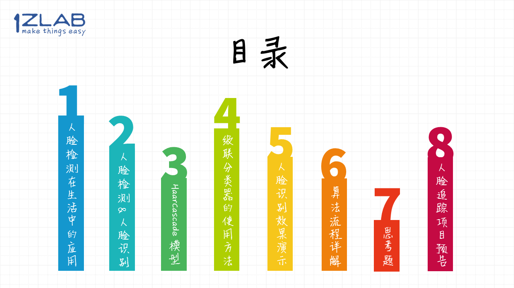
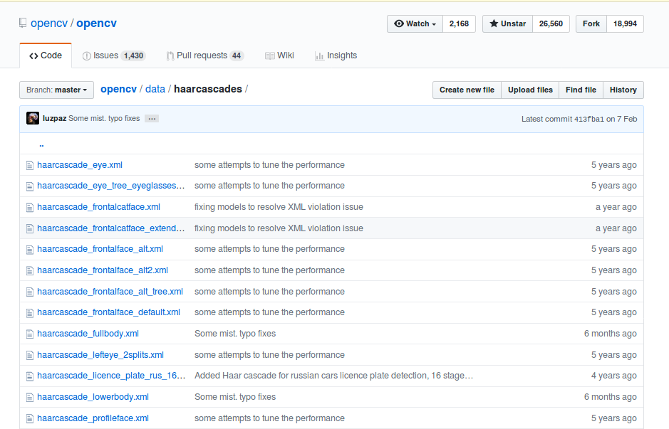
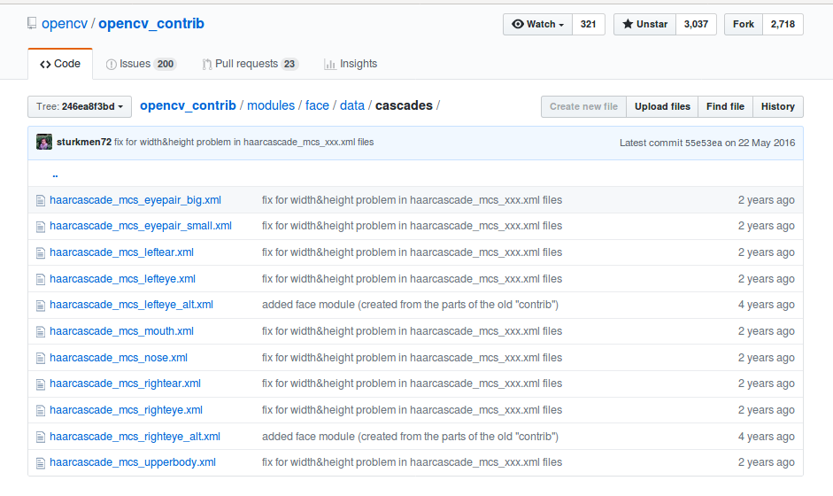
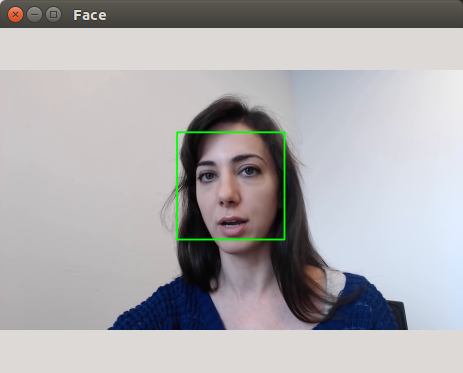

# 人脸检测

> 主旨是为了展示OpenCV有多简单， 让学生有信心学下去
> 另外数据OpenCV的基本操作


## 概要


在本节课，首先介绍一下人脸检测在日常生活中的广泛应用，然后讲解人脸检测与人脸识别的区别， 接下来会教大家通过OpenCV内置的人脸检测模型，实时的在画面中绘制人脸所在的位置。


## 目录




## 人脸检测在生活中的应用

人脸识别在我们生活中的应用越来越广泛。


你可以扫脸解锁手机，扫脸支付，可以扫脸开门，人脸变成了一个人非常重要的生物信息。

所以在这期教程， 阿凯会带大家用OpenCV实现人脸检测。

其实这个也**1Z**,  在OpenCV里面对这个算法封装的足够友好，核心代码不过两行而已。

所以对初学者来讲，学习人脸检测会让你信心满满。


## 人脸检测与人脸识别


在开始讲解人脸检测之前，先帮大家解析经常被搞混的两个概念`人脸检测 vs 人脸识别`
注意！！ 大家经常会搞混的概念：
分清楚这两个概念的不同 

简单来讲，他们的核心区别在于：
1. 哪有脸？人脸检测 （是在图像中定位人脸区域的过程）

2. 脸是谁？人脸识别 （分类检测这个脸是谁）

   一种是把人脸检测获得的人脸区域，在已知人脸库进行比对

   另外一种是针对人脸图像特征，提取特征值。特征值数组 用来标识人脸信息。后者更实用。

   

从顺序来讲，先进行人脸检测，然后再进行人脸识别。

那我们今天就先来讲讲如何使用OpenCV进行人脸检测。


## 关于HaarCascade


OpenCV中人脸识别是通过Haar特征的级联分类器实现，在本期教程里面，我们暂不涉及太多底层算法原理部分的讲解。

实际上OpenCV里面有很多预先训练好的**HaarCascade模型(XML文件)** , 例如正脸检测， 眼睛检测， 全身检测，下半身检测等。


在OpenCV的两个代码仓库里面都有。

数据1:  [opencv/data/cascades](https://github.com/opencv/opencv/tree/master/data/haarcascades)




数据2: [opencv_contrib/modules/face/data/cascades](https://github.com/opencv/opencv_contrib/tree/246ea8f3bdf174a2aad6216c2601e3a93bf75c29/modules/face/data/cascades)




## 级联分类器的使用方法

通过FaceCascade模型， 输入图片， 我们可以获取人脸所在区域的矩形位置。


模型的使用方法比较简单， 首先要载入对应的HaarCascade文件， 文件格式为xml。 这里为了方便大家使用， 我已经将文件下载到了`haar`文件夹下， 可以通过相对路径进行引用。

```
├── FaceDetection-v1.py
├── FaceDetection-v2.py
├── face.mp4
├── face.png
├── haar
    ├── haarcascade_eye.xml
    └── haarcascade_frontalface_default.xml

```


我们在`CascadeClassifier`中传入对应HaarCascade文件

```python
# 载入人脸检测的Cascade模型
FaceCascade = cv2.CascadeClassifier('./haar/haarcascade_frontalface_default.xml')
```

**输入 Input**

接下来就是将图片的灰度图传入到这个`FaceCascade`模型中， 进行人脸检测。
```python
# 检测画面中的人脸
faces = FaceCascade.detectMultiScale(gray)
```

**输出 Output**
返回的faces是人脸所在区域的`ROI`数组， 例如：

`[(x1, y1, w1, h1), (x2, y2, w2, h2)]`


当然， 你可以设定不同的参数，例如设定缩放因子， 设置最小邻居阈值。

```python
# 检测画面中的人脸
faces = FaceCascade.detectMultiScale(
    gray,
    scaleFactor=1.1,
    minNeighbors=5
) 
```

参数的具体含义与使用方法见OpenCV的官方API文档 :

 [OpenCV官方文档： cascadeclassifier-detectmultiscale](https://docs.opencv.org/3.0-beta/modules/objdetect/doc/cascade_classification.html?#cascadeclassifier-detectmultiscale)


**ROI** 的全称是**Region Of Interest** , 用于表示在画面的子区域。整个画面的原点`（0,0）` ， 在整个画面中的左上角。 ROI 本质上是Tuple类型的数据，其中`（x,y）`代表人脸所在矩形区域的左上角坐标， ` w` 代表矩形的宽度， `h`代表矩形的高度。


## 人脸检测的效果演示


### 人脸检测-V1

从图片中读入图片，识别人脸，并在图片中标识人脸所在的矩形区域。

 

### 人脸检测-V2


这个是阿凯放的是人脸识别v2版的效果演示， 里面用到了两个HaarCascade模型， 一个是识别人脸的模型， 另外一个是识别眼睛的模型。

> TODO 视频


## 程序流程讲解

虽然我们是基础入门教程，但是不会在视频里面详细讲解各个API。 


访问 `github.com/1zlab` 查看1Z实验室出品的[OpenCV入门教程](https://github.com/1zlab/1ZLAB_OpenCV_Tutorial) ， 这里为大家准备了自助餐式的教程， 查阅[目录](https://github.com/1zlab/1ZLAB_OpenCV_Tutorial/blob/master/%E7%9B%AE%E5%BD%95.md)，根据自己的需求自由学习OpenCV基础。


> TODO 打开目录 展示如下部分
>
> 1. 开发环境配置 
> 2. HighGUI上位机
> 3. Draw画图
> 4. 视频流


虽然在python -opencv里面，只需要导入`cv2` 模块，但是实际上`cv2` 是由若干个模块构成的， python-opencv只不过是屏蔽掉了这些细节。

人脸识别v1的代码里面核心三个主要模块 `HighGUI` 上位机部分， `Draw` 绘图模块， `CascadeClassifier` 级联分类器。的

程序大致的流程如下： 

1. `HighGUI` 读入图片， 并转换为灰度图
2. `CascadeClassifier` 载入 人脸检测的级联模型（xml）文件
3. `CascadeClassifier` 使用模型检测灰度图中的人脸，返回faces
4. `Draw` 遍历faces，在彩图上绘制人脸的矩形区域
5. `HighGUI`创建一个窗口叫做`Face`
6. `HighGUI` 在窗口`Face`中展示图像（绘制人脸矩形区域后的）
7. `HighGUI` 等待任意按键按下
8. `HighGUI` 退出程序，关闭所有的窗口


`FaceDetection-v1.py`

```python
# -*- coding:utf-8 -*-
'''
人脸识别FaceDetection
通过HaarCascade模型，进行人脸识别与眼睛识别，在视频流中绘制矩形，标识人脸
'''
import cv2

# 设置图片路径
img_path = 'face.png'
# 载入带有人脸的图片
img = cv2.imread(img_path)
if img is None:
    # 判断图片是否读入正确
    print("ERROR：请检查图片路径")
    exit(1)
# 将彩色图片转换为灰度图
gray = cv2.cvtColor(img, cv2.COLOR_BGR2GRAY)


# 载入人脸检测的Cascade模型
FaceCascade = cv2.CascadeClassifier('./haar/haarcascade_frontalface_default.xml')

# 检测画面中的人脸
faces = FaceCascade.detectMultiScale(
    gray,
    scaleFactor=1.1,
    minNeighbors=5
)

# 遍历返回的face数组
for face in faces:
    # 解析tuple类型的face位置数据
    # (x, y): 左上角坐标值
    # w: 人脸矩形区域的宽度
    # h: 人脸矩形区域的高度
    (x, y, w, h) = face
    # 在原彩图上绘制矩形
    cv2.rectangle(img, (x, y), (x+w, y+h), (0, 255, 0), 4)

# 创建一个窗口 名字叫做Face
cv2.namedWindow('Face',flags=cv2.WINDOW_NORMAL | cv2.WINDOW_KEEPRATIO | cv2.WINDOW_GUI_EXPANDED)

# 在窗口Face上面展示图片img
cv2.imshow('Face', img)
# 等待任意按键按下
cv2.waitKey(0)
# 关闭所有的窗口
cv2.destroyAllWindows()
```


## 思考题


看似简单的人脸识别，在实际项目中，有很多的处理追踪问题的算法可以讲。 今天阿凯抛出的问题是：**如何提高人脸识别的速度？**  

欢迎在视频下方**留言参与讨论**， 期待你可以动手改进算法， 留言里可以放你改进后代码的github链接。


> 温馨小提示（不要局限于这两条）
>
> 1. 缩小检索范围， 在上一帧人脸所在矩形周围寻找。
> 2. 缩放，在低分辨率下检索，然后逐步精确位置。


## 人脸追踪的项目预告

> TODO 截图


在一开始的课程导引中，我们也提到了， 结合机器人与计算机视觉是我们课程的一大特色。 既然我们学会了人脸检测，那么为啥不用它来搞点事情： 我们要结合二自由度云台实现人脸检测与追踪。 

项目的大致思路是**检测画面中的人脸，根据人脸偏移画面中心的位置，调整舵机的角度。**

代码也是开源的，在1zlab实验室的代码仓库里面， 大家可以自取：

[github.com/1zlab/1ZLAB_Face_Track_Robot](https://github.com/1zlab/1ZLAB_Face_Track_Robot)


## 推广

关注微信公众号， 回复关键词`人脸检测`， 获取文稿与实验代码。

> TODO 添加人脸检测 关键词


