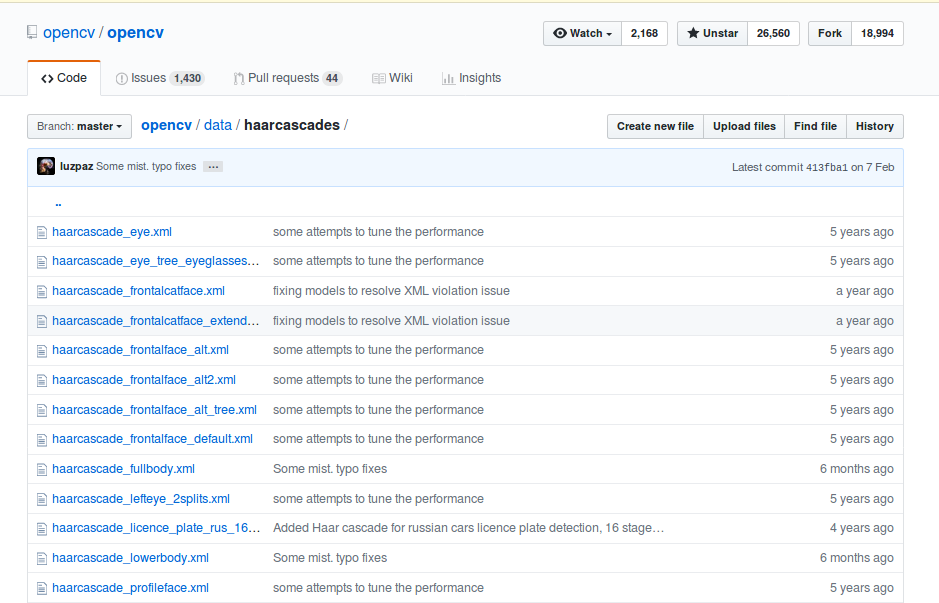
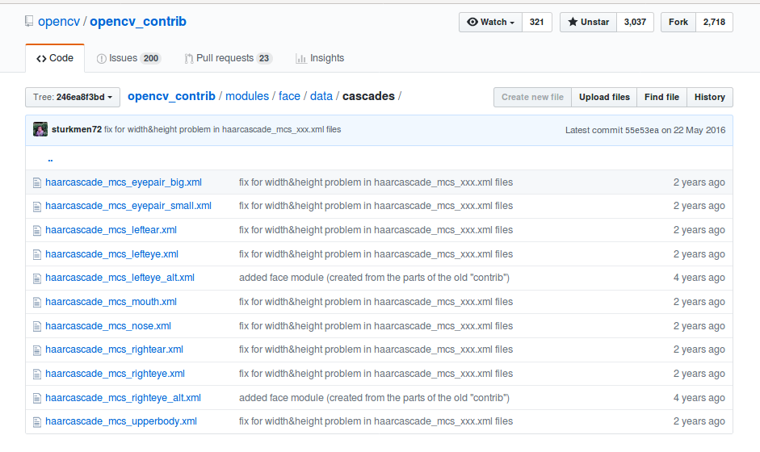

# t先玩一把-人脸检测

> 主旨是为了展示OpenCV有多简单， 让学生有信心学下去
> 另外数据OpenCV的基本操作


## 导引

> 导引介绍人脸识别在生活中的应用


人脸识别在我们生活中的应用越来越广泛。

> 配图 
>
> 1. 扫脸解锁手机
> 2. 扫脸支付
> 3. 扫脸开门

你可以扫脸解锁手机，扫脸支付，可以扫脸开门，人脸变成了一个人非常重要的生物信息。


> 视频： 插入一段人脸检测的效果视频 
>
> 脚本2

所以在这期教程， 阿凯会带大家用OpenCV实现人脸检测。

其实这个也**1Z**,  在OpenCV里面对这个算法封装的足够友好，核心代码不过两行而已。

所以对初学者来讲，学习人脸检测会让你信心满满。


## 人脸检测与人脸识别

> 配图A 
> 左侧：三个人合照 方框框出人脸，然后下方写 人脸检测
> 右侧：三个人的头像 经过分类器， 识别出各自的身份（名字） 下面写人脸识别


在开始讲解人脸检测之前，先帮大家解析经常被搞混的两个概念`人脸检测 vs 人脸识别`
注意！！ 大家经常会搞混的概念：
分清楚这两个概念的不同 

https://blog.csdn.net/fengxianghui01/article/details/71083684

简单来讲，他们的核心区别在于：
1. 哪有脸？人脸检测 （是在图像中定位人脸区域的过程）

2. 脸是谁？人脸识别 （分类检测这个脸是谁）

   一种是把人脸检测获得的人脸区域，在已知人脸库进行比对

   另外一种是针对人脸图像特征，提取特征值。特征值数组 用来标识人脸信息。后者更实用。

   

从顺序来讲，先进行人脸检测，然后再进行人脸识别。

那我们今天就先来讲讲如何使用OpenCV进行人脸检测。


## 关于HaarCascade


OpenCV中人脸识别是通过Haar特征的级联分类器实现，在本期教程里面，我们暂不涉及太多底层算法原理部分的讲解。


## OpenCV中都有哪些训练好的模型


实际上OpenCV里面有很多预先训练好的HaarCascade模型(XML文件) 

> 图片  简笔画 各个部位与中英文名字
>
> 1. 眼睛 eye
>
> 2. 正脸 frontalface
>
> 3. 全身 fullybody
>
> 4. 下半身 lowerbody
>
>    ....


在OpenCV的两个代码仓库里面都有。

数据1:  [opencv/data/cascades](https://github.com/opencv/opencv/tree/master/data/haarcascades)




数据2: [opencv_contrib/modules/face/data/cascades](https://github.com/opencv/opencv_contrib/tree/246ea8f3bdf174a2aad6216c2601e3a93bf75c29/modules/face/data/cascades)




## 黑盒子-模型怎么用

> 配图
>
> 一张有多个人脸的灰度图 （左侧）
>
> 中间： FaceCascade
>
> 右侧  人脸图像标注不同的矩形框（不同颜色）， 然后编写Tuple List对应的Tuple的字体颜色与矩形框颜色相同
>
> [(x1, y1, w1, h1), (x2, y2, w2, h2)]
>
> 

**输入 Input**

我们在`CascadeClassifier`中传入对应HaarCascade

```python
# 载入人脸检测的Cascade模型
FaceCascade = cv2.CascadeClassifier('./haar/haarcascade_frontalface_default.xml')

# 检测画面中的人脸
faces = FaceCascade.detectMultiScale(gray)
```


**输出 Output**

faces ROI数组

`[(x1, y1, w1, h1), (x2, y2, w2, h2)]`


> 配图  ROI附图 讲解   

ROI 本质上是Tuple类型的数据，其中（x,y）左上交坐标 w 代表宽度， h代表高度


API的详细说明文档见 : [OpenCV官方文档： cascadeclassifier-detectmultiscale](https://docs.opencv.org/3.0-beta/modules/objdetect/doc/cascade_classification.html?#cascadeclassifier-detectmultiscale)


## 效果-查看演示效果

`工程结构介绍`

主要是`haar`文件夹中的模型， 

**在我们的代码仓库里面我放置了人脸检测与眼睛检测的HaarCascade模型文件。**


依次运行`FaceDetection-v1.py` , `FaceDetection-v2.py`

讲解以**FaceDetection-v1.py** 为主， `v2` 比较复杂。

>  TODO v3 从USB摄像头读入视频流
>
>  进行人脸识别


**从图片中读入图片，识别人脸，并在图片中标识人脸所在的矩形区域。**


```python
# -*- coding:utf-8 -*-
'''
人脸识别FaceDetection
通过HaarCascade模型，进行人脸识别与眼睛识别，在视频流中绘制矩形，标识人脸
'''
import cv2

# 设置图片路径
img_path = 'face.png'
# 载入带有人脸的图片
img = cv2.imread(img_path)
if img is None:
    # 判断图片是否读入正确
    print("ERROR：请检查图片路径")
    exit(1)
# 将彩色图片转换为灰度图
gray = cv2.cvtColor(img, cv2.COLOR_BGR2GRAY)


# 载入人脸检测的Cascade模型
FaceCascade = cv2.CascadeClassifier('./haar/haarcascade_frontalface_default.xml')

# 检测画面中的人脸
faces = FaceCascade.detectMultiScale(
    gray,
    scaleFactor=1.1,
    minNeighbors=5
)

# 遍历返回的face数组
for face in faces:
    # 解析tuple类型的face位置数据
    # (x, y): 左上角坐标值
    # w: 人脸矩形区域的宽度
    # h: 人脸矩形区域的高度
    (x, y, w, h) = face
    # 在原彩图上绘制矩形
    cv2.rectangle(img, (x, y), (x+w, y+h), (0, 255, 0), 4)

# 创建一个窗口 名字叫做Face
cv2.namedWindow('Face',flags=cv2.WINDOW_NORMAL | cv2.WINDOW_KEEPRATIO | cv2.WINDOW_GUI_EXPANDED)

# 在窗口Face上面展示图片img
cv2.imshow('Face', img)
# 等待任意按键按下
cv2.waitKey(0)
# 关闭所有的窗口
cv2.destroyAllWindows()
```


## 代码-算法流程详解

这个部分，获得一个大概。

> TODO 画面 
>
> 左侧画面， 右侧代码片段

人脸识别详解

从人脸识别的这个代码， 讲解不同的部分所属的包/模块， 都有哪些模块。


1. `HighGUI` 读入图片， 并转换为灰度图
2. `CascadeClassifier` 载入 人脸检测的级联模型（xml）文件
3. `CascadeClassifier` 使用模型检测灰度图中的人脸，返回faces
4. `Draw` 遍历faces，在彩图上绘制人脸
5. 的矩形区域
6. `HighGUI`创建一个窗口叫做`Face`
7. `HighGUI` 在窗口`Face`中展示图像（绘制人脸矩形区域后的）
8. `HighGUI` 等待任意按键按下
9. `HighGUI` 退出程序，关闭所有的窗口


核心三个主要模块 `HighGUI` 上位机部分， `Draw` 绘图模块， `CascadeClassifier` 级联分类器


前两个模块的学习地址：


## API-核心API讲解

> PASS

> TODO 是如何做到在多尺度下检测的？

```
1.  使用模型检测灰度图中的人脸，返回faces
2.  遍历faces，在彩图上绘制人脸的矩形区域
```


黑盒子， 输入输出？


函数： `detectMultiScale` 多尺度 人脸检测。

**Input** 

1. `image`  待检测图像， 一般为灰度图像加快检测速度

2. `scaleFactor` 放缩因子

   表示在前后两次相继的扫描中，搜索窗口的比例系数。默认为1.1即每次搜索窗口依次扩大10%

3. `minNeighbors`  表示构成检测目标的相邻矩形的最小个数(默认为3个)。         如果组成检测目标的小矩形的个数和小于 min_neighbors - 1 都会被排除。         如果min_neighbors 为 0, 则函数不做任何操作就返回所有的被检候选矩形框，         这种设定值一般用在用户自定义对检测结果的组合程序上；

   > TODO 这个参数有点看不懂 额


## 优化-思考题？

**如何提高人脸识别的速度？**

1. 人脸追踪 ROI （缩小检索范围）
2. 缩放，在低分辨率下检索，然后逐步精确（金字塔）。

> 你可以带着这个问题，跟随你随后的OpenCV学习过程。

欢迎在视频下方留言 参与讨论
`我们会在下期视频揭晓答案。`


## 应用-人脸识别的项目实战（预告）

> TODO 添加效果视频


预告，我们接下来要做的这个项目是人脸识别的项目实战

结合二自由度的人脸检测与追踪
（另外一个单独的主题课程）

项目的大致思路: 
检测画面中的人脸，根据人脸偏移画面中心的位置，调整舵机的角度。


