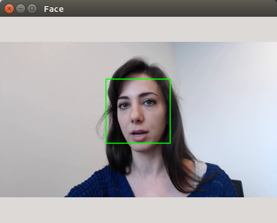

# 先玩一把-人脸检测

> 主旨是为了展示OpenCV有多简单， 让学生有信心学下去
> 另外数据OpenCV的基本操作

## 导引
注意！！ 大家经常会搞混的概念：
分清楚这两个概念的不同 
`人脸检测 vs 人脸识别`
https://blog.csdn.net/fengxianghui01/article/details/71083684

1. 哪有脸？人脸检测 （是在图像中定位人脸区域的过程）
2. 脸是谁？人脸识别 （分类检测这个脸是谁）

我们今天要做的是带大家使用OpenCV进行人脸检测，人脸检测是基于HaarCascade算法模型。

## HaarCascade 模型简介

OpenCV中的级联分类器（CascadeClassifier）是根据
论文： Robust Real-Time Face Detection 编写的。
https://www.cnblogs.com/pakfahome/p/3611303.html

**什么是Haar-Like特征**
明暗关系

**何为Cascade？**
级联的含义

**何为Classifier？** 分类器

HaarCascade算法概要， 基本原理

什么是Haar特征？
局限性

级联分类器

## 运行代码查看演示效果
运行`FaceDetection-v1.py`

## 代码详细讲解

黑盒子， 输入输出？

## OpenCV模块分析
人脸识别详解

从人脸识别的这个代码， 讲解不同的部分所属的包/模块， 都有哪些模块。

* HighGUI
* 绘图
* 视频流读取
* HaarCascade特征？

查看对应的API（官网 OpenCV C++ and Python 同时查阅）

## 对应OpenCV入门教程

映射图
可视化

## 人脸识别的项目实战

预告，我们接下来要做的这个项目是人脸识别的项目实战

结合二自由度的人脸检测与追踪
（另外一个单独的主题课程）

项目的大致思路: 
检测画面中的人脸，根据人脸偏移画面中心的位置，调整舵机的角度。

## 思考题？

**如何提高人脸识别的速度？**

1. 人脸追踪 ROI （缩小检索范围）
2. 缩放，在低分辨率下检索，然后逐步精确（金字塔）。

> 你可以带着这个问题，跟随你随后的OpenCV学习过程。

欢迎在视频下方留言 参与讨论
`我们会在下期视频揭晓答案。`

