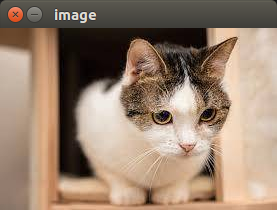

# 显示图片-display_image

opencv中在窗口展示图片需要用到`04.HighGUI上位机开发` 中的API， 因为这个`demo`比较简单， 所以可以通过代码注释，了解一下整个流程， 深入学习HighGUI请看第四章。


`show-img.py`
```python
# -*- coding: utf-8 -*-  
import cv2
# 读入图片
img = cv2.imread('demo_img.jpg')
# 创建窗口并展示图片
cv2.imshow('image', img)
# 等待任意一个按键按下
cv2.waitKey(0)
# 关闭所有的窗口
cv2.destroyAllWindows()
```

我们要读入图片是`demo_img.jpg`, 确认`show-img.py`同级的目录下有这个图片， 当然你也可以自行修改图片的地址。


运行`show-img.py`

```python
python3 show-img.py
```
如果你的`Python`解释器默认是`python3`的话， 你也可以执行
```python
python3 show-img.py
```

接下来你会看到一个窗口：


窗口的标题是`image`， 窗口主体内容就是我们刚刚读入`imread`的彩图。

接下来，**选中当前的窗口（点击一下）**, 按键盘的任意键， 例如`回车Enter`， 程序关闭窗口， 脚本结束。
