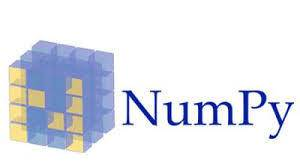
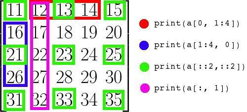
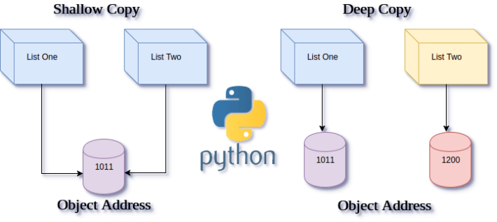
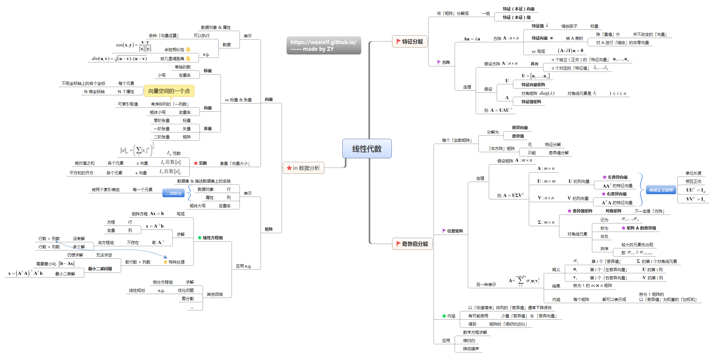

# Numpy从入门到差不多-1Z实验室


出品：1Z实验室  作者：阿凯

**1zlab：make things easy**


## 概要

本文讲解了numpy的一些基础操作. 同时还会介绍numpy中两个重要的概念全局函数与广播. 最后还介绍了numpy下面的两个包, linalg线形代数计算包与random随机生成包.


## 何为Numpy?



NumPy 是一个运行速度非常快的数学库，主要用于矩阵运算。


## 为什么我们不用python原生的list呢?

**矩阵运算功能**
它可以让你在 Python 中使用向量和数学矩阵,以及封装了很多矩阵运算等操作, 这些都是list所不具备的.

**numpy更省空间**
NumPy中的数组的存储效率和输入输出性能均远远优于Python中等价的基本数据结构，且其能够提升的性能是与数组中的元素成比例的．

**处理速度更快**

NumPy的大部分代码都是用C语言写的，其底层算法在设计时就有着优异的性能，这使得NumPy比纯Python代码高效得多.


关于这方面的讨论细节, 大家可以在StackOverflow上的一篇问答中了解更多:

[why-numpy-instead-of-python-lists](https://stackoverflow.com/questions/993984/why-numpy-instead-of-python-lists)


NumPy 是 Python 在科学计算领域取得成功的关键之一，如果你想通过 Python 学习数据科学(例如scipy)或者机器学习(例如numpy)，就必须学习 NumPy。

## 安装并引入Numpy科学计算包模块

使用pip, 我们在终端输入
```bash
sudo pip3 install numpy
```
即可安装完成numpy.

引入numpy模块

```python
import numpy
```
一般来讲习惯上, 我们引入numpy模块的时候, 会将numpy起一个别名`np`, 方便调用(因为比较简短)

```python
import numpy as np
```


## ndarray初始化

### 方法1-基础定义
接下来, 我们就写一组简单的代码, 实验一下`ndarray`的相关属性.

首先我们需要使用`np.array` 函数初始化几个数组.

```python
import numpy as np

# 一维数组
A1 = np.array([1, 2, 3])

# 二维数组
A2 = np.array([[1, 2, 3], [4, 5, 6]])

```

声明数组的方法就是使用`[]`嵌套, `,`分割同层级的元素.

当然有了二维数组, 后面也会有更高维度的数组(或者说是矩阵).

打印一下这两个数组.

```python

print('A1: \n%s'%A1)

print('A2: \n%s'%A2)
```
[OUT]
```
A1: 
[1 2 3]
A2: 
[[1 2 3]
 [4 5 6]]
```

### 方法2-初始化特定区间的整数数组

初始化一个数组的方式, 我们还可以使用"批量"的方式

`np.arange`的使用方法类似Python原生的`range`
它的函数原型为

```
arange([start,] stop[, step,], dtype=None)
```
`start` : 数值区前开始　默认是0
`stop`  : 数值区间结束
`step`  : 数值增加间隔, 默认为1
`dtype` :　数据类型


**代码演示**

```python
print('\n递增')
print(np.arange(0, 10, 1))
```

>OUTPUT
```
递增
    [0 1 2 3 4 5 6 7 8 9]
```

```python
print(np.arange(10))
```
>OUTPUT
```
 [0 1 2 3 4 5 6 7 8 9]
```
可以看到上面的两个语句是等同的.

我们接下来实验一下**递减**

```python
print('\n 递减')
print(np.arange(10, 0, -1))
```

>OUTPUT

```
递减
    [10  9  8  7  6  5  4  3  2  1]
```

### 方法3-初始化特定区间的浮点数组

我们还可以使用`linspace`在一个数值区间内划分若干个段(浮点数).

```python
# 随机间隔
np.linspace(1,10,5)

```
> OUTPUT


```
array([  1.  ,   3.25,   5.5 ,   7.75,  10.  ])
```


## ndarray的属性

这里给大家展示几个常用的属性.


| 属性名称             |              含义 |
| :--------------- | --------------: |
| ndarray.ndim     |    数组的维度,等于Rank |
| ndarray.shape    |        (行数, 列数) |
| ndarray.size     | 元素总个数 = 列数 * 行数 |
| ndarray.dtype    |        数组元素数据类型 |
| ndarray.itemsize |    数组中每个元素,字节大小 |

```python
print('A2.ndim = %d' % A2.ndim)
print('A2.shape')
print(A2.shape)
print('A2.size = %d' % A2.size)
print('A2.dtype = %s'%A2.dtype)
print('A2.itemsize = %d'%A2.itemsize)
```

> OUTPUT

```
A2.ndim = 2
A2.shape
(2, 3)
A2.size = 6
A2.dtype = int64
A2.itemsize = 8
```


## ndarray数据类型

NumPy 的核心是数组（arrays）。具体来说是多维数组（ndarrays）.

```
nd: n-dimension n维的意思
```

`ndarray`与我们之前介绍的 `list`之间巨大的差别在于, `numpy`的ndarray所有的元素数据类型**必须相同**. 这是为矩阵运算做保障的.

Python支持的数据类型有整型、浮点型以及复数型，但这些类型不足以满足科学计算的需求，因此NumPy中添加了许多其他的数据类型，如bool、inti、int64、float32、complex64等。同时，它也有许多其特有的属性和方法。
在Numpy中定义了24种新的Python基础数据类型, 大多基于**C语言**的数据类型.

> 不是所有的ndarray的数据类型, 都可以交给`python-opencv`计算的, 所以数据类型, 在使用的时候也要注意. 


详情见 [arrays-scalars-官方文档](https://docs.scipy.org/doc/numpy/reference/arrays.scalars.html#arrays-scalars)


我们还可以使用`astype`函数, 将原本为int类型的`ndarray`转换为浮点型.

```python
# 修改数据格式
A2.astype(float)
```
>OUTPUT

```
array([[ 1.,  2.,  3.],
        [ 4.,  5.,  6.]])
```


## slicing切片操作


何为切片? 大家应该吃过面包吧


一开始这里是一个大大的面包, 而我们需要这一整个面包其中的一部分, 所以,为了达到这个目的, 我们要进行切片, 可以横着切, 也可以竖着切, 于是我们就获取到了面包片.同样对于多维数组, 我们切片是为了获取数组的其中某一个子区域.


### 一维数组切片

Numpy 中多维数组的切片操作与 Python 中 list 的切片操作一样，同样由 `start`, `stop`, `step` 三个部分组成.

首先我们声明一个长度为10的一维数组.

```python
A = np.arange(10)
```

> OUTPUT 打印一下A
>
> In [7]: A
>
> Out[7]: array([0, 1, 2, 3, 4, 5, 6, 7, 8, 9])


那么我们需要获取, 前三个元素.

我们输入`A[:3]`, 使用`:`分隔, 第一个参数是起始值, 默认为0, 这里可以省略.

后面的`3`是切片的结尾(但是取不到编号为3的元素)


```python
In [8]: A[:3]
Out[8]: array([0, 1, 2])
```

完整版是这种写法:

```python
In [11]: A[0:3]
Out[11]: array([0, 1, 2])
```

`:`分割的第三个参数是`step`代表每次走多少步, 即序号增加的数值, 默认为1.

所以更完整的写法是:

```python
In [12]: A[0:3:1]
Out[12]: array([0, 1, 2])
```


我们也可以隔一个数值取一个. 我们设置`step=2`

```python
In [13]: A[0:10:2]
Out[13]: array([0, 2, 4, 6, 8])
```

`step`也可以是**负值**, 例如我们设置为`step=-1`

```python
In [15]: A[-1:5:-1]
Out[15]: array([9, 8, 7, 6])
```

需要说明的是, 这里`start=-1` 代表是最末尾的元素.


如果我们只是填写`step=-1` 结果等于原来数组的倒序

```python
In [14]: A[::-1]
Out[14]: array([9, 8, 7, 6, 5, 4, 3, 2, 1, 0])
```


### 多维数组切片

针对多维数组的切片, 不同之处在于, 需要使用`,`分隔.


一图胜千言, 相信大家看下面这张图片就会秒懂. 




## ndarray的内存共享

ndarray的之间的直接赋值与索引(切片 slicing)赋值, 那么这两个元素之间的所使用的内存都是同一块. 

也就意味着, 如果A = B, 修改B的值, A也会被修改, 因为他们共用了同一片内存空间.

这样比较高效, 但是如果不注意的话, 也会造成很多问题.

我们先来演示一下.


```python

In [1]: import numpy as np

In [2]: A = np.array([[1, 2], [3, 4]])

In [3]: A
Out[3]: 
array([[1, 2],
       [3, 4]])

In [4]: B = A

In [5]: B[0] = -1

In [6]: B
Out[6]: 
array([[-1, -1],
       [ 3,  4]])

In [7]: A
Out[7]: 
array([[-1, -1],
       [ 3,  4]])


```


## ndarray的深度拷贝

那么, 我们如何才可以复制一个ndarray, 修改新的ndarray而不影响之前的值呢?

这里我们需要用到numpy的深度拷贝函数. `np.copy`

```python
new_img = np.copy(old_img)
```


```python
In [8]: A = np.array([[1, 2], [3, 4]])

In [9]: B = np.copy(A)

In [10]: B[0] = -1

In [11]: B
Out[11]: 
array([[-1, -1],
       [ 3,  4]])

In [12]: A
Out[12]: 
array([[1, 2],
       [3, 4]])

```


当然我们也可以使用另外一种拷贝方式: 

```python
B = A.copy()
```


如果你对python中的浅度拷贝跟深度拷贝不是很清楚的话, 可以看一下博客园的这篇文章.

[图解Python深拷贝和浅拷贝](http://www.cnblogs.com/wilber2013/p/4645353.html)

顺便你再了解一下copy包里面的`copy` 跟`deepcopy` 两个函数都有哪些不同.





## ndarray的变形


在矩阵计算中, 有时候我们需要将矩阵进行变形, 例如原来是`4*5`的矩阵, 可能会变形为`5*4` 或者`10*2`.

也有可能为改变维度, 原来是二维的转变为一维的, 例如`1*20`.


这里我们就需要两个函数`resize` 跟`reshape`


### reshape


reshape函数的原型:

```
reshape(a, newshape, order='C')
```

其中 `a` 是要被resize的数组

new_shape是新数组的尺寸, 类型为tuple 元组类型


**使用样例**

```python
In [29]: A = np.arange(10)

In [30]: A
Out[30]: array([0, 1, 2, 3, 4, 5, 6, 7, 8, 9])

In [31]: np.reshape(A, (2, 5))
Out[31]: 
array([[0, 1, 2, 3, 4],
       [5, 6, 7, 8, 9]])

```


`reshape`函数变形前与变形后的**size**必须相同. 

否则就会报错.

```python
In [21]: np.reshape(A, (5, 5))
---------------------------------------------------------------------------
ValueError                                Traceback (most recent call last)
<ipython-input-21-a0bcf970fe78> in <module>()
----> 1 np.reshape(A, (5, 5))

/usr/lib/python3.6/site-packages/numpy/core/fromnumeric.py in reshape(a, newshape, order)                                                                           
    230            [5, 6]])
    231     """
--> 232     return _wrapfunc(a, 'reshape', newshape, order=order)
    233 
    234 

/usr/lib/python3.6/site-packages/numpy/core/fromnumeric.py in _wrapfunc(obj, method, *args, **kwds)
     55 def _wrapfunc(obj, method, *args, **kwds):
     56     try:
---> 57         return getattr(obj, method)(*args, **kwds)
     58 
     59     # An AttributeError occurs if the object does not have

ValueError: cannot reshape array of size 10 into shape (5,5)

```


`ndarray`对象`A`在调用`reshape`函数的时候, **返回一个新的ndarray对象, 原来的ndarray并不发生改变.**

```python
In [23]: A
Out[23]: array([0, 1, 2, 3, 4, 5, 6, 7, 8, 9])

In [24]: A.reshape((2, 5))
Out[24]: 
array([[0, 1, 2, 3, 4],
       [5, 6, 7, 8, 9]])

In [25]: A
Out[25]: array([0, 1, 2, 3, 4, 5, 6, 7, 8, 9])

```


### resize

resize相当于reshape的一种扩展, 他不要求新的array的`size` 必须与原来array的`size`相同, 可以自动填充.


**np.resize的函数原型**

```python
resize(a, new_shape)
```

其中 `a` 是要被resize的数组

new_shape是新数组的尺寸, 类型为tuple 元组类型

我们首先声明一个1*10的一维数组
```python
In [6]: A = np.arange(10)

In [7]: A
Out[7]: array([0, 1, 2, 3, 4, 5, 6, 7, 8, 9])
```
将其转换为2维数组.
```python
In [17]: np.resize(A, (2, 5))
Out[17]: 
array([[0, 1, 2, 3, 4],
       [5, 6, 7, 8, 9]])
```
如果`new_shape` 大于`a`的shape, 则使用`a`填充.

```python
In [18]: np.resize(A, (4, 5))
Out[18]: 
array([[0, 1, 2, 3, 4],
       [5, 6, 7, 8, 9],
       [0, 1, 2, 3, 4],
       [5, 6, 7, 8, 9]])

```

```python
In [19]: np.resize(A, (5, 5))
Out[19]: 
array([[0, 1, 2, 3, 4],
       [5, 6, 7, 8, 9],
       [0, 1, 2, 3, 4],
       [5, 6, 7, 8, 9],
       [0, 1, 2, 3, 4]])

```


`ndarray`对象`A`在调用`resize`函数的时候, **什么也不返回, 原来的ndarray值变更为resize之后的.**


```python
In [25]: A
Out[25]: array([0, 1, 2, 3, 4, 5, 6, 7, 8, 9])

In [26]: A.resize((2, 5))

In [27]: A
Out[27]: 
array([[0, 1, 2, 3, 4],
       [5, 6, 7, 8, 9]])


```


## 矩阵拼接

在opencv中常会用到图像拼接, 这里就需要用到numpy中的矩阵拼接.

矩阵拼接有个前提条件, 就是,拼接的那一面长度必须相同.

* hstack() 横向拼接
* vstack() 纵向拼接


我们先声明两个矩阵, `A`, 跟`B`


```python
A = np.arange(16).reshape(4,4)
B = np.arange(16).reshape(4,4) * -1

print(A)

print(B)
```

>OUTPUT

    [[ 0  1  2  3]
     [ 4  5  6  7]
     [ 8  9 10 11]
     [12 13 14 15]]
    [[  0  -1  -2  -3]
     [ -4  -5  -6  -7]
     [ -8  -9 -10 -11]
     [-12 -13 -14 -15]]


然后将两个矩阵先进行**横向拼接**. **注意这里传入的是tuple**

```python
# 注意这里传入的是tuple
np.hstack((A, B))
```

> OUTPUT


    array([[  0,   1,   2,   3,   0,  -1,  -2,  -3],
           [  4,   5,   6,   7,  -4,  -5,  -6,  -7],
           [  8,   9,  10,  11,  -8,  -9, -10, -11],
           [ 12,  13,  14,  15, -12, -13, -14, -15]])


然后再尝试进行**纵向拼接**.


```python
np.vstack((A, B))
```

> OUTPUT


    array([[  0,   1,   2,   3],
           [  4,   5,   6,   7],
           [  8,   9,  10,  11],
           [ 12,  13,  14,  15],
           [  0,  -1,  -2,  -3],
           [ -4,  -5,  -6,  -7],
           [ -8,  -9, -10, -11],
           [-12, -13, -14, -15]])


## ufunc 全局函数


作用于数组中每个元素的函数我们称之为`ufunc`  


```
universal function  # 全局函数
```

在ufunc中，**如果是两个ndarray之间的运算，shape必须相等**

- `+` 加法
- `-` 减法
- `*` 乘法, 注意这里不是点乘
- `/` 除法 


声明两个尺寸相同的矩阵. `A` 与`B`

```python
In [54]: A = np.arange(12).reshape((4, 3))

In [55]: B = np.arange(2, 14).reshape(4, 3)

In [56]: A
Out[56]: 
array([[ 0,  1,  2],
       [ 3,  4,  5],
       [ 6,  7,  8],
       [ 9, 10, 11]])

In [57]: B
Out[57]: 
array([[ 2,  3,  4],
       [ 5,  6,  7],
       [ 8,  9, 10],
       [11, 12, 13]])
```


### 全局加法


```python
In [58]: A + B
Out[58]: 
array([[ 2,  4,  6],
       [ 8, 10, 12],
       [14, 16, 18],
       [20, 22, 24]])
```


### 全局减法


```python
In [59]: A - B
Out[59]: 
array([[-2, -2, -2],
       [-2, -2, -2],
       [-2, -2, -2],
       [-2, -2, -2]])
```


### 全局乘法

```python
In [60]: A * B
Out[60]: 
array([[  0,   3,   8],
       [ 15,  24,  35],
       [ 48,  63,  80],
       [ 99, 120, 143]])
```


### 全局除法

```python
In [61]: A / B
Out[61]: 
array([[ 0.        ,  0.33333333,  0.5       ],
       [ 0.6       ,  0.66666667,  0.71428571],
       [ 0.75      ,  0.77777778,  0.8       ],
       [ 0.81818182,  0.83333333,  0.84615385]])

```


### 其他全局函数

如果我们的计算对象是单个ndarray中的每个元素, 就需要使用到numpy内置的一些全局函数.

例如`np.sin()` , 这个函数的作用就是返回一个矩阵, 其中每个元素都是原来矩阵`A` 进行`sin`运算的结果


```python
print(np.sin(A))
```

    [[ 0.          0.84147098  0.90929743  0.14112001]
     [-0.7568025  -0.95892427 -0.2794155   0.6569866 ]
     [ 0.98935825  0.41211849 -0.54402111 -0.99999021]
     [-0.53657292  0.42016704  0.99060736  0.65028784]]


### 自定义全局函数

我们也可以自定义自己的`ufunc` 具体方法见

[文档-Writing your own ufunc](https://docs.scipy.org/doc/numpy-1.13.0/user/c-info.ufunc-tutorial.html)

需要先写用C底层实现方法, 然后再python中调用.


> 先MARK一下, 也想实现自己的C语言拓展, 嘿嘿, 不过暂时没有想到啥应用场景.


## broadcasting 广播

那如果两个`ndarray`的`shape` 不相同的话, 两者之间可以进行计算么?

答案是可以的, shape不同的两个ndarray的操作都是由broadcasting管理的


举个最简单的例子.


### ndarray与数值的运算


声明一个矩阵A

```python
In [62]: A = np.array([1, 2])
```

```python
In [65]: A + 3
Out[65]: array([4, 5])
```

很明显, `A` 与`3` 两个对象的尺寸 显然不相同, 但是二者之间可以进行运算, A中的每个元素都与3进行了加运算.

同样, 减法`-`,  乘法`*` ,除法`/` 都是成立的.


```python

In [66]: A - 3
Out[66]: array([-2, -1])

In [67]: A * 3
Out[67]: array([3, 6])

In [68]: A / 3
Out[68]: array([ 0.33333333,  0.66666667])

```


### ndarray与ndarray之间的广播

两个`ndarray`进行广播由个前提条件, 就是其中一个的shape应该是`(N, 1)` 另外一个是`(1, N)`

有趣的是一维的`ndarray`的矩阵转置的尺寸并不是`(N, 1)`

```python
In [87]: A.shape
Out[87]: (2,)

In [88]: A.T.shape
Out[88]: (2,)
```

所以, 我们先将矩阵`A`进行转置, 并且`reshape`为 `(N, 1)`

```python
In [78]: C =  np.reshape(A.T, (2,1))
```

> OUTPUT

```
In [90]: C
Out[90]: 
array([[1],
       [2]])

In [91]: B
Out[91]: array([2, 4, 6])

```

####  加法广播

然后`尝试B`与`C`进行加法运算.


```python
In [92]: C + B
Out[92]: 
array([[3, 5, 7],
       [4, 6, 8]])

In [93]: B + C
Out[93]: 
array([[3, 5, 7],
       [4, 6, 8]])

```


可以看到`C + B` 与`B + C`计算的值是相等的.

广播的意思是, C中的元素, 分别与B中的元素进行向加, 最后将这些值存在一起.

加入shape为`(N, 1)` 的矩阵与`(1, M)`的矩阵进行广播运算, 那么会后获取的矩阵`shape` 为`(N, M)`.

#### 减法广播

这里可以看到`C-B`的结果与`B-C`的不同. 

`C - B` 是C中的元素分别减去B中的元素的广播.
`B - C` 是B中的元素分别减去C中的元素的广播.

```python
In [94]: C - B
Out[94]: 
array([[-1, -3, -5],
       [ 0, -2, -4]])

In [95]: B - C
Out[95]: 
array([[1, 3, 5],
       [0, 2, 4]])

```
#### 乘法广播

```python
In [96]: C * B
Out[96]: 
array([[ 2,  4,  6],
       [ 4,  8, 12]])

In [97]: B * C
Out[97]: 
array([[ 2,  4,  6],
       [ 4,  8, 12]])

```

#### 除法广播

```python
In [98]: C / B
Out[98]: 
array([[ 0.5       ,  0.25      ,  0.16666667],
       [ 1.        ,  0.5       ,  0.33333333]])

In [99]: B / C
Out[99]: 
array([[ 2.,  4.,  6.],
       [ 1.,  2.,  3.]])
```


## np.linalg 线性代数的基本操作




numpy的`linalg`里包含着线形代数的函数.

**引入linalg模块**

引入并起名为`LA`

```python
import numpy.linalg as LA
```


声明一个矩阵`A`


```python
In [117]: A = np.random.rand(16).reshape((4, 4))

In [118]: A
Out[118]: 
array([[ 0.70961003,  0.38232282,  0.3333471 ,  0.67033575],
       [ 0.42843928,  0.10718751,  0.60270476,  0.17157395],
       [ 0.59779218,  0.49990817,  0.38124034,  0.40720553],
       [ 0.39828826,  0.25732704,  0.21937875,  0.73758145]])

```


### 矩阵转置


```python
In [120]: A.T
Out[120]: 
array([[ 0.70961003,  0.42843928,  0.59779218,  0.39828826],
       [ 0.38232282,  0.10718751,  0.49990817,  0.25732704],
       [ 0.3333471 ,  0.60270476,  0.38124034,  0.21937875],
       [ 0.67033575,  0.17157395,  0.40720553,  0.73758145]])
```


### 矩阵求逆

```python
In [119]: LA.inv(A)
Out[119]: 
array([[ 5.66701404, -0.28541964, -2.31329719, -3.80682588],
       [-3.70856223, -1.21853464,  4.49424461,  1.17271036],
       [-3.13121486,  2.0909343 ,  1.02248164,  1.79485974],
       [-0.83498553, -0.04266018, -0.62290378,  2.46845944]])

```


### 矩阵乘法


另外声明一个矩阵*B*


```python
In [121]: B = np.random.rand(12).reshape((4, 3))
  
```


```python
In [123]: B
Out[123]: 
array([[ 0.53177202,  0.2393353 ,  0.28119078],
       [ 0.65747444,  0.07336546,  0.05293755],
       [ 0.61559046,  0.86580537,  0.91073328],
       [ 0.95129791,  0.14128977,  0.36143378]])

```


矩阵相乘 `dot`

```python
In [124]: A.dot(B)
Out[124]: 
array([[ 1.47161254,  0.58120931,  0.76564731],
       [ 0.8325423 ,  0.65647117,  0.73706332],
       [ 1.26862768,  0.56736268,  0.68894366],
       [ 1.21769166,  0.40835537,  0.59199963]])

```


### 行列式求解


`determinant`

```python
In [126]: LA.det(A)
Out[126]: -0.024091509709235282
```


## np.random 随机函数模块

### 生成0-1区间的随机数

```python
print('\n生成10个0-1区间内的随机数值\n')
print(np.random.rand(10))
```

> OUTPUT

    生成10个0-1区间内的随机数值
    
    [ 0.62092807  0.79909637  0.29885985  0.3382252   0.50991553  0.1246462
      0.15690747  0.57804792  0.11380593  0.75276443]


### 生成满足正态分布的数组

```python
print('\n生成10个满足正态分布的随机数组\n')
print(np.random.randn(10))
```


> OUTPUT

    生成10个满足正态分布的随机数组
    
    [-0.77878196  0.08298678 -1.1126773  -0.34096876 -1.39003661 -1.36326881
      1.14411379 -0.80727601 -0.94789066  0.01724758]


## 拓展阅读


[codingpy - 使用 Python 进行科学计算：NumPy入门](http://codingpy.com/article/an-introduction-to-numpy/)

> 语言比较风趣幽默, 翻译自另外一片英文文章
> [An Introduction to Scientific Python – NumPy](http://www.datadependence.com/2016/05/scientific-python-numpy/)