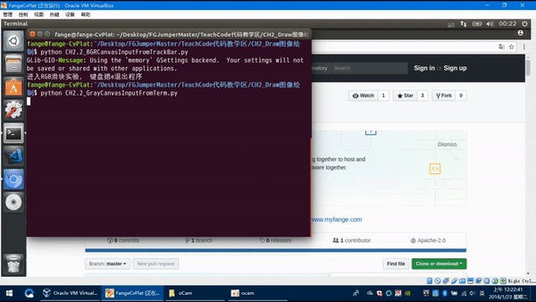
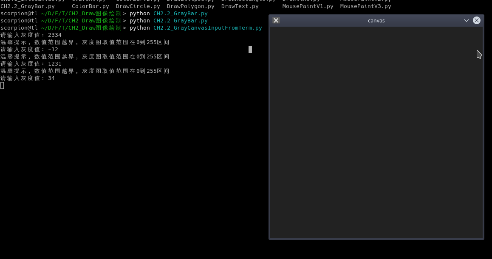
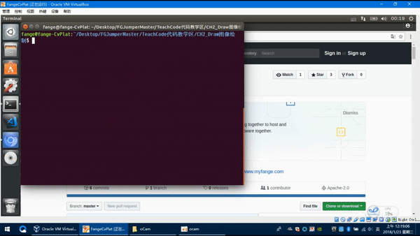

# 项目实战-可变色画布

## 0. 概要

阿凯带你从创建一个特定灰度的灰度图， 到终端输入灰度的值生成特定灰度的图片， 然后我们引入了一个新的HighGui组件:Trackbar . 你还会接触到回调函数（callback）这个概念， 用于响应Trackbar 拖动带来的影响。
你可以拖动滑条， 动态的看到色块颜色的改变， 最后阿凯给大家留了一个作业， 制作RGB三通道的带Trackbar的调色板。

## 1. 创建统一灰度画布的函数

本期相当于是对`CH2.1` 作业的解析.

我们创建一个函数`createGrayscaleCanvas` 用于创建灰度图的画布.


`CH2.2_GrayCanvas.py`

```python
import numpy as np
import cv2

# 初始化灰度图的画布
def createGrayscaleCanvas(width, height, color=255):
    canvas = np.ones((height, width), dtype="uint8")
    canvas[:] = color
    return canvas

# 创建一个颜色为125的灰度图
canvas = createGrayscaleCanvas(500, 500, color=125)
# 展示画布
cv2.imshow("canvas", canvas)
# 中断
cv2.waitKey(0)
# 关闭窗口
cv2.destroyAllWindows()
```


代码阅读有困难的同学请回顾阿凯的`CH2.1` 教程, 创建一个空白画布.

这里只是做一个课程回顾.

## 2. 终端输入灰度 生成灰度图



接下来, 阿凯想通过终端输入一个特定的数值, 然后生成对应值的灰度图, 那我们如何来实现呢?

在python中, 类似C语言中的`scanf`语句的函数是`input`, `input` 中传入的字符串是提示.

读入字符串赋值给`gray_value`. **注意这里读入的是字符串, 不是数值**

```python
gvalue_str  = input("请输入灰度值: ")
```

如果我们想得到整数的数值的话, 需要对其进行强制类型转换. 使用`int()` 函数.

```python
gvalue = int(gvalue_str)
```

接下来, 我们还要判断, 数值范围是否合法, 在[0, 255] 区间之内.

我们使用函数`is_gvalue_legal`来判断灰度值是否合法.

```python
# 判断灰度值是否合法
def is_gvalue_legal(gvalue):
    
    return not (gvalue < 0 or gvalue > 255)
```

如果啰嗦一点的版本, 就是这样的:

```python
# 判断灰度值是否合法
def is_gvalue_legal_balabala(gvalue):
    if gvalue < 0 or gvalue > 255:
        return False
    else:
        return True
```

**读入gvalue , 如果符合要求的话, 就生成对应的背景. 不合法就要求重新输入.**

```python
#  读入灰度值
def read_gvalue():
    # 是否读取成功
    read_done = False
    gvalue = None

    while not read_done:
        
        gvalue_str  = input("请输入灰度值: ")
        gvalue = int(gvalue_str)
        read_done = is_gvalue_legal(gvalue)
        # 添加一个温馨小提示
        if not read_done:
            print("温馨提示, 数值范围越界, 灰度图取值范围在0到255区间")
    return gvalue
```

完整版本的程序见: 

`CH2.2_GrayCanvasInputFromTerm.py`

```python
import numpy as np
import cv2

# 初始化灰度图的画布
def createGrayscaleCanvas(width, height, color=255):
    canvas = np.ones((height, width), dtype="uint8")
    canvas[:] = color
    return canvas

# 判断灰度值是否合法
def is_gvalue_legal(gvalue):
    
    return not (gvalue < 0 or gvalue > 255)

#  读入灰度值
#  如果符合要求的话, 就生成对应的背景. 不合法就要求重新输入. 
def read_gvalue():
    # 是否读取成功
    read_done = False
    gvalue = None

    while not read_done:
        
        gvalue_str  = input("请输入灰度值: ")
        gvalue = int(gvalue_str)
        read_done = is_gvalue_legal(gvalue)
        
        if not read_done:
            print("温馨提示, 数值范围越界, 灰度图取值范围在0到255区间")
    return gvalue

gvalue = read_gvalue()

canvas = createGrayscaleCanvas(500, 500, color=gvalue)

cv2.imshow("canvas", canvas)

print("按任意按键结束程序")
cv2.waitKey(0)

cv2.destroyAllWindows()
```

**效果演示**



## 3. 创建滑条-ceateTrackBar

用终端的方式, 也有它的弊端, 主要是我没办法从交互界面上去规范它输入的值. 

于是我们就用到了我们的`TrackBar` 组件.

首先我们需要创建一个`Trackbar` , 调用`createTrackbar` 这个函数

```python
cv2.createTrackbar(trackbar_name,window_name,min_value,max_value,callback_func)
```

 依次传入的函数

* `trackbar_name` 滑条的名称，获取这个滑条的数值也是通过名称
* `window_name` 滑条所在窗口 (window) 的名称
* `min_value` 滑条最小值
* `max_value` 滑条最大值
* `callback_func` 回调函数，这个参数其实类似`C`语言中的函数指针，我传入的是函数名称，每次滑条被拖动的时候，都会执行这个函数．　

例如：　

```python
# 这个nothing的意思就是啥也不做。
def nothing(x):
    pass
cv2.createTrackbar('gray_value','image',0,255,nothing)
```

这里的`nothing(x)` ,  被传入的`x` 实际上是滑条的当前取值。

你也可以改成这样， 看一下`x` 的值。

```python
# 这个nothing的意思就是啥也不做。
def nothing(x):
    print(x)
cv2.createTrackbar('gray_value','image',0,255,nothing)
```

`x` 是我命名的值， 你可以命名为任意名称。

## 4. 灰度图调色板 - V1

.gif)

这里， 我们来演示， 不用回调函数的解决方法。

定时每隔1ms刷新画面， 这种方式比较低效， 即便值没有被修改1s也会修改1000次。

`CH2.2_GrayCanvasInputFromTrackBarV1.py`

```python
'''
滑块调色板 - v1 比较傻的版本
'''
import cv2
import numpy as np

# 初始化灰度图的画布
def createGrayscaleCanvas(width, height, color=255):
    canvas = np.ones((height, width), dtype="uint8")
    canvas[:] = color
    return canvas

cv2.namedWindow('image')

# 函数原型
# createTrackbar(trackbarName, windowName, value, count, onChange) -> None
# 解释
# 在window‘iamge’ 上创建一个滑动条，起名为Channel_XXX， 设定滑动范围为0-255, 
# onChange事件回调 啥也不做
def nothing(x):
    pass
    
cv2.createTrackbar('gray_value','image',0,255,nothing)

print("进入Grayscale滑块实验， 键盘摁e退出程序")

img = None

# 每隔1ms检查更新一次。
while(True):
    
    # 程序跳出判断 最多等待1毫秒
    k = cv2.waitKey(1)
    # 如果key是e键就退出程序
    if k == ord('e'):
        break
    
    # 获取当前滑条的值
    gvalue = cv2.getTrackbarPos('gray_value','image')
    # 创建新的画布
    img = createGrayscaleCanvas(500, 500, color=gvalue)
    # 显示更新后的图片
    cv2.imshow('image',img)

cv2.destroyAllWindows()
```

## 5. 灰度图调色板 - V2

.gif)

我们首先创建一个名字叫做`gray_value` 的trackbar。 这个trackbar在`image` 窗口上。

最小取值是0, 最大取值是255, 修改时候的回调函数是`updateImg`

```python
cv2.createTrackbar('gray_value','image',0,255,updateImg)
```

那我们来看一下`updateImg` 图像更新的函数。 每次trackbar修改的时候， 就会给函数`updateImg` 传入当前的值`gvalue`。

然后我们创建一个新的图片， 并在`image` 窗口展示。

```python
# 更新画布
def updateImg(gvalue):
    
    img = createGrayscaleCanvas(500, 500, color=gvalue)
    # 显示更新后的图片
    cv2.imshow('image',img)
```

完整的程序： 

`CH2.2_GrayCanvasInputFromTrackBarV2.py`

```python
'''
滑块调色板 - v2 回调函数
'''
import cv2
import numpy as np

# 初始化灰度图的画布
def createGrayscaleCanvas(width, height, color=255):
    canvas = np.ones((height, width), dtype="uint8")
    canvas[:] = color
    return canvas

# 更新画布
def updateImg(gvalue):
    
    img = createGrayscaleCanvas(500, 500, color=gvalue)
    # 显示更新后的图片
    cv2.imshow('image',img)

cv2.namedWindow('image')    
# 初始化画布
updateImg(0)

cv2.createTrackbar('gray_value','image',0,255,updateImg)

print("进入Grayscale滑块实验， 键盘摁e退出程序")

img = None
# 接收按键事件， 判断是否退出
while cv2.waitKey(0) != ord('e'):
    continue

cv2.destroyAllWindows()
```

## 6. 作业 CH2.2



看到这里, 相信你已经掌握了如何创建画布与HighGUI组件中的Trackbar的使用.

那么阿凯接下来要给你布置的作业就是, 创建一个可以调RGB三通道的调色板. 

你需要创建三个TrackBar, 分别记录三个通道的值.   然后你拖动TrackBar触发更新当前color的事件, 接下来, 重新渲染画布. 思路就给这么多. 大家加油.

为了降低难度, 阿凯提供一个代码模板.

`CH2.2_BGRCanvasInputFromTrackBar.py`

```python
'''
滑块调色板 - V2 利用回调更新窗口图像
'''

import cv2
import numpy as np

# 创建一个空白画布
canvas = np.zeros((300,512,3), np.uint8)
# 色块的颜色
color = (0, 0, 0)

# 更新图像，并且刷新windows
def updateImage():
    '''
    请填入你的代码
    '''

# 更新颜色
def updateColor(x):
    '''
    	请填入代码
    '''

cv2.namedWindow('image')

# 函数原型
# createTrackbar(trackbarName, windowName, value, count, onChange) -> None
# 解释
# 在window‘iamge’ 上创建一个滑动条，起名为Channel_XXX， 设定滑动范围为0-255, 
# onChange事件回调 啥也不做
cv2.createTrackbar('Channel_Red','image',0,255,updateColor)
cv2.createTrackbar('Channel_Green','image',0,255,updateColor)
cv2.createTrackbar('Channel_Blue','image',0,255,updateColor)

print("进入RGB滑块实验， 键盘摁e退出程序")

# 首次初始化窗口的色块
# 后面的更新 都是由getTrackbarPos产生变化而触发
updateImage()

while cv2.waitKey(0) != ord('e'):
    continue

cv2.destroyAllWindows()
```