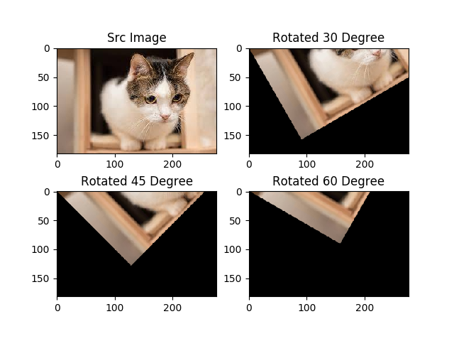

# 旋转(rotation)


## 利用getRotationMatrix2D实现旋转

opencv中`getRotationMatrix2D`函数可以直接帮我们生成`M` 而不需要我们在程序里计算三角函数．

```
getRotationMatrix2D(center, angle, scale)
```

**参数解析**

- `center` 旋转中心点 (cx, cy) 你可以随意指定

- `angle` 旋转的角度 单位是角度 **逆时针方向为正方向** ， 角度为正值代表逆时针。

- `scale` 缩放倍数. 值等于`1.0 `代表尺寸不变


该函数返回的就是仿射变换矩阵`M`

```python
import cv2
import numpy as np

# 获取旋转矩阵
rotateMatrix = cv2.getRotationMatrix2D((100, 200), 90, 1.0)

#设置numpy矩阵的打印格式
np.set_printoptions(precision=2,suppress=True)
print(rotateMatrix)
```


**OUTPUT**

```
[[   0.    1. -100.]
 [  -1.    0.  300.]]
```


为了使用方便， 你也可以封装一下旋转过程

```python
def rotate(image, angle, center = None, scale = 1.0):

    (h, w) = image.shape[:2]

    if center is None:
        center = (w / 2, h / 2)
    
    M = cv2.getRotationMatrix2D(center, angle, scale)
    rotated = cv2.warpAffine(image, M, (w, h))

    return rotated
```


```python
# -*- coding: utf-8 -*- 
'''
围绕原点处旋转　(图片左上角)　正方向为逆时针
利用getRotationMatrix2D函数生成仿射矩阵
'''
import numpy as np
import cv2
from math import cos,sin,radians
from matplotlib import pyplot as plt

img = cv2.imread('cat.jpg')

height, width, channel = img.shape

# 求得图片中心点， 作为旋转的轴心
cx = int(width / 2)
cy = int(height / 2)
# 旋转的中心
center = (cx, cy)

new_dim = (width, height)

# 进行2D 仿射变换
# 围绕原点 逆时针旋转30度
M = cv2.getRotationMatrix2D(center=center,angle=30, scale=1.0)
rotated_30 = cv2.warpAffine(img, M, new_dim)

# 围绕原点 逆时针旋转30度
M = cv2.getRotationMatrix2D(center=center,angle=45, scale=1.0)
rotated_45 = cv2.warpAffine(img, M, new_dim)

# 围绕原点  逆时针旋转30度
M = cv2.getRotationMatrix2D(center=center,angle=60, scale=1.0)
rotated_60 = cv2.warpAffine(img, M, new_dim)

plt.subplot(221)
plt.title("Src Image")
plt.imshow(img[:,:,::-1])

plt.subplot(222)
plt.title("Rotated 30 Degree")
plt.imshow(rotated_30[:,:,::-1])

plt.subplot(223)
plt.title("Rotated 45 Degree")
plt.imshow(rotated_45[:,:,::-1])

plt.subplot(224)
plt.title("Rotated 60 Degree")
plt.imshow(rotated_60[:,:,::-1])

plt.show()
```

------
**学霸分割线**
如果你对图像旋转的数学原理不感兴趣的话,就不需要往下看了.

------

## 利用wrapAffine实现缩放

### 围绕原点进行旋转


$$
\begin{align*}
x &=  r * cos(\phi)\\
\\
x' &= r * cos(\phi + \theta)\\ 
 &=  r*cos(\phi)*cos(\theta) - r*sin(\phi)*sin(\theta)\\
\\ 
y &= r * sin(\phi)\\
\\
y' &= r * sin(\phi + \theta)\\
&= r*sin(\phi)*cos(\theta) + r*cos(\phi)*sin(\theta)
\end{align*}
$$
由此我们得出
$$
\begin{align*}
x' = x*cos(\theta) - y*sin(\theta) \\
\\
y' = x*sin(\theta) + y*cos(\theta)
\end{align*}
$$
所以对应的变换矩阵为
$$
\begin{equation}
{
\left[ \begin{array}{c}
x'\\
y'\\
\end{array} 
\right ]}=
{
\left[ \begin{array}{cc}
cos(\theta) & -sin(\theta)\\
sin(\theta) & cos(\theta)\\
\end{array}
\right ]}\times
{
  \left[\begin{array}{c}
  x\\
  y\\
  \end{array}
  \right]
}+
{
   \left[\begin{array}{c}
  0\\
  0\\
  \end{array}
  \right]
}
\end{equation}
$$

$$
M =\left[ \begin{array}{c}
cos(\theta) &-sin(\theta) & 0\\
sin(\theta) &  cos(\theta)& 0\\
\end{array} 
\right ]
$$

**注意，这里我们进行公式推导的时候，参照的原点是在左下角， 而在OpenCV中图像的原点在图像的左上角， 所以我们在代码里面对theta取反。**


我们可以利用`math`包中的三角函数。但是有一点需要注意 ：**三角函数输入的角度是弧度制而不是角度制**。

我们需要使用`radians(x)` 函数， 将角度转变为弧度。

```python
import math
math.radians(180)
```

```
3.141592653589793
```




**源代码**


`rotate_image_v2.py`

```python
# -*- coding: utf-8 -*- 
'''
围绕原点处旋转　(图片左上角)　正方向为逆时针
'''
import numpy as np
import cv2
import math
from matplotlib import pyplot as plt

img = cv2.imread('cat.jpg')

height, width, channel = img.shape

def getRotationMatrix2D(theta):
    # 角度值转换为弧度值
    # 因为图像的左上角是原点 需要×-1
    theta = math.radians(-1*theta)

    M = np.float32([
        [math.cos(theta), -math.sin(theta), 0],
        [math.sin(theta), math.cos(theta), 0]])
    return M

# 进行2D 仿射变换
# 围绕原点 顺时针旋转30度
M = getRotationMatrix2D(30)
rotated_30 = cv2.warpAffine(img, M, (width, height))

# 围绕原点 顺时针旋转45度
M = getRotationMatrix2D(45)
rotated_45 = cv2.warpAffine(img, M, (width, height))

# 围绕原点 顺时针旋转60度
M = getRotationMatrix2D(60)
rotated_60 = cv2.warpAffine(img, M, (width, height))

plt.subplot(221)
plt.title("Src Image")
plt.imshow(img[:,:,::-1])

plt.subplot(222)
plt.title("Rotated 30 Degree")
plt.imshow(rotated_30[:,:,::-1])

plt.subplot(223)
plt.title("Rotated 45 Degree")
plt.imshow(rotated_45[:,:,::-1])

plt.subplot(224)
plt.title("Rotated 60 Degree")
plt.imshow(rotated_60[:,:,::-1])

plt.show()
```


### 围绕任意点进行旋转

那么如何围绕任意点进行旋转呢？

可以先把当前的旋转中心点平移到原点处， 在原点处旋转后再平移回去。

假定旋转中心为  $(c_x, c_y) $

$M_{translation}$ 为平移矩阵  $ M_{translation}^{-1}$ 为平移矩阵的逆矩阵　$M_{rotation} $　为原点旋转矩阵


$$
{
\left[ \begin{array}{c}
x'\\
y'\\
0\\
\end{array} 
\right ]}
=M_{translation}^{-1}( M_{rotation} *  (M_{translation} * {
\left[ \begin{array}{c}
x\\
y\\
0\\
\end{array} 
\right ]}) )
$$


其中
$$
M_{translation} = {
 \left[ \begin{array}{c}
1 &0 & -c_x\\
0& 1& -c_y\\
0 & 0 & 1\\
\end{array} 
\right ]
}\\

M_{translation}^{-1} = {
 \left[ \begin{array}{c}
1 &0 & c_x\\
0& 1&  c_y\\
0 & 0 & 1\\
\end{array} 
\right ]
}\\

M_{rotation} = {
\left[ \begin{array}{c}
cos(\theta) &-sin(\theta) & 0\\
sin(\theta) &  cos(\theta)& 0\\
0 & 0 & 1\\
\end{array} 
\right ]
}
$$


所以
$$
\begin{align*}
M &= M_{translation}^{-1} \times M_{rotation} \times M_{translation}\\
&= {
 \left[ \begin{array}{c}
1 &0 & c_x\\
0& 1&  c_y\\
0 & 0 & 1\\
\end{array} 
\right ]
} \times
{
\left[ \begin{array}{c}
cos(\theta) &-sin(\theta) & 0\\
sin(\theta) &  cos(\theta)& 0\\
0 & 0 & 1\\
\end{array} 
\right ]
} \times
{
 \left[ \begin{array}{c}
1 &0 &-c_x\\
0& 1&  -c_y\\
0 & 0 & 1\\
\end{array} 
\right ]
}\\
&= 
 {
\left[ \begin{array}{c}
cos(\theta) &-sin(\theta) & (1-cos(\theta))*c_{x} + sin(\theta)*c_{y}\\
sin(\theta) &  cos(\theta)& -sin(\theta)*c_{x} + (1-cos(\theta))*c_{y}\\
0 & 0 & 1\\
\end{array} 
\right ]
} 

\end{align*}
$$
完美．

 

**旋转效果**

围绕图片中心点旋转30度至60度。

                                                               


**源代码**

`rotate_image_v3.py`

```python
# -*- coding: utf-8 -*- 
'''
围绕画面中的任意一点旋转
'''
import numpy as np
import cv2
from math import cos,sin,radians
from matplotlib import pyplot as plt

img = cv2.imread('cat.jpg')

height, width, channel = img.shape

theta = 45

def getRotationMatrix2D(theta, cx=0, cy=0):
    # 角度值转换为弧度值
    # 因为图像的左上角是原点 需要×-1
    theta = radians(-1 * theta)

    M = np.float32([
        [cos(theta), -sin(theta), (1-cos(theta))*cx + sin(theta)*cy],
        [sin(theta), cos(theta), -sin(theta)*cx + (1-cos(theta))*cy]])
    return M

# 求得图片中心点， 作为旋转的轴心
cx = int(width / 2)
cy = int(height / 2)

# 进行2D 仿射变换
# 围绕原点 逆时针旋转30度
M = getRotationMatrix2D(30, cx=cx, cy=cy)
rotated_30 = cv2.warpAffine(img, M, (width, height))

# 围绕原点 逆时针旋转45度
M = getRotationMatrix2D(45, cx=cx, cy=cy)
rotated_45 = cv2.warpAffine(img, M, (width, height))

# 围绕原点 逆时针旋转60度
M = getRotationMatrix2D(60, cx=cx, cy=cy)
rotated_60 = cv2.warpAffine(img, M, (width, height))

plt.subplot(221)
plt.title("Src Image")
plt.imshow(img[:,:,::-1])

plt.subplot(222)
plt.title("Rotated 30 Degree")
plt.imshow(rotated_30[:,:,::-1])

plt.subplot(223)
plt.title("Rotated 45 Degree")
plt.imshow(rotated_45[:,:,::-1])

plt.subplot(224)
plt.title("Rotated 60 Degree")
plt.imshow(rotated_60[:,:,::-1])

plt.show()
```


