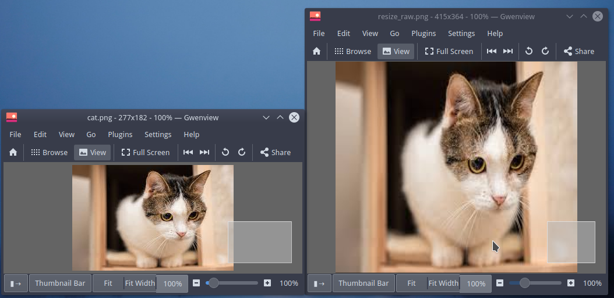

# 缩放 resize

## 利用resize函数实现缩放

 opencv其实有专门进行图像缩放的函数`resize`。

```python
resize(src, dsize[, dst[, fx[, fy[, interpolation]]]]) -> dst
```

**参数解析**

* `src` 输入图片
* `dsize` 输出图片的尺寸  
* `dst` 输出图片
* `fx` x轴的缩放因子
* `fy` y轴的缩放因子
* `interpolation` 插值方式 
  * `INTER_NEAREST` - 最近邻插值
  * `INTER_LINEAR` - 线性插值（**默认**）
  * `INTER_AREA` - 区域插值
  * `INTER_CUBIC` - 三次样条插值
  * `INTER_LANCZOS4` - Lanczos插值


在使用的时候， 我们可以传入指定的图片的尺寸`dsize`

```python
import cv2
import numpy as np

img = cv2.imread('cat.png')
height,width,channel = img.shape

# 声明新的维度
new_dimension = (400, 400)
# 指定新图片的维度与插值算法（interpolation）
resized = cv2.resize(img, new_dimension)

cv2.imwrite('cat_resize_400_400.png', resized)
```


或者指定缩放因子$$f_x, f_y$$

将`dsize` 设置为 `None` 然后指定`fx ` `fy`

```python
import cv2
import numpy as np

img = cv2.imread('cat.png')
height,width,channel = img.shape

# 指定新图片的维度与插值算法（interpolation）
resized = cv2.resize(img, None, fx=1.5, fy=2)

cv2.imwrite('cat_resize_fx_fy.png', resized)
```


或者指定输出图片，并传入输出图片的size。

```python
import cv2
import numpy as np

img = cv2.imread('cat.png')
height,width,channel = img.shape

# 指定输出图片
dst = np.zeros((100, 100, 3), dtype='uint8')

# 指定新图片的维度与插值算法（interpolation）
cv2.resize(img, dst=dst, dsize=(dst.shape[1], dst.shape[0]), fx=1.5, fy=2)

cv2.imwrite('cat_resize_from_dst.png', dst)
```


> 更详细的使用说明见[opencv-resize 文档](https://docs.opencv.org/master/da/d54/group__imgproc__transform.html#ga47a974309e9102f5f08231edc7e7529d)


为了方便使用， 我们也可以将其封装成函数

```python
def resize(image, width = None, height = None, inter = cv2.INTER_AREA):
    dim = None
    (h, w) = image.shape[:2]

    if width is None and height is None:
        return image
    
    if width is None:
        r = height / float(h)
        dim = (int(w * r), height)

    if height is None:
        r = width / float(w)
        dim = (width, int(h * r))
    
    if width and height:
        dim = (width, height)
    
    resized = cv2.resize(image, dim, interpolation = inter)
    return resized
```


分辨率 从**5*5** 放大到**1000*1000**, 选择不同的插值算法，对应的演示效果。


```python
import cv2
import numpy as np
from matplotlib import pyplot as plt

img = np.uint8(np.random.randint(0,255,size=(5,5)))
height,width= img.shape

# 声明新的维度
new_dimension = (1000, 1000)

plt.subplot(231)
plt.title("SRC Image")
plt.imshow(img,cmap='seismic')

plt.subplot(232)
resized = cv2.resize(img, new_dimension, interpolation = cv2.INTER_NEAREST)
plt.title("INTER_NEAREST")
plt.imshow(resized,cmap='seismic')

plt.subplot(233)
resized = cv2.resize(img, new_dimension, interpolation = cv2.INTER_LINEAR)
plt.title("INTER_LINEAR")
plt.imshow(resized,cmap='seismic')

plt.subplot(234)
resized = cv2.resize(img, new_dimension, interpolation = cv2.INTER_AREA)
plt.title("INTER_AREA")
plt.imshow(resized,cmap='seismic')

plt.subplot(235)
resized = cv2.resize(img, new_dimension, interpolation = cv2.INTER_CUBIC)
plt.title("INTER_CUBIC")
plt.imshow(resized,cmap='seismic')

plt.subplot(236)
resized = cv2.resize(img, new_dimension, interpolation = cv2.INTER_LANCZOS4)
plt.title("INTER_LANCZOS4")
plt.imshow(resized,cmap='seismic')

plt.show()
```


------
**!!学霸分割线!!**
如果你对`图像缩放`的数学原理不感兴趣的话,就不需要往下看了.


------


## 利用wrapAffine实现缩放

对图像的伸缩变换的变换矩阵M为
$$
\begin{equation}
{
\left[ \begin{array}{c}
x'\\
y'\\
\end{array} 
\right ]}=
{
\left[ \begin{array}{cc}
f_x & 0\\
0 & f_y\\
\end{array}
\right ]}\times
{
  \left[\begin{array}{c}
  x\\
  y\\
  \end{array}
  \right]
}+
{
   \left[\begin{array}{c}
 0\\
 0\\
  \end{array}
  \right]
}
\end{equation}
$$
其中，$$f_x$$ 代表**x轴的焦距(缩放因子)**， $$f_y$$ 代表**y轴的焦距(缩放因子)**。


$$ x' = f_x * x$$

$$ y' = f_y*y $$


```python
import numpy as np
import cv2

img = cv2.imread('cat.png')

height,width,channel = img.shape

# x轴焦距 1.5倍
fx = 1.5
# y轴焦距 2倍
fy = 2

# 声明变换矩阵 向右平移10个像素， 向下平移30个像素
M = np.float32([[fx, 0, 0], [0, fy, 0]])

# 进行2D 仿射变换
resized = cv2.warpAffine(img, M, (int(width*fx), int(height*fy)))
cv2.imwrite('resize_raw.png', resized)
```


**演示效果**




我们利用`random` 模块生成一个5×5的随机矩阵。

```python
# 生成一个随机噪点
img = np.uint8(np.random.randint(0,255,size=(5,5)))
```

**原图**

```
[[227  66   2 153  30]                                                            
 [  8  23  68  45  91]                                                            
 [194 216 229 128 109]                                                            
 [ 73 111 189 200 111]                                                            
 [ 99  82 217  80  52]] 

```

**缩放后**

```
[[227 121  44   2 101 111  30]                                                    
 [118  70  41  35  77  86  61]                                                    
 [  8  18  38  68  53  61  91]                                                    
 [101 113 129 149 108  91 100]                                                    
 [194 208 220 229 163 121 109]                                                    
 [134 153 179 209 179 145 110]                                                    
 [ 73  98 138 189 196 169 111]                                                    
 [ 86  93 133 203 162 120  82]                                                    
 [ 99  88 128 217 127  70  52]
 [ 50  44  64 109  64  35  26]]
```

为了更加直观的感受， 我们可以进行数据可视化。

我们使用matplotlib进行绘制 resize前与resize之后的图片。


**源代码**

```python
import numpy as np
import cv2
from matplotlib import pyplot as plt
# 生成一个随机噪点
img = np.uint8(np.random.randint(0,255,size=(5,5)))

height,width = img.shape

# x轴焦距 1.5倍
fx = 1.5
# y轴焦距 2倍
fy = 2

# 声明变换矩阵 向右平移10个像素， 向下平移30个像素
M = np.float32([[fx, 0, 0], [0, fy, 0]])

# 进行2D 仿射变换
resized = cv2.warpAffine(img, M, (int(width*fx), int(height*fy)))

print(img)
print(resized)

# 数据可视化
plt.subplot(121)
plt.imshow(img, cmap="gray")
plt.subplot(122)
plt.imshow(resized,cmap="gray")
plt.show()
```