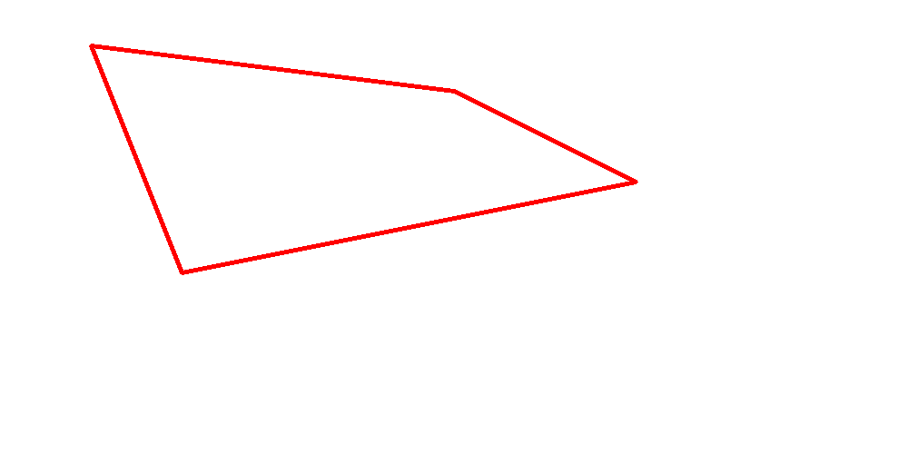

# 多边形绘制(cv2.polylines)

多边形绘制的这个函数比较特殊， 传入的点集需要满足的条件为：维度是`N×1×2`

类似这样：

```
[[[100  50]]

 [[200 300]]

 [[700 200]]

 [[500 100]]]
```

```python
cv2.polylines(img=canvas, pts=[points], isClosed=True, color=(0,0,255), thickness=3)
```

**参数说明**

* `img` 画布
* `pts` 点集
* `isClosed` 是否闭合 ， 如果是闭合的话， 就将第一个与最后一个链接起来。
* `color` 颜色
* `thickness` 宽度， 如果是-1就会填充（如果是闭合图像的话）

**演示例程**



`CH2.3_DrawPolygon.py`

```python
'''
绘制多边形

'''

import cv2
import numpy as np

# 初始化一个空画布 1000×500 三通道 背景色为白色 
canvas = np.ones((500, 1000, 3), dtype="uint8")
canvas *= 255
# 初始化点集
points = np.array([[100,50],[200,300],[700,200],[500,100]], np.int32)
# 点集矩阵变形
points = points.reshape((-1,1,2))
print("points after reshape")
# RESHAPE TO N*1*2
print(points)
'''
[[[100  50]]

 [[200 300]]

 [[700 200]]

 [[500 100]]]
'''

'''
pts : 点集数组
isClosed: 多边形是否闭合
color: 颜色
thickness: 线条宽度
'''
cv2.polylines(canvas, pts=[points], isClosed=True, color=(0,0,255), thickness=3)

cv2.imshow("polylines", canvas)
cv2.imwrite("polylines.png", canvas)

cv2.waitKey(0)
```