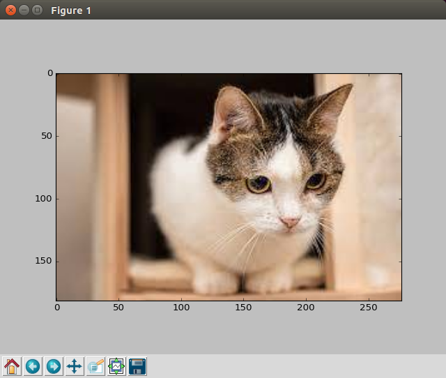

# 显示图片

> TODO 录制视频

阿凯一直在反思之前自己做课程设计的时候的思路，我更倾向于让更多的同学会玩opencv，不能让前期大量的预备知识，把大家吓跑。 所以前期大家在入门的时候 **可以先不掌握numpy与matplotlib**，用阿凯写好的脚本，屏蔽掉这些细节，把精力放在如何用opencv玩上面。**所以，只要你会Python基础，就可以玩计算机视觉啦。**

在`akai_cv_utils.py`工具包中，阿凯声明了一个函数`display_image`，传入image对象，代码会自动判断图像是灰度图还是BGR彩图， 然后通过matplotlib显示图像。 


```python
# -*- coding: utf-8 -*- 
import cv2
from akai_cv_utils import display_image

if __name__ == "__main__":
    # 读入图片 默认是BGR格式
    image = cv2.imread("demo_img.png")
    # 读入图片 灰度图 
    # image = cv2.imread("demo_img.png", cv2.IMREAD_GRAYSCALE)
    display_image(image)
```

