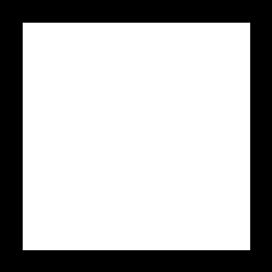
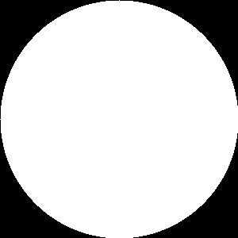
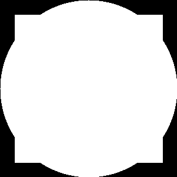
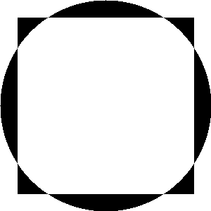

# CH4.6_二值化逻辑运算


## 0. 概述

本节， 阿凯创建了两个二值化图像， 演示了各种二值化运算对应的效果。并给出了详细的二值化逻辑运算对应的真值表(Truth Table)。


## 1. 创建二值化图像

首先我们定义两个图形, 一个是正方形，另外一个为圆形。

中间白色的区域是1 (灰度值为255)

黑色的区域即为0 (灰度值为0)

`图形1 正方形`



```python
rectangle = np.zeros((300, 300), dtype="uint8")
cv2.rectangle(rectangle, (25, 25), (275, 275), 255, -1)
cv2.imwrite("bitwise_rectangle.png", rectangle)
```


`图形2 圆形`



```python
circle = np.zeros((300, 300), dtype="uint8")
cv2.circle(circle, (150, 150), 150, 255, -1)
cv2.imwrite("bitwise_circle.png", circle)
```


然后我们对其进行逻辑运算。


## 2. 逻辑非 - not

**逻辑非**其实也相当于反色。 原来是白色的地方变成黑色， 原来是黑色的地方变成白色。

```python
bitwiseNOT = cv2.bitwise_not(circle)
cv2.imwrite("bitwise_not_circle.png", bitwiseNOT)
```

**真值表**

| A    | not A |
| ---- | ----- |
| 0    | 1     |
| 1    | 0     |

**效果**


## 3. 逻辑与 - and

逻辑与经常被用于遮盖层(MASK), 即去除背景, 选取自己感兴趣的区域.

```python
bitwiseAnd = cv2.bitwise_and(rectangle, circle)
cv2.imwrite("bitwise_and.png", bitwiseAnd)
```

**真值表**

| A    | B    | A AND B |
| ---- | ---- | ------- |
| 0    | 0    | 0       |
| 0    | 1    | 0       |
| 1    | 0    | 0       |
| 1    | 1    | 1       |

**效果**


## 4. 逻辑或 - or

```python
bitwiseOR = cv2.bitwise_or(rectangle, circle)
cv2.imwrite("bitwise_or.png", bitwiseOR)
```

**真值表**

| A    | B    | A OR B |
| ---- | ---- | ------ |
| 0    | 0    | 0      |
| 0    | 1    | 1      |
| 1    | 0    | 1      |
| 1    | 1    | 1      |

**效果**




## 5. 逻辑与非 - nand

```python
bitwiseNAnd = cv2.bitwise_not(bitwiseAnd)
cv2.imwrite("bitwise_nand.png", bitwiseNAnd)
```

**真值表**

| A    | B    | A NOT AND B |
| ---- | ---- | ----------- |
| 0    | 0    | 1           |
| 0    | 1    | 0           |
| 1    | 0    | 0           |
| 1    | 1    | 0           |

**效果**


## 6. 逻辑或非 - nor

```python
bitwiseNOR = cv2.bitwise_and(cv2.bitwise_not(rectangle), cv2.bitwise_not(circle))
cv2.imwrite("bitwise_nor.png", bitwiseNOR)
```

**真值表**

| A    | B    | A NOR B |
| ---- | ---- | ------- |
| 0    | 0    | 1       |
| 0    | 1    | 0       |
| 1    | 0    | 0       |
| 1    | 1    | 0       |

**效果**


## 7. 逻辑异或 - xor

```python
bitwiseXOR = cv2.bitwise_xor(rectangle, circle)
cv2.imwrite("bitwise_xor.png", bitwiseXOR)
```

**真值表**

| A    | B    | A OR B |
| ---- | ---- | ------ |
| 0    | 0    | 0      |
| 0    | 1    | 1      |
| 1    | 0    | 1      |
| 1    | 1    | 0      |

**效果**


##8. 逻辑异或非 - xnor

```python
bitwiseXNOR = cv2.bitwise_or(bitwiseAnd, bitwiseNOR)
cv2.imwrite("bitwise_xnor.png", bitwiseXNOR)
```

**真值表**

| A    | B    | A OR B |
| ---- | ---- | ------ |
| 0    | 0    | 1      |
| 0    | 1    | 0      |
| 1    | 0    | 0      |
| 1    | 1    | 1      |

**效果**




