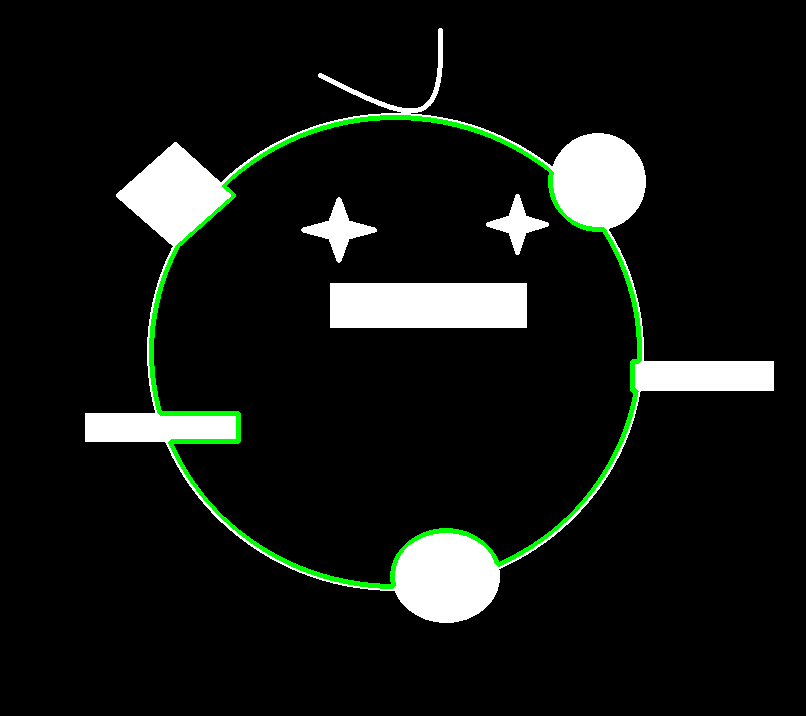

# 连通域的轮廓点集(contours)

首先读入灰度图.

```python
import numpy as np
import cv2
gray = cv2.imread('cute_princess.png', cv2.IMREAD_GRAYSCALE)
```


这幅画是阿凯手绘的, 取名为可爱的小公主.

接下来呢, 我们利用`cv2.findContours` 来寻找二值化图像的轮廓.

如果不是二值化图片而是灰度图的话, opencv会这样处理:

* `0` 如果灰度图该点像素点为0
* `1` 如果是除零以外的其他值


```python
# 获取边缘信息
image, contours, hierarchy = cv2.findContours(image=gray,mode=cv2.RETR_TREE, method=cv2.CHAIN_APPROX_SIMPLE)
```


## 1.参数解析

* `image` 传入的图片

* `mode` 模式选择，检测外轮廓还是内轮廓，是否包含继承（包含）关系等．

  > 关于模式的问题，比较复杂下文还会细讲.

  * `cv2.RETR_EXTERNAL` 只检测外轮廓。忽略轮廓内部的洞。
  * `cv2.RETR_LIST` : 检测所有的轮廓但不建立继承(包含)关系．
  * `cv2.RETR_TREE` 检测所有轮廓，并且建立所有的继承(包含)关系。
  * `cv2.RETR_CCOMP` 检测所有轮廓，但是仅仅建立两层包含关系。

* `method`  边缘记录方法

  * `cv2.CHAIN_APPROX_NONE` 记录边缘所有的点.
  * `cv2.CHAIN_APPROX_SIMPLE ` 仅记录必要的点, 去除所有冗余点.  可以降低内存消耗.

  下面这个图是官网的例子.

  左边是采用`CHAIN_APPROX_NONE` 方法检测到的轮廓点集, 一共734个点.

  右边是采用`CHAIN_APPROX_SIMPLE` 方法检测到的轮廓点集, 一共4个点.

  ​

  


## 2 返回参数

```
image, contours, hierarchy 
```

### 2.1 `image` 灰度图的二值化图像

**如果传入的就是二值化的图像则二者值相同.**


### 2.2 `contours` 轮廓点集数组

> 注意: 该contours样例讲解
>
> 是在 `mode=cv2.RETR_TREE` 与`method=cv2.CHAIN_APPROX_SIMPLE` 条件下获取的.

  

  ```
  [cnt0, cnt1, ...., cntn]
  ```

**contour样例**

  二号点集(**cnt2**)是一个矩形比较简单, 所以我们可以打印出来看一下.

  ```python
  print(contours[2])
  ```

  ```
  [[[330 283]]

   [[330 327]]

   [[526 327]]

   [[526 283]]]
  ```


  

### 2.3 `hierarchy`继承关系矩阵

>**注意**: 该contours样例讲解
>
>是在 `mode=cv2.RETR_TREE` 与`method=cv2.CHAIN_APPROX_SIMPLE` 条件下获取的.


`hierarchy` 返回的是一个矩阵. 1* N * 4 

这里的每一个值代表都是contour的序号(id).  **-1** 代表没有这个元素

```
[[[-1 -1  1 -1]
  [-1 -1  2  0]
  [ 3 -1 -1  1]
  [ 4  2 -1  1]
  [-1  3 -1  1]]]  
```

基础元素由四个值组成.

 **[Next, Previous, First_Child, Parent]**

* `Next` 下一个同级的元素的序号.
* `Previous` 上一个同级元素的序号
* `First_Child` 第一个子元素的序号
* `Parent` 父元素的序号.


> 我们用cnt作为contour的简写.


#### `cnt0` 最外层外轮廓

```python
[-1 -1  1 -1]

Next =-1 		# 最外面的外轮廓.  无同级元素, 所以Next与Previous 均为-1.
Previous = -1
First_Child = 1 # 第一个孩子是cnt1 (也是唯一一个孩子), 所以First_Child 为1.
Parent = -1 	# 因为cnt-0 是老祖宗, 所以没有爸爸, Parent 为-1
```


#### `cnt1` 最外层内轮廓

最外面的内轮廓. 

它的孩子有三个, 两个小星星, 跟一个矩形.

```python
[-1 -1  2  0]

Next =-1 # 没有下一个同级元素
Previous = -1 # 没有上一个同级元素
First_Child = 2 # 第一个孩子是2号轮廓
Parent = 0 # 父亲是0号轮廓

```




#### `cnt2` 矩形嘴巴

```python
[ 3 -1 -1  1]

Next = 3 # 下一个同级元素 cnt3 小星星
Previous = -1 # 上一个同级元素 没有
First_Child = -1 # 没有孩子
Parent = 1 # 父亲是cnt1
```


#### `cnt3` 小星星左眼

```python
[ 4  2 -1  1]

Next = 4 # 下一个同级元素 cnt4 小星星
Previous = 2 # 上一个同级元素 矩形嘴巴
First_Child = -1 # 没有孩子
Parent = 1 # 父亲是cnt1
```


#### `cnt4` 小星星右眼

```python
[-1  3 -1  1]

Next = -1 # 下一个同级元素 无
Previous = 3 # 上一个同级元素 左眼
First_Child = -1 # 没有孩子
Parent = 1 # 父亲是cnt1
```


