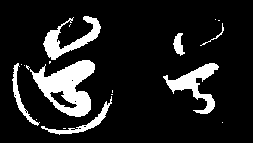
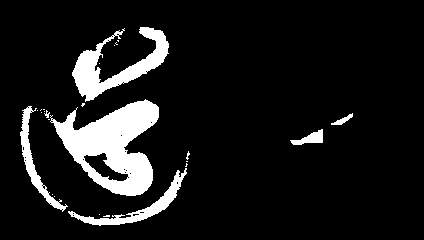

# 腐蚀(erode) 

**腐蚀是一个软弱无能的亡国君.**

何为腐蚀, 腐蚀在于消除一些孤立点, 消除一些边界点. 使边界向内收缩. 我们可以借用腐蚀来消除无意义的小点.

那么腐蚀是如何实现的呢?

首先我们需要确定一个**核 kernel** ， 明确核的尺寸与核取值. 

还记得我们之前提到过的**卷积核**么, 其实是一个东西, 只不过数学形态学的操作不是线形的. 

例如我们确定好这个核的尺寸为`3*3` . 在opencv中核又被称之为**结构元素**。

用结构元素与其覆盖的二值图像做**与 and**操作
如果都为1，结果图像的该像素为1。否则为0。

简单来讲, 如果一个点周边所有点与其本身, **只要这里面有一个0, 它就会被视作为0.**


> 如何选取合适的核?
>
> 这个根据图像的图像质量, 分辨率, 应用场景不同， 因图而异。 你需要去尝试取不同的值

那么我们执行腐蚀操作, 最直观的感觉就是二值化图像向内缩减了一圈.

如果你取的核越大, 腐蚀效果越强.


在opencv中我们腐蚀要使用`erode`函数. 我们需要新建一个核.

```python
kernel = np.ones((5,5), np.uint8)
```

然后将核传入`erode`函数:

```python
erorsion_img = cv2.erode(img, kernel, iterations=1)
```

其中`iterations` 指的是迭代的次数.


**源代码** `CH4.5_erosion.py`

```python
'''
    数学形态学 腐蚀 erorsion
'''
import cv2
import numpy as np

# 读入灰度图
img = cv2.imread("dao-bin.png", flags=cv2.IMREAD_GRAYSCALE)

# 创建 核
kernel = np.ones((5,5), np.uint8)
# 腐蚀
erorsion_img = cv2.erode(img, kernel, iterations=1)

cv2.imwrite('dao_erorsion_k5.png', np.hstack((img, erorsion_img)))
```


**迭代次数**`1`


这个是实际的运行效果.  `道` 的笔触变得细腻了. 粗糙的边缘减少了. 向内缩减了一圈. 同时我们可以看到, 白色区域原来一个小黑点, 经过腐蚀就会变成一个大黑点.


**迭代次数**`2`




**迭代次数**`3`


**迭代次数**`5`




随着迭代次数的增加, 我们可以看到, 原来连通的图像, 被逐渐腐蚀, 变成一个个独立的连通域**孤岛** 最后逐渐消亡. 

**这就像一个没落的帝国, 逐渐消亡的过程, 自己的地盘被一点点吞噬.**
