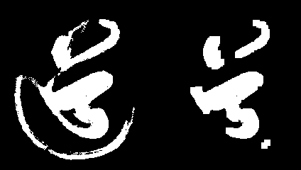

# 开运算(opening)

**开运算是奋力抵抗的亡国君**

**开运算(opening)** 等于对图像先进行**腐蚀(erode)** 然后进行**膨胀(dilate)**. 

开运算其主要作用**与腐蚀相似**，与腐蚀操作相比，具有可以基本保持目标原有**大小不变**的优点。 


通常用于去除小粒噪声。

援引官网的例子, 你可以看到, 开运算去除背景噪点的功效.


在opencv中实现开运算, 我们要通过`morphologyEx(img, cv2.MORPH_OPEN, kernel)` 数学形态学扩展实现开运算.

```python
opening = cv2.morphologyEx(img, cv2.MORPH_OPEN, kernel)
```


**源代码** `CH4.5_opening.py`

```python
'''
    数学形态学 开运算 opening
'''
import cv2
import numpy as np

# 迭代次数
iter_time = 4
# 读入灰度图
img = cv2.imread("dao-bin.png", flags=cv2.IMREAD_GRAYSCALE)

# 创建 核
kernel = np.ones((5,5), np.uint8)
# 开运算
opening_img = cv2.morphologyEx(img, cv2.MORPH_OPEN, kernel,iterations=iter_time)

cv2.imwrite('dao_opening_k5_iter%d.png'%(iter_time), np.hstack((img, opening_img)))
```


**迭代次数**`1`


**迭代次数**`2`




**迭代次数**`3`


**迭代次数**`4`


**迭代次数**`5`


这些操作, 映证了之前我们讲过的一句话.

> 开运算其主要作用**与腐蚀相似**

有心的同学, 你可以比对一下, 腐蚀与开运算不同迭代次数的对比.  消退的趋势是一致的。

只不过, 开运算得到的图像线条更粗一些. 

