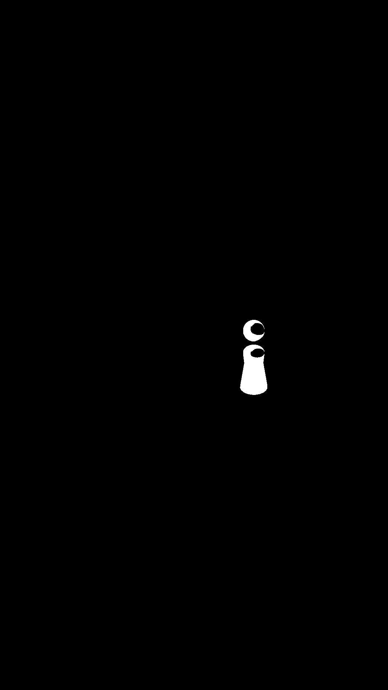
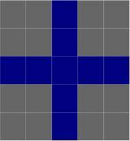

# 课后习题


## TASK01

利用腐蚀跟膨胀运算, 实现开运算与闭运算. 并给出相关代码.


## TASK02

利用以上介绍的数学形态学方法. 将二值化图像中棋子的头部与身体部分连接在一起, 体积尽量不变.




## TASK03

了解另外两种数学形态学方法, **顶帽 top-hat** 跟**黑帽 black-hat**

理解其作用, 并给出样例代码与应用实例.


## TASK04

了解`cv2.getStructuringElement` 函数, 搜集opencv中支持的核的形状.

并重复此篇文章进行的操作, 看换用不同类型的核都有哪种不同的效果, **什么情况下应该使用哪种核?**

> 当然你也可以使用numpy自己创建特定形状的核.


**举例: 十字形状的核**




```python
element = cv2.getStructuringElement(cv2.MORPH_CROSS,(5,5))  
```

```
[[0 0 1 0 0]  
 [0 0 1 0 0]  
 [1 1 1 1 1]  
 [0 0 1 0 0]  
 [0 0 1 0 0]]  
```
