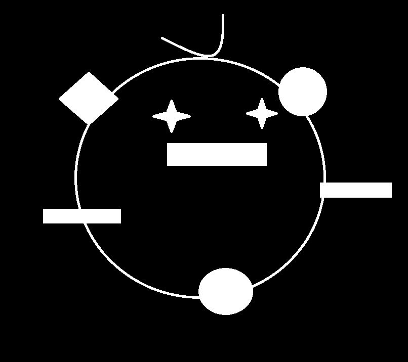
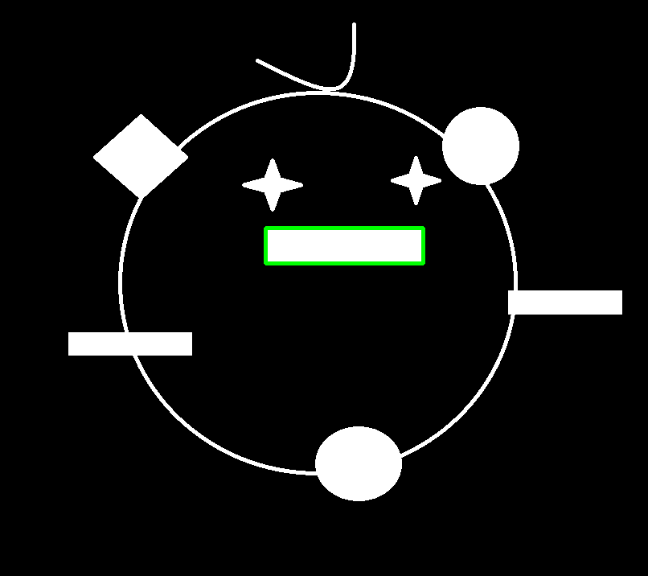

# 连通域的轮廓点集(contours)

首先读入灰度图.

```python
import numpy as np
import cv2
gray = cv2.imread('cute_princess.png', cv2.IMREAD_GRAYSCALE)
```




这幅画是阿凯手绘的, 取名为可爱的小公主.

接下来呢, 我们利用`cv2.findContours` 来寻找二值化图像的轮廓.

如果不是二值化图片而是灰度图的话, opencv会这样处理:

* `0` 如果灰度图该点像素点为0
* `1` 如果是除零以外的其他值


```python
# 获取边缘信息
image, contours, hierarchy = cv2.findContours(image=gray,mode=cv2.RETR_TREE, method=cv2.CHAIN_APPROX_SIMPLE)
```


## 1.参数解析

* `image` 传入的图片

* `mode` 模式选择，检测外轮廓还是内轮廓，是否包含继承（包含）关系等．

  > 关于模式的问题，比较复杂下文还会细讲.

  * `cv2.RETR_EXTERNAL` 只检测外轮廓。忽略轮廓内部的洞。
  * `cv2.RETR_LIST` : 检测所有的轮廓但不建立继承(包含)关系．
  * `cv2.RETR_TREE` 检测所有轮廓，并且建立所有的继承(包含)关系。
  * `cv2.RETR_CCOMP` 检测所有轮廓，但是仅仅建立两层包含关系。

* `method`  边缘记录方法

  * `cv2.CHAIN_APPROX_NONE` 记录边缘所有的点.
  * `cv2.CHAIN_APPROX_SIMPLE ` 仅记录必要的点, 去除所有冗余点.  可以降低内存消耗.

  下面这个图是官网的例子.

  左边是采用`CHAIN_APPROX_NONE` 方法检测到的轮廓点集, 一共734个点.

  右边是采用`CHAIN_APPROX_SIMPLE` 方法检测到的轮廓点集, 一共4个点.

  ​

  


## 2 返回参数

```
image, contours, hierarchy 
```

### 2.1 `image` 灰度图的二值化图像

**如果传入的就是二值化的图像则二者值相同.**


### 2.2 `contours` 轮廓点集数组

> 注意: 该contours样例讲解
>
> 是在 `mode=cv2.RETR_TREE` 与`method=cv2.CHAIN_APPROX_SIMPLE` 条件下获取的.

  

  ```
  [cnt0, cnt1, ...., cntn]
  ```

**contour样例**

  二号点集(**cnt2**)是一个矩形比较简单, 所以我们可以打印出来看一下.

  ```python
  print(contours[2])
  ```

  ```
  [[[330 283]]

   [[330 327]]

   [[526 327]]

   [[526 283]]]
  ```




  
