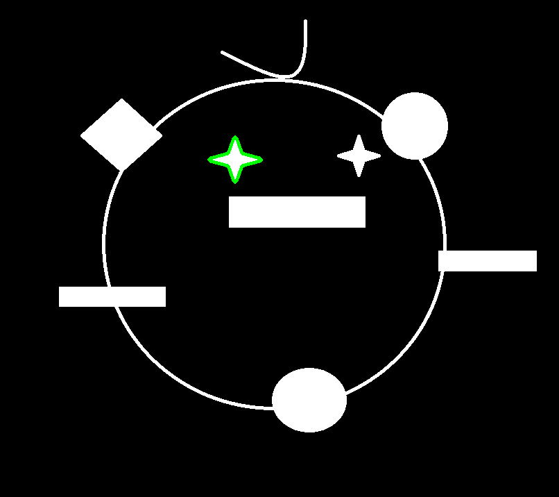
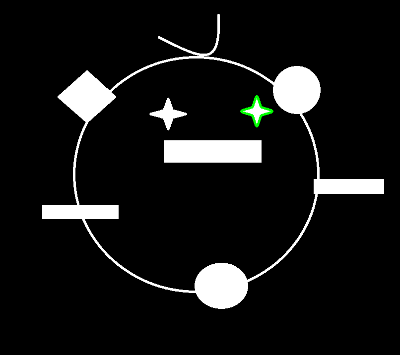

# 连通域的继承关系矩阵`hierarchy`


>**注意**: 该contours样例讲解
>
>是在 `mode=cv2.RETR_TREE` 与`method=cv2.CHAIN_APPROX_SIMPLE` 条件下获取的.


`hierarchy` 返回的是一个矩阵. 1* N * 4 

这里的每一个值代表都是contour的序号(id).  **-1** 代表没有这个元素

```
[[[-1 -1  1 -1]
  [-1 -1  2  0]
  [ 3 -1 -1  1]
  [ 4  2 -1  1]
  [-1  3 -1  1]]]  
```

基础元素由四个值组成.

 **[Next, Previous, First_Child, Parent]**

* `Next` 下一个同级的元素的序号.
* `Previous` 上一个同级元素的序号
* `First_Child` 第一个子元素的序号
* `Parent` 父元素的序号.


> 我们用cnt作为contour的简写.


## `cnt0` 最外层外轮廓

```python
[-1 -1  1 -1]

Next =-1 		# 最外面的外轮廓.  无同级元素, 所以Next与Previous 均为-1.
Previous = -1
First_Child = 1 # 第一个孩子是cnt1 (也是唯一一个孩子), 所以First_Child 为1.
Parent = -1 	# 因为cnt-0 是老祖宗, 所以没有爸爸, Parent 为-1
```


## `cnt1` 最外层内轮廓

最外面的内轮廓. 

它的孩子有三个, 两个小星星, 跟一个矩形.

```python
[-1 -1  2  0]

Next =-1 # 没有下一个同级元素
Previous = -1 # 没有上一个同级元素
First_Child = 2 # 第一个孩子是2号轮廓
Parent = 0 # 父亲是0号轮廓

```


## `cnt2` 矩形嘴巴

```python
[ 3 -1 -1  1]

Next = 3 # 下一个同级元素 cnt3 小星星
Previous = -1 # 上一个同级元素 没有
First_Child = -1 # 没有孩子
Parent = 1 # 父亲是cnt1
```


## `cnt3` 小星星左眼

```python
[ 4  2 -1  1]

Next = 4 # 下一个同级元素 cnt4 小星星
Previous = 2 # 上一个同级元素 矩形嘴巴
First_Child = -1 # 没有孩子
Parent = 1 # 父亲是cnt1
```




## `cnt4` 小星星右眼

```python
[-1  3 -1  1]

Next = -1 # 下一个同级元素 无
Previous = 3 # 上一个同级元素 左眼
First_Child = -1 # 没有孩子
Parent = 1 # 父亲是cnt1
```



