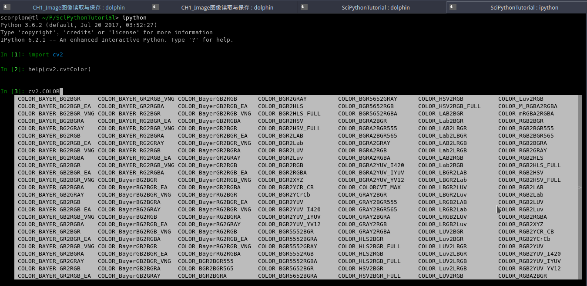

# 颜色空间变换cvtColor

> TODO 添加一个从彩图转变为灰度图的映射
>
> YUV LAB可视化


我们在做图像处理的时候，或者是显示图像的时候，经常需要从一个颜色空间变换为另外一个颜色空间。
阿凯在这里以RGB与BGR颜色空间的转换为例演示使用`cvtColor`函数实现颜色空间的变换。
使用方法如下

```python
newImg = cv2.cvtColor(img, cv2.COLOR_BGR2RGB)
```

传入的`img`就是源图像, 然后你要告诉`cvtColor`函数, 从哪个格式转变成另外哪种格式的图片. 

`2` 在编程里经常被用作`to`的意思, to 转变为的意思. `COLOR_BGR2RGB` 的含义是从BGR颜色空间转变为RGB颜色空间.

那么如何才能知道opencv都支持哪些颜色空间的转换呢?

大家不妨跟阿凯一起打开`ipython` 的终端, 然后引入`cv2`模块, 敲入`cv2.COLOR_` 然后按`Tab`键,  ipython会提示,所有以cv2.COLOR_开头的变量, 哇, 好多诶, 不着急, 我们现在只需要用到其中几个.

> 阿凯好像经常说别着急, 慢慢学之类的话, 是不是?
>
> 学习真的急不得, 以前我就是这么急躁的一个人.欲速则不达. 

阿凯还需要你再注意另外一个`cv2.COLOR_BGR2GRAY` 就是将BGR格式的图片转变为灰度图.



