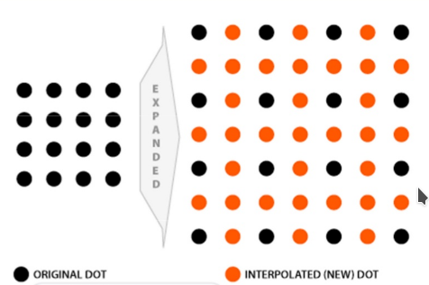
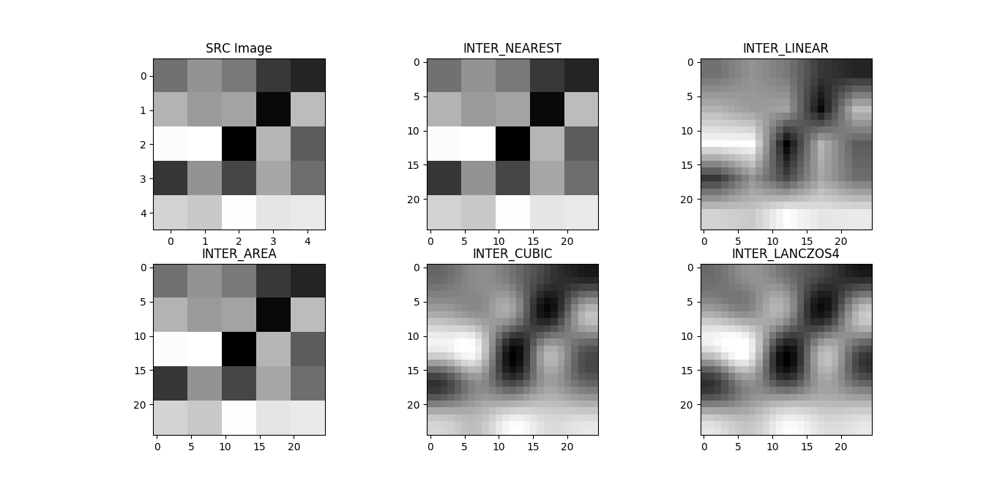
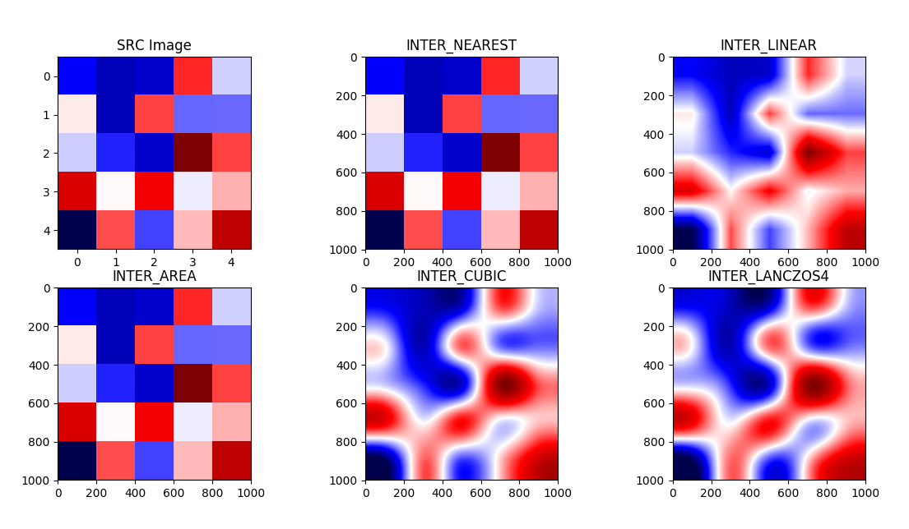
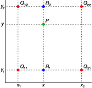
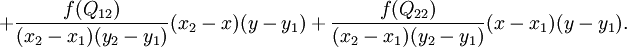
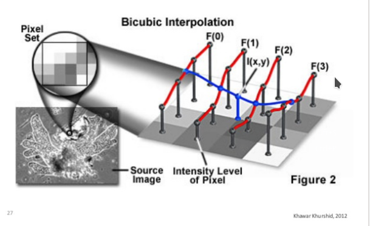
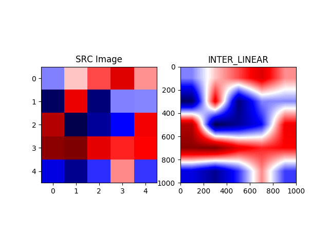

# 插值算法解析

注： 未完成 仅供参考


## 概述

在CH5.3 图像2D仿射变换一章里， 我们介绍了resize中有若干个插值算法，本节， 阿凯将讲解各种插值算法的实现过程。


## 何为插值?

一个图片从**4×4** 放大到**8*8**的时候， 就会产生一些**新的像素点**（ 如下图红点所示），

如何给这些值赋值， 就是`interpolation` 插值所要解决的问题。





## 插值方法一览

全部的插值方式 请见文档 [InterpolationFlags](https://docs.opencv.org/master/da/d54/group__imgproc__transform.html#ga5bb5a1fea74ea38e1a5445ca803ff121)

这里我们只讲解五个插值方式。 我们随机生成一个5×5的矩阵， 然后用下面五种方式进行插值， 效果如图所示：




```python
import cv2
import numpy as np
from matplotlib import pyplot as plt


img = np.uint8(np.random.randint(0,255,size=(5,5)))
height,width= img.shape


# 声明新的维度
new_dimension = (25, 25)

plt.subplot(231)
plt.title("SRC Image")
plt.imshow(img,cmap='gray')

plt.subplot(232)
resized = cv2.resize(img, new_dimension, interpolation = cv2.INTER_NEAREST)
plt.title("INTER_NEAREST")
plt.imshow(resized,cmap='gray')


plt.subplot(233)
resized = cv2.resize(img, new_dimension, interpolation = cv2.INTER_LINEAR)
plt.title("INTER_LINEAR")
plt.imshow(resized,cmap='gray')


plt.subplot(234)
resized = cv2.resize(img, new_dimension, interpolation = cv2.INTER_AREA)
plt.title("INTER_AREA")
plt.imshow(resized,cmap='gray')


plt.subplot(235)
resized = cv2.resize(img, new_dimension, interpolation = cv2.INTER_CUBIC)
plt.title("INTER_CUBIC")
plt.imshow(resized,cmap='gray')


plt.subplot(236)
resized = cv2.resize(img, new_dimension, interpolation = cv2.INTER_LANCZOS4)
plt.title("INTER_LANCZOS4")
plt.imshow(resized,cmap='gray')

plt.show()
```

为了更加直观的观察，我们将`cmap` 换为`seismic`  分辨率 从**5*5** 放大到**1000*1000**





```python
import cv2
import numpy as np
from matplotlib import pyplot as plt


img = np.uint8(np.random.randint(0,255,size=(5,5)))
height,width= img.shape


# 声明新的维度
new_dimension = (1000, 1000)

plt.subplot(231)
plt.title("SRC Image")
plt.imshow(img,cmap='seismic')

plt.subplot(232)
resized = cv2.resize(img, new_dimension, interpolation = cv2.INTER_NEAREST)
plt.title("INTER_NEAREST")
plt.imshow(resized,cmap='seismic')


plt.subplot(233)
resized = cv2.resize(img, new_dimension, interpolation = cv2.INTER_LINEAR)
plt.title("INTER_LINEAR")
plt.imshow(resized,cmap='seismic')


plt.subplot(234)
resized = cv2.resize(img, new_dimension, interpolation = cv2.INTER_AREA)
plt.title("INTER_AREA")
plt.imshow(resized,cmap='seismic')


plt.subplot(235)
resized = cv2.resize(img, new_dimension, interpolation = cv2.INTER_CUBIC)
plt.title("INTER_CUBIC")
plt.imshow(resized,cmap='seismic')


plt.subplot(236)
resized = cv2.resize(img, new_dimension, interpolation = cv2.INTER_LANCZOS4)
plt.title("INTER_LANCZOS4")
plt.imshow(resized,cmap='seismic')

plt.show()
```


关于插值方式的不同与缩放因子的不同对应的时间消耗， 可以查阅下表：


## 最近邻插值 INTER_NEAREST


最近邻插值法， 找到与之距离最相近的邻居（原来就存在的像素点， 黑点）， 赋值与其相同。


> 问题 如果距离四个点都相等（中心处）要如何处理？


**效果展示**


## 线性插值（**默认**）INTER_LINEAR

这里的线形插值`INTER_LINEAR` 其实是`Bi-Linear Interpolation` 


我们先来看一个简单的**一维线形插值**的例子。

已知两点（红色） ，在给出一个蓝点的x坐标， 求y。

所以需要根据两个红点确定一条直线，求出直线的表达式， 然后再将x坐标带进去。


接下来我们来看`Bi-Linear Interpolation` 的例子。





下图中 $P$ 点$(x,y)$周围有
$$
Q{11} = (x_1, y_1), Q{12} = (x_1, y_2), Q{21} = (x_2,y_1), Q{22} = (x_2, y_2)
$$
四个点．

又假定我们已知函数$$f(x_n, y_n)$$在四个点的取值， 现在需要我们求$$f(P) = f(x,y)$$

思路是我们可以将求解过程分解为两次插值过程。

首先在x轴方向上进行插值，根据点$$Q_{11},1 Q_{21}$$ 的取值求得$$f(R_1)$$,  根据点$$Q_{12}, Q_{22}$$ 的取值求得$$f(R_2)$$.

然后在y轴方向上进行插值， 根据点$$R_1, R_2$$ 的取值求得f(P).


$$
R_1 = (x, y_1)
$$

$$
f(R1) = (x-x_1)/ (x_2-x_1)* f(Q{11}) + (x_2-x)/(x_2-x_1)*f(Q{21})
$$

$$
R_2 = (x, y_2)
$$

$$
f(R2) = (x-x_1)/ (x_2-x_1)* f(Q{12}) + (x_2-x)/(x_2-x_1)*f(Q{22})
$$


**这本质上就是加权平均。以x点到$$x_1, x_2$$ 的距离作为权值，来表示该点受周边两点的影响。**

$$P = (x, y)$$

$$f(P) = (y - y1)/(y2 - y1) * f(R_1) + (y2- y)/(y2-y1) *f(R_2)$$

展开后得到





**不知道你有没有发现， 实际上P点的值， 等于周边四点值根据与P点形成的对角矩形面积的加权平均。**





**效果展示**




## 区域插值  INTER_AREA 


## 三次样条插值 INTER_CUBIC


由相邻的4*4像素计算得出，公式类似于双线性.


## Lanczos插值 INTER_LANCZOS4


兰索斯插值：由相邻的8*8像素计算得出，公式类似于双线性


## Reference

[02 sampling quantization interpolation](https://www.slideshare.net/LalSaid/02-sampling-quantization-interpolation)

> **插值部分讲解的原理图片，主要来自与此课件**


[Neighborhood Operations - ENDS489 Course Notes - Fall 2000 Section 1-8](http://www.viz.tamu.edu/faculty/parke/ends489f00/notes/sec1_8.html)


[双线性插值(Bilinear Interpolation)](http://www.cnblogs.com/xpvincent/archive/2013/03/15/2961448.html)

[三次样条插值(Cubic Spline Interpolation)及代码实现(C语言)](http://www.cnblogs.com/xpvincent/archive/2013/01/26/2878092.html)


[Comparison of OpenCV Interpolation Algorithms](http://tanbakuchi.com/posts/comparison-of-openv-interpolation-algorithms/)

> 插值算法性能对比来自于此文章


[小强学Python+OpenCV之－1.4.1平移、旋转、缩放、翻转－之实践](http://blog.csdn.net/eric_pycv/article/details/72636785?locationNum=15&fps=1)

> 博客里提到了各种插值算法的运算速度与选择。
>
> 

​

