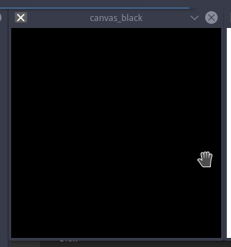
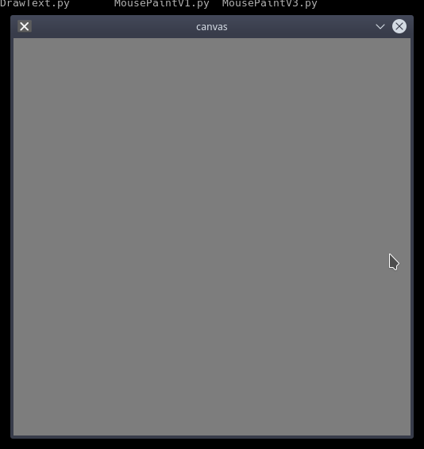

# 创建空白画布


## 0. 概要
阿凯在这篇文章中给大家讲解了如何分别用numpy的方法, 与numpy与cv2结合的方法创建空白画布, 创建白色画布, 与创建彩色画布. 本节实际上同时也帮大家回顾了`numpy` 的一些常用的功能.

本节阿凯还介绍了cv2进行通道分割`cv2.split`与通道合并`cv2.merge`的两个函数.

## 1. 创建一个空白画布

创建空白画布的函数,成品如下:

```python
def InitCanvas(width, height, color=(255, 255, 255)):
    canvas = np.ones((height, width, 3), dtype="uint8")
    canvas[:] = color
    return canvas
```

调用的时候传入图像的宽度与高度,还有画布的颜色即可. 例如创建一个800*600 颜色为纯黑色的画布:
```python
canvas = InitCanvas(800, 600, color=(255,255,255))
```



**如果你不想深究numpy的ndarray数据结构的索引与赋值的话,下面的内容不需要阅读.**

-----

学霸的神奇的分割线

-----


我们在使用画图工具的时候, 第一件事情就是创建一个新的空白画布, 我们可以指定画布的大小, 跟颜色.

**那我们如何使用opencv来创建一个空白的画布(值相同的图片) ?**

还记得我们在讲解image的数据结构的时候, 提到过`python-opencv`上的图片，本质上就是`numpy`里面的`ndarray`的对象吗? 创建一个画布本质上就是创建一个同等规格的`ndarray`

创建一个新的特定尺寸的`ndarray`我们可以使用`np.zeors` 函数, 我们将图像的高度(height), 图像的宽度(width), 以及图像的通道数`channel` 以`tuple` 类型传入`np.zeros` . **再次声明是tuple类型**

另外由于不是所有的numpy类型的数值, 都可以放到opencv中进行图像处理.

数值取值范围在0-255, 我们需要指定数据类型为`uint8` unsigned integer 8-bit

```python
np.zeros((height, width, channels), dtype="uint8")
```

所有的像素点的值, 都是0, 那么其实也就是纯纯的黑色. 我们新建了一个黑色背景的画布.


举个例子, 我们想创建一个800 x 600  x 3 的图片, 我们就得这么写: 

一个BGR格式的图像, 

```python
# 初始化一个空画布 300×300 三通道 背景色为黑色 
canvas_black = np.zeros((600, 800, 3), dtype="uint8")
```

**注意 height写在前面** 图像数据结构, 记不牢靠的同学, 请复习教程: 

[CH1.1_读入图片并显示图片的相关属性-阿凯带你玩转opencv](http://www.myfange.com/p/opencv-imread-propoerty)

有时候我们也可以偷懒, 如果我们想创建与另外一个图像尺寸相同的画布的时候, 我们可以使用`np.zeros_like`

```python
canvas_black = np.zeros_like(img)
```

## 2. 初始化白色的画布

emmm, 老是黑色的背景, 总给人一种很压抑的感觉. 

那么有没有一种好的方法, 可以让我自定义颜色 ? 

首先我想到的是白色, 又因为比较简单, 三个通道的值都相同.

>  ps: 其实灰色的图片(GRAY2BGR), 三个通道的值都相同.


那么我们创建一个全都是1的矩阵, 然后,乘上某个数值, 问题是不是就解决了.

我们需要用到`np.ones` 函数

```python
# 初始化一个空画布 300×300 三通道 背景色为白色 
canvas_white = np.ones((300, 300, 3), dtype="uint8")
```

接下来, 需要乘上一个整数, `255` (你可以填入0-255的任意值)

```python
canvas_white *= 255
```

还记得阿凯在`numpy`教程里面,称这种运算为什么运算么?

这种运算称之为 **全局乘法** , 忘记的同学, 赶紧复习一下**全局函数 ufunc** 的概念.

[Numpy快速入门-阿凯带你玩转Python科学计算](http://www.myfange.com/p/numpy-quick-start)

## 3. 初始化彩色的画布

### 3.1 利用cv2的内置方法merge与split

初始化画布有两种方法. 一种方法, 是我们初始化BGR的图片`canvas_white` 之后将原来的图片进行通道分离. 分别乘上BGR三个通道的整数值, 然后将三个通道合并在一起. 就得到我们想要的彩图纯色背景.

那通道的分离我们需要用到的函数是`cv2.split(img)`.

```python
# 将原来的三个通道抽离出来， 分别乘上各个通道的值
(channel_b, channel_g, channel_r) = cv2.split(canvas)
```

`channel_b` 蓝色通道, `channel_g` 绿色通道, `channel_r` 红色通道, 都是二维的ndarray对象. 

我们指定一种颜色, 例如 `color =  (100, 20, 50))`

**注意, 我们这里的颜色指的BGR格式**

也就是 

```
B -> 100
G -> 20
R -> 50
```

接下来我们分别将其乘上对应的值.

```python
# 颜色的值与个通道的全1矩阵相乘
channel_b *= color[0]
channel_g *= color[1]
channel_r *= color[2]
```

接下来我们将三个通道重新合并, 需要用到的函数是`cv2.merge`

```python
cv2.merge([channel_b, channel_g, channel_r])
```

注意,三个通道的矩阵, 以list `[]` 的方式, 传入merge函数.

综合起来, 就是我们的第一个初始化彩色背景的函数: 

```python
# 初始化一个彩色的画布 - cv2版本
def InitCanvasV1(width, height, color=(255, 255, 255)):
    canvas = np.ones((height, width, 3), dtype="uint8")
    
    # 将原来的三个通道抽离出来， 分别乘上各个通道的值
    (channel_b, channel_g, channel_r) = cv2.split(canvas)
    # 颜色的值与个通道的全1矩阵相乘
    channel_b *= color[0]
    channel_g *= color[1]
    channel_r *= color[2]

    # cv.merge 合并三个通道的值
    return cv2.merge([channel_b, channel_g, channel_r])
```

**此函数使用 cv2.split 非常耗时 所以只有在需要的时候才能做到。 否则用Numpy索引。**

### 3.2 利用numpy内置的索引

使用numpy原生的方法, 性能会比opencv中的要好. 我们直接使用numpy的`ndarray`的索引的方法.

例如 `canvas[:,:,0] ` 选中的是, 所有行, 所有列, 像素元素的第一个值, 也就是, 所有B通道的值. 

然后对其进行赋值: 

```python
canvas[:,:,0] = color[0]
```

对numpy索引方式, 忘掉的朋友, 回顾一下教程吧.


[Numpy快速入门-阿凯带你玩转Python科学计算](http://www.myfange.com/p/numpy-quick-start) 

在教程中搜索 切片 slicing , 两者其实是一个东西.

完整版本的函数如下: 

```python
'''
初始化一个彩色的画布 - numpy版本
使用numpy的索引　赋值
'''
def InitCanvasV2(width, height, color=(255, 255, 255)):
    canvas = np.ones((height, width, 3), dtype="uint8")
    # Blue 
    canvas[:,:,0] = color[0]
    # Green
    canvas[:,:,1] = color[1]
    # Red
    canvas[:,:,2] = color[2]

    return canvas
```

实际上我们还有更快的方法, 可以实现这个功能, 这就需要你熟练掌握**Numpy**的使用技巧.

我们可以直接赋值color

```python
canvas[:] = color
```

完整的函数如下, 这是我们的第三个版本.

```python
def InitCanvasV3(width, height, color=(255, 255, 255)):
    canvas = np.ones((height, width, 3), dtype="uint8")
    canvas[:] = color
    return canvas
```

## 4. 综合实验-初始化背景

在这个综合实验里, 阿凯会分别用上述的方法, 创建黑色背景, 白色背景, 彩色背景.


```python
'''
初始化一个空白的画布
并指定画布的颜色
'''

import cv2
import numpy as np

# 初始化一个空画布 300×300 三通道 背景色为黑色 
canvas_black = np.zeros((300, 300, 3), dtype="uint8")
cv2.imshow("canvas_black", canvas_black)

# 初始化一个空画布 300×300 三通道 背景色为白色 
canvas_white = np.ones((300, 300, 3), dtype="uint8")
canvas_white *= 255

cv2.imshow("canvas_white", canvas_white)

'''
初始化一个彩色的画布 - cv2版本
此函数使用 cv2.split 非常耗时 所以只有在需要的时候才能做到。 否则用Numpy索引。

'''
def InitCanvasV1(width, height, color=(255, 255, 255)):
    canvas = np.ones((height, width, 3), dtype="uint8")
    
    # 将原来的三个通道抽离出来， 分别乘上各个通道的值
    (channel_b, channel_g, channel_r) = cv2.split(canvas)
    # 颜色的值与个通道的全1矩阵相乘
    channel_b *= color[0]
    channel_g *= color[1]
    channel_r *= color[2]

    # cv.merge 合并三个通道的值
    return cv2.merge([channel_b, channel_g, channel_r])

'''
初始化一个彩色的画布 - numpy版本
使用numpy的索引　赋值
'''
def InitCanvasV2(width, height, color=(255, 255, 255)):
    canvas = np.ones((height, width, 3), dtype="uint8")
    # Blue 
    canvas[:,:,0] = color[0]
    # Green
    canvas[:,:,1] = color[1]
    # Red
    canvas[:,:,2] = color[2]

    return canvas

'''
初始化终极版本

熟练掌握 numpy 才可以提高工作效率哦
'''
def InitCanvasV3(width, height, color=(255, 255, 255)):
    canvas = np.ones((height, width, 3), dtype="uint8")
    canvas[:] = color
    return canvas

# 初始化一个彩色的画布
canvas_color = InitCanvasV2(300, 300, color=(100, 20, 50))
cv2.imshow("canvas_color", canvas_color)

# 等待e键按下 关闭所有窗口
while cv2.waitKey(0) != ord('e'):
    continue
cv2.destroyAllWindows()
```

## 5. 作业-CH2.1

阿凯这里教大家如何创建一个三通道的画布, 那么灰度图的画布你会创建么?



阿凯给你提供一个代码模板, 请填入关键的函数.

```python
import numpy as np
import cv2

# 初始化灰度图的画布
def createGrayscaleCanvas(width, height, color=255):
    '''
    请在这里填入代码
    '''
    return canvas

# 创建一个颜色为125的灰度图
canvas = createGrayscaleCanvas(500, 500, color=125)
# 展示画布
cv2.imshow("canvas", canvas)
# 中断
cv2.waitKey(0)
# 关闭窗口
cv2.destroyAllWindows()
```

