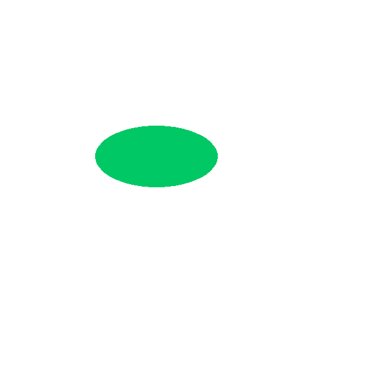

# 椭圆形绘制(cv2.ellipse)

```python
cv2.ellipse(img=canvas,center=(256,256), axes=(100,50), angle=0, startAngle=0, endAngle=360, color=(100, 200, 0), thickness=-1)
```

**参数说明**

* `img` 图像
* `center` 椭圆中心
* `axes` （长轴长度， 短轴长度）
* `angle` 旋转角度
* `startAngle` 开始角度
* `endAngle` 结束角度
* `color` 颜色
* `thickness` 边的宽度， -1代表填充

**例程演示**



`CH2.3_DrawEllipse.py`

```python

import cv2
import numpy as np

# 初始化一个空画布 300×300 三通道 背景色为白色 
canvas = np.ones((600, 600, 3), dtype="uint8")
canvas *= 255

'''

(256,256) - location (x, y)
    椭圆的中心点
(100, 50) - axes length (major axis length, minor axis length)
    100: 椭圆的长轴长度， 50 短轴长度
0 - Angle
    椭圆旋转的角度，逆时针方向
0 - startAngle
    椭圆的开始角度
360 - endAngle
    椭圆的结束角度
    360 代表绘制一个完整的椭圆
    180 则是椭圆的一半
(100, 200, 0) - color
    颜色
-1 - thickness
    边缘宽度
    -1 代表填充

'''
cv2.ellipse(img=canvas,center=(256,256), axes=(100,50), angle=0, startAngle=0, endAngle=360, color=(100, 200, 0), thickness=-1)

cv2.imshow("draw_ellipse", canvas)
cv2.imwrite("draw_ellipse.png", canvas)
cv2.waitKey(0)

```