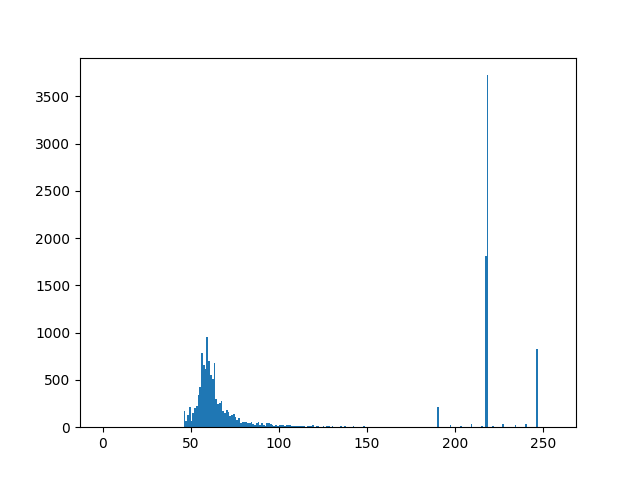
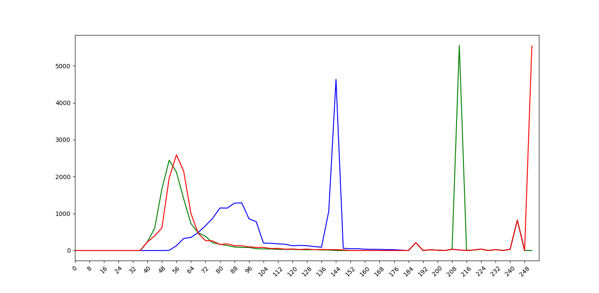
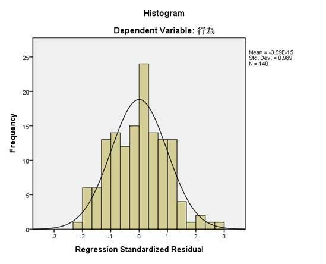

# 颜色统计与分布曲线绘制


## 概述

在`4.1` 中我们截取了棋子的图像. 

现在我们就要对这个图像进行统计.并绘制棋子的色彩统计图.


## 目标图像


## 绘制灰度图的统计直方图

之前我们在`CH1.2`节简单讲了一下matplotlib展示图片的用法.

[CH1.2_通过Matplotlib展示图片](http://www.1zlab.com(网站备案中)/p/opencv-matplotlib-image-show)

在这一章我们继续学习, 利用matploblib绘制统计直方图.

我们需要借助matploblib的[matplotlib.pyplot.hist](https://matplotlib.org/devdocs/api/_as_gen/matplotlib.pyplot.hist.html) 这个函数, 你可以点击链接查看其api文档.


首先我们将图片读入为`img`, 然后转换为灰度图`gray`.

然后将`gray` 用numpy的`ravel`函数变为一维的扁平数组, 输入到`plt.hist` 中.

了解更多查看[numpy.ravel -文档](https://docs.scipy.org/doc/numpy-1.9.0/reference/generated/numpy.ravel.html)

最终我们得到灰度图的统计图.


```python
from matplotlib import pyplot as plt
import numpy as np
import cv2


img = cv2.imread('little_chess.png')
if img is None:
    print("图片读入失败")
    exit()

gray = cv2.cvtColor(img, cv2.COLOR_BGR2GRAY)
'''
	1Darray: 一维数组　这里通过gray.ravel()，把灰度图变为一维数组．
	bins: 统计分隔区间　如果是256 就是分成256份统计, 你可以修改这个值, 看不同的统计效果
	range: 统计数值的空间
'''
plt.hist(gray.ravel(), bins=256, range=[0, 256])
plt.show()
```





左边比较密集的分布, 主要是就是chess区域, 然后右边的那个高高的窄条, 主要是背景图片.

我们可以通过Matplotlib窗口的工具, 局部放大(放大镜icon), 查看颜色分布的细节.


可以看到`chess` 主要分布在45-90左右.


## 绘制BGR彩图的统计直方图


### BGR统计图 V1


我们为了计算图片`BGR` 三个通道的像素统计, 我们可以借助`cv2.calcHist` 函数.


```python
cHist = cv2.calcHist([img], [cidx], None, [256], [0, 256])
```


我们预先设定了RGB三个通道对应在画布上笔触的颜色.

```python
# Matplotlib预设的颜色字符
bgrColor = ('b', 'g', 'r')
```

然后我们使用python的枚举器`enumerate`去遍历`bgrColor`

我们也可以将迭代器, 强制类型转换为list,看一下它的值

```python
print(list(enumerate(bgrColor)))
```

```
[(0, 'b'), (1, 'g'), (2, 'r')]
```


```python
for cidx, color in enumerate(bgrColor):
	# do something
```

> ps  这个不是必须的, 你也可以使用"原始"一些的方法, 这不过这样更pythonic


```python
'''
    绘制BGR彩图的统计直方图 V1
'''
from matplotlib import pyplot as plt
import numpy as np
import cv2

# 读入图片
img = cv2.imread('little_chess.png')
if img is None:
    print("图片读入失败, 请检查图片路径及文件名")
    exit()


# Matplotlib预设的颜色字符
bgrColor = ('b', 'g', 'r')


for cidx, color in enumerate(bgrColor):
    # cidx channel 序号
    # color r / g / b
    cHist = cv2.calcHist([img], [cidx], None, [256], [0, 256])
    # 绘制折线图
    plt.plot(cHist, color=color)  


# 设定画布的范围
plt.xlim([0, 256])

# 显示画面
plt.show()
```


### BGR统计图 V2


如果我们直接绘制的话, 锯齿状会比较明显, 我们很难一眼就看出BGR三个通道的布局范围.

所以我们要调整代码.




这就需要你对matplotlib有一定的了解, 知道如何设定x轴的标注. 代码我注释的已经很详细, 需要你课后去查看对应的文档跟博文.


**源代码**

```python
'''
    绘制BGR彩图的统计直方图
'''
from matplotlib import pyplot as plt
import numpy as np
import cv2

# 读入图片
img = cv2.imread('little_chess.png')
if img is None:
    print("图片读入失败, 请检查图片路径及文件名")
    exit()

# 创建画布
fig, ax = plt.subplots()

# Matplotlib预设的颜色字符
bgrColor = ('b', 'g', 'r')

# 统计窗口间隔 , 设置小了锯齿状较为明显 最小为1 最好可以被256整除
bin_win  = 4
# 设定统计窗口bins的总数
bin_num = int(256/bin_win)
# 控制画布的窗口x坐标的稀疏程度. 最密集就设定xticks_win=1
xticks_win = 2

for cidx, color in enumerate(bgrColor):
    # cidx channel 序号
    # color r / g / b
    cHist = cv2.calcHist([img], [cidx], None, [bin_num], [0, 256])
    # 绘制折线图
    ax.plot(cHist, color=color)  


# 设定画布的范围
ax.set_xlim([0, bin_num])
# 设定x轴方向标注的位置
ax.set_xticks(np.arange(0, bin_num, xticks_win))
# 设定x轴方向标注的内容
ax.set_xticklabels(list(range(0, 256, bin_win*xticks_win)),rotation=45)

# 显示画面
plt.show()
```


## 作业CH4.2


### TASK01

结合CH4.1,你可以做一个ROI颜色统计小工具.

 要求你选择ROI区域后, 然后就可以看到对应的颜色直方图. 同时展示RGB 与 Graysacle的两种模式的直方图.

并且ROI区域可以重复选择.


### TASK02

在本章我们学会了如何利用`cv2.calcHist` 获取单个通道图片的统计.

那么, 如何不通过人眼, 就计算出画面中占比最大色块的颜色分布范围呢 ? 如何才能得出最大值与最小值.

综合三个通道, 你就可以获取到 `BGR`三通道的阈值上界与阈值下界


### TASK03 拓展

观察一下统计图, 你可能会发现颜色分布跟正态分布很相似, 颜色直方图其实是多个正态分布图的累加.

那么你有没有方法, 可以获取画面中占比最大色块对应的正态分布参数.

$$\mu$$  跟 $$\sigma$$  并在直方图上绘制模拟的正态分布曲线.




