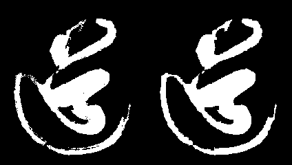
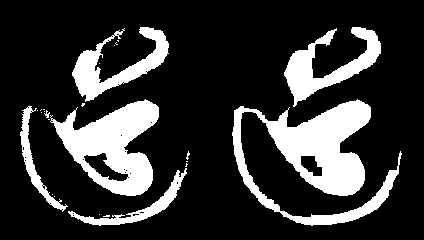
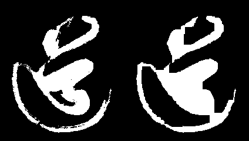
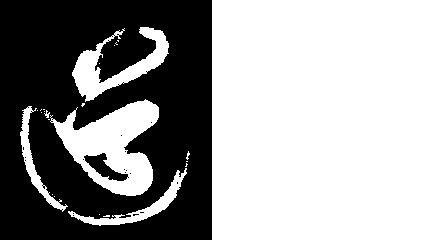

# 闭运算(closing)

**闭运算是攘外必先安内的国共两党**

闭运算与开运算相似, 都是由**腐蚀**与**膨胀** 两个操作组成, 只不过顺序不同.

**闭运算(closing) 是先对图像进行膨胀, 然后进行腐蚀操作.**

**闭运算**用来填充物体内细小空洞、连接邻近物体、平滑其边界的同时并不明显改变其面积。


关于消除**内部细小空洞**的部分,我们可以看官网的示例:


```python
opening = cv2.morphologyEx(img, cv2.MORPH_CLOSE, kernel)
```


**源代码** `CH4.5_closing.py`

```python
'''
    数学形态学 闭运算 closing
'''
import cv2
import numpy as np

# 迭代次数
iter_time = 1
# 读入灰度图
img = cv2.imread("dao-bin.png", flags=cv2.IMREAD_GRAYSCALE)

# 创建 核
kernel = np.ones((5,5), np.uint8)
# 闭运算
closing_img = cv2.morphologyEx(img, cv2.MORPH_CLOSE, kernel,iterations=iter_time)

cv2.imwrite('dao_closing_k5_iter%d.png'%(iter_time), np.hstack((img, closing_img)))
```


**迭代次数**`1`




**迭代次数**`2`




**迭代次数**`3`




**迭代次数**`4`


**迭代次数**`5`


**迭代次数**`10`


**迭代次数**`20`


**迭代次数**`100`




其实, **闭运算与膨胀很接近**. 只不过它一开始向外扩张的意图不是很明显, 反倒是我们可以看到它遵循着**攘外必先安内**的政策.前几次迭代首先把内部的黑色孤岛攻克填满. 接下来才开始纵横边疆, 最后完成大一统.

> 嘿嘿 虽说, 攘外必先安内的口号是抗日的时候国民党提出来的, 最后完成国内统一的却是共产党.

