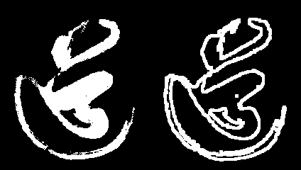

# 数学形态学梯度 gradient-明确国界

关于数学形态学, 阿凯这里简单提一下. 

**数学形态学梯度 = 图像膨胀 - 图像腐蚀** 从而获取到图像的边缘.

```python
gradient = cv2.morphologyEx(img, cv2.MORPH_GRADIENT, kernel)
```


**源代码** `CH4.5_gradient.py`

```python
'''
    数学形态学 获取形态学梯度 gradient
'''
import cv2
import numpy as np

# 读入灰度图
img = cv2.imread("dao-bin.png", flags=cv2.IMREAD_GRAYSCALE)

# 创建 核
kernel = np.ones((5,5), np.uint8)
# 获取形态学梯度
gradient = cv2.morphologyEx(img, cv2.MORPH_GRADIENT, kernel)

cv2.imwrite('dao_gradient_k5.png', np.hstack((img, gradient)))
```





**阿凯用opencv自带的逻辑运算, 也可以实现形态学梯度.**

> 别着急, 在CH4.6 阿凯会介绍opencv的二进制逻辑运算.


**源代码** `CH4.5_gradient_v2.py`

```python
'''
    数学形态学 获取形态学梯度 gradient
'''
import cv2
import numpy as np

# 读入灰度图
img = cv2.imread("dao-bin.png", flags=cv2.IMREAD_GRAYSCALE)

# 创建 核
kernel = np.ones((5,5), np.uint8)
# 获取形态学梯度
erode = cv2.erode(img, kernel)
dilate = cv2.dilate(img,kernel)
gradient = cv2.bitwise_xor(dilate, erode)

cv2.imwrite('dao_gradient_k5_v2.png', np.hstack((img, gradient)))
```


