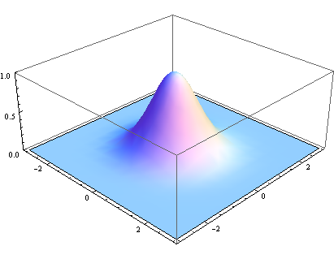
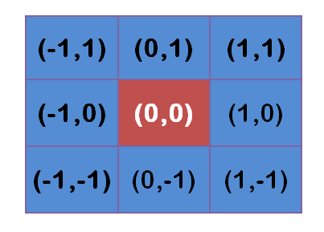
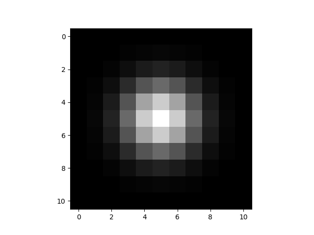
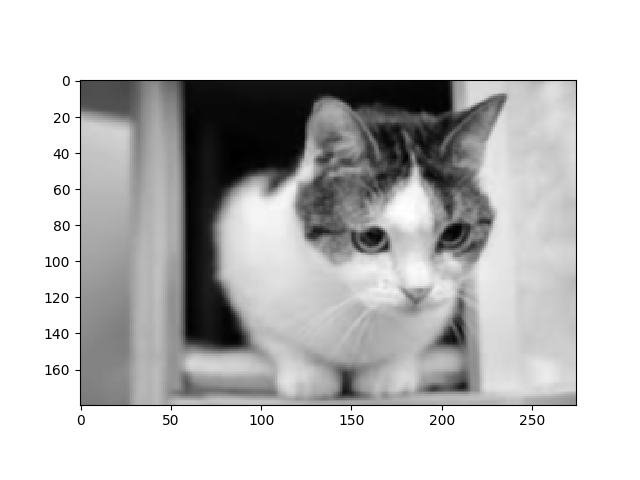
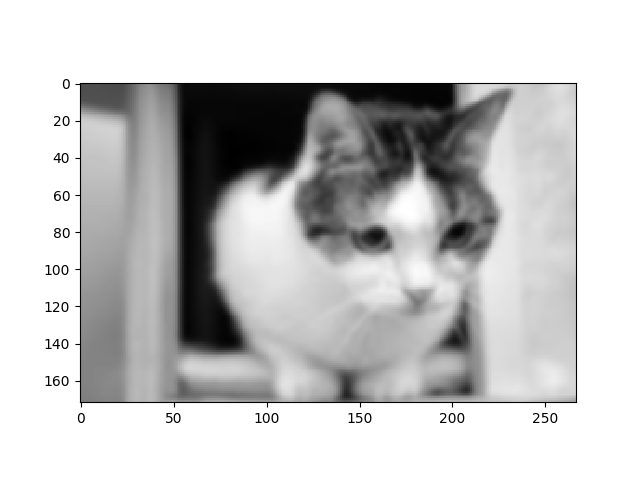

# 卷积


## 0. 概述

卷积，英文名称为`Convolution`

卷积在工程领域有非常重要的作用。在图像处理方面， 图像过滤，图像求导，模板匹配等各种操作均会用到卷积。 阿凯觉得在讲opencv的腐蚀膨胀等数学形态学操作的时候, 有必要让大家知道卷积的概念.

卷积分为几种， 空域卷积， 时域卷积， 频域卷积

下文只讲解空域卷积的部分，而空域又分为一维卷积和二维卷积。 

那我们先从一维卷积开始讲起.


## 1. 一维卷积 


我们以王大锤的幸福生活,来讲解一维卷积的概念.

> **18禁** 以下是一个很暴力的例子


作为资深技术宅的大锤， 性格内向， 耿直， 不太会说话。

年到中年的时候遇到了他的另一半胜男。

胜男是个女汉子， 跆拳道黑带， 脾气特别暴。

 因为大锤嘴欠，经常说错话，说错话胜男就会在他头上打一下， 打一下就会起包。


假定胜男每天最多打一次， 每次不会重复在同一个位置上。


**周一**

胜男正在看电视吃零食，问大锤：我最近感觉自己衣服变紧了

大锤：都这么胖了还吃？

......

胜男在大锤头上打了一个**10cm**的包


**周二**

相安无事


**周三**

胜男： 你之前谈了几个女朋友啊？

大锤：一个，两个， 三个 ... 十个， 完了手指不够用了。

......

胜男在大锤头上打了一个**12cm**的包


**周四**

胜男： 我又不漂亮， 你为什么会喜欢我？

大锤：当时光线昏暗， 没看清楚。

......

胜男在大锤头上打了一个**8cm**的包


**周五**

相安无事


我们用一维矩阵`X`来记录一周内(周末休息)大锤被打的次数。

```
X = [10, 0, 12, 8, 0]
```


我们再定义一个变量`S`来记录大锤脑袋上每天所有包的长度之和．我们如何求？

**旧的包会一点点消退, 但是有个过程.**

假设包的高度是`X`, 随着天数变动， 包的高度会慢慢消去， 第二天会变成`0.6X` ， 第三天会变成`0.2X` ， 第四天就消肿了。

那矩阵`G` 就等于 `[1, 0.6, 0.2]`  第四天前的包不会对当前产生影响, 权值为0。


计算某一天的长度和`S` ， 那么$$ S_n = 1*X_n + 0.6 * X_{n-1} + 0.2 * X_{n-2}$$

本质上是**一定范围内的加权求和**， 那么数学上有没有定义这种运算呢？

这个时候我们就用到了卷积 ， 符号是`*` , `G` 记录权重，称之为**卷积核**`Kernel`

$$ S = X * G$$


具体运算过程如下：

光看不过瘾, 我们通过python科学计算包`scipy` 来计算一维卷积.

```python
import numpy as np
from scipy import signal

X = np.array([1, 0.6, 0.2])
G = np.array([10, 0, 12, 8, 0])

S = signal.convolve(X, G)

print(S)
```

打印结果

```
[ 10.    6.   14.   15.2   7.2   1.6   0. ]
```


## 2. 二维卷积

### 2.1 二维卷积的计算过程


其中K是奇数， 公式感觉有点难懂， 没关系， 我们画图来说明

公式对应的中心点为(0,0)

假设卷积核为3`*`3 . 

 $$2 * k + 1 = 3 $$

那么`k` 就等于1， 坐标系如下图所示


举个例子

Image对象也就是`F`


卷积核`H`为


这里要强调一点， 就是我们选取的这个卷积核比较特别， 原因是**H为实对称矩阵**

**卷积过程**

**途中的橙色部分的下标其实是`H`的转置**


其实这个图是带有一点误导的，原因是这个采用的卷积核比较特殊，为对称矩阵

**对称矩阵** 方形矩阵，转置矩阵和自身相等 $$ a_{ij} = a_{ji}$$

**如果卷积核是对称矩阵的话，卷积与互相关运算出来的结果是相同的**

我们用 `scipy.signal` 的二维卷积函数进行计算.

[scipy.signal.convolve2d](https://docs.scipy.org/doc/scipy/reference/generated/scipy.signal.convolve2d.html) 详细说明见文档


`CH4.4_convolve2d.py`

```python
import numpy as np
from scipy import signal

F = np.array([
    [1, 1, 1, 0, 0],
    [0, 1, 1, 1, 0],
    [0, 0, 1, 1, 1],
    [0, 0, 1, 1, 0],
    [0, 1, 1, 0, 0]
])

H = np.array([
    [1, 0, 1],
    [0, 1, 0],
    [1, 0, 1]
])

S = signal.convolve2d(F, H, boundary='wrap',mode='valid')

print(S)
```


```
[[4 3 4]
 [2 4 3]
 [2 3 4]]
```


### 2.2 二维卷积在图像处理中的应用

卷积在图像处理领域经常被用于如下功能

- 低通滤波
- 高通滤波
- 平移和差分边缘检测
- 匹配滤波和边缘检测
- 边缘检测
- 梯度方向边缘检测

不同的功能搭配不同的模板，详情可以见**小熊不去实验室** 的博客

[图像处理基本概念—卷积，滤波，平滑](http://blog.csdn.net/yangtrees/article/details/8740933)


 我们这里只举一个高斯模糊的例子， 其他的内容将在今后的教程中涉及， 莫急。


### 2.3 二维卷积实例-高斯模糊

> 注意: 高斯模糊的部分大多都是来自于阮一峰先生的高斯模糊的算法
>
> http://www.ruanyifeng.com/blog/2012/11/gaussian_blur.html


我先来说一下模糊的思想， 当图片中存在噪声的时候， 或者我们想对其做模糊处理的时候， 如何设定当前值，而又自然地变换， 肯定是根据这个像素点周边的像素取值， 做一个加权平均，这个权值的不同， 就是不同的模糊卷积核。当我们采用二维的高斯分布的权值作为我们的卷积核的时候， 这就是高斯模糊。


相信会PS的同学，肯定用过高斯模糊了，但是它到底是个啥呢？

高斯模糊， 首先要从高斯分布/正态分布说起

$$ f(x) = 1/(\sigma * \sqrt{2*\pi}) * e^{-(x-\mu)^2/(2*\sigma^{2})}$$

令$$ \mu = 0$$, $$ \mu$$ 其实是均值的意思

参数我们改成两个， 分别是x坐标与y坐标

改造后的公式为

二维高斯函数

$$ f(x) = 1/(\sigma^2 * {2*\pi}) * e^{-(x^2 + y^2)/(2*\sigma^{2})}$$



一维与二维的高斯函数, 可以用python表示:

```python
import numpy as np
import math

def gaussian(x, mu, sigma):
    return 1/(sigma * math.sqrt(2*math.pi)) * math.e**(-(x-mu)**2/(2*sigma**2))

def gaussian2d(x, y, sigma):
    return (1/(2*math.pi*(sigma**2))) * math.e**(-(x**2 + y**2)/(2*(sigma**2)))
```


#### 2.3.1 权重矩阵的计算

我们以矩阵中心点为原点计算 中心点为(0,0).

其周围8个点的坐标为: (x,y)



```python
def gaussian_kernal(size, sigma=1.5):
    sigma = 1.5
    # 高斯模糊的核 必须为奇数
    # 半径
    radius = int(size / 2)
    G = np.zeros((size, size))

    for x in range(0, 2*radius+1):
        for y in range(0, 2*radius+1):
            G[x][y] = gaussian2d(x-radius, y-radius, sigma)

    wsum = np.sum(G)
    G = G / wsum

    return G
```


假定$$ \sigma = 1.5$$ 将我们的坐标参数带入

```python
print(gaussian_kernal(3))
```

起先会计算得到`G`

```bash
[[ 0.04535423  0.05664058  0.04535423]
 [ 0.05664058  0.07073553  0.05664058]
 [ 0.04535423  0.05664058  0.04535423]]
```

然后我们对其做归一化处理， 也就是所有的值加起来=1

```python
wsum = np.sum(G)
G = G / wsum
```

得到最终的权值矩阵

```python
[[ 0.09474166  0.11831801  0.09474166]
 [ 0.11831801  0.14776132  0.11831801]
 [ 0.09474166  0.11831801  0.09474166]]
```


这就是我们用于做高斯模糊的卷积核


我们也可以用可视化的方法, 看高斯模糊的权值

这里阿凯采用的核的大小是11:

```python
from matplotlib import pyplot as plt
def draw_gaussian_weight(size, sigma=1.5):
    gweight = gaussian_kernal(size, sigma)
    plt.imshow(gweight, cmap='gray')
    plt.show()
```



#### 2.3.2 计算高斯模糊

将计算得来的高斯核作为卷积核, 与原图像进行卷积运算.

得到的图像就是模糊后的图像.

方便起见, 我们来实验一下灰度图的高斯模糊效果.


#### 2.3.3 斯模糊实战

我们使用之前我们写的gaussian_weight函数生成的卷积核, 与灰度图进行卷积.

```python
img = cv2.imread("cat.jpg")

gray = cv2.cvtColor(img, cv2.COLOR_BGR2GRAY)

gray_blur = gray_gaussian_blur(gray, 11)
plt.imshow(gray_blur, cmap='gray')
plt.show()
```


**原图**


`kernal size = 3`



`kernal_size=5`


`kernal_size=11 `



在opencv中我们可以使用现成的函数`GaussianBlur` 实现彩色图片的高斯模糊.


```python
import numpy as np
import cv2

kernel_size = (5, 5);
sigma = 1.5;

img = cv2.imread('cat.jpg')
cv2.imshow("src", img)

img_blur = cv2.GaussianBlur(img, kernel_size, sigma)
cv2.imshow('gaussian_blur', img_blur)

cv2.waitKey(0)
cv2.destroyAllWindows()
```


### 2.4 卷积的边界处理

#### 2.4.1 尺寸问题

**尺寸的问题, 其实也就是卷积运算区域的范围问题. **


左边是卷积后**扩大**

中间是卷积和中心点对准各个角点，**大小不变**

右边， 卷积后图片**缩小**

**实际上我们做卷积的时候用的是中间的那个， 要保持图像大小不变。**


#### 2.4.2 空白值的填充

按照上图中间的卷积起始点， 有一部分是没有值的， 我们要怎么处理？

`纯色填充 pure`一种是将边界设定为一种纯色， 全为白或者为黑， 会留下黑边或者白边， 在进行直线检测的时候，也会给你带来意外的困扰。

`平铺 wrap around` 主要针对有周期性的图像平铺， 适用范围较窄

`边缘复制 copy edge` 是将边界的颜色拓展， 如下图所示


`镜像填充 reflect across edge` 是将图片镜像， 用于填充边界，如下图所示


 

## 3. Reference


1. 阮一峰 高斯模糊的图片

http://www.ruanyifeng.com/blog/2012/11/gaussian_blur.html

2. Udacity - Computer Vision课程

>  本文中的部分图片为课程截图

3. 知乎 - 如何通俗易懂地解释卷积？

https://www.zhihu.com/question/22298352

> 一维卷积的情节设计思路参考知乎中的讨论
>
> 


