# Ubuntu虚拟机安装(VirtualBox)

## 概要

在本次教程里, 阿凯带大家安装VirtualBox, 介绍了一下VirtualBox与VMWare的不同之处. 

接下来教大家如何创建一个虚拟机, 如何分配物理资源等.  然后我们挂载Ubuntu16.04的镜像, 阿凯逐步教大家安装Ubuntu.课程最后, 你可以进入到你自己安装的Ubuntu桌面, 是不是很有成就感.

##  下载16.04 64位版本的镜像

> ps: 有同学不太清楚 linux跟ubuntu之间的关系
>
> ubuntu是linux的其中一款发行版。 桌面系统比较好用，被广泛用于linux开发环境下的学习与工作
>
> 每个linux发行版都有自己的个性。
>
> 你可以看看知乎的这篇文章 ： 各个 Linux 发行版的风格和哲学分别是怎样的？ https://www.zhihu.com/question/19852664

首先我们要到Ubuntu官网下载16.04的镜像文件。 

16.04版本属于长期支持版本（LTS）， 所以我们用来学习是比较合适的。 不推荐大家下载17版本的Ubuntu。

https://www.ubuntu.com/download/desktop

官网的下载起来比较慢， 大家可以从清华的镜像下载。

下载地址

https://mirrors.tuna.tsinghua.edu.cn/#

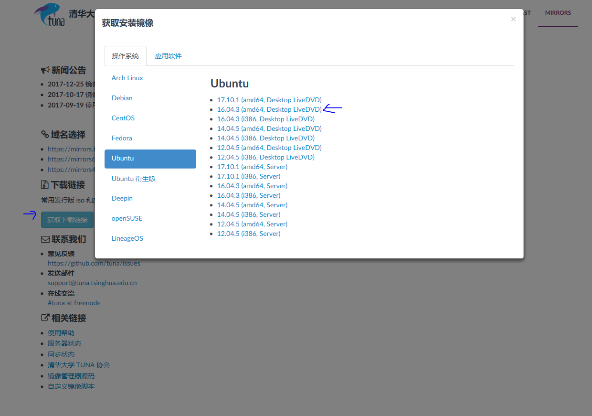

## 下载VitrualBox

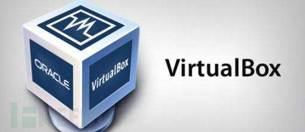

`Virtualbox`是一款虚拟机软件， 属于`Oracle`公司的产品，跟`VMWare` 类似， 优点在于免费， 轻量级。 

对于我们入门学习， 功能是绝对够用的。 

官网下载地址

https://www.virtualbox.org/

清华镜像站下载地址

https://mirrors.tuna.tsinghua.edu.cn/#

`Virtualbox` 的安装方法， 阿凯这里就不给大家讲解了， 傻瓜式安装。

## 安装Virtualbox拓展包

**注意, VirtualBox跟VirtualBox的拓展, 都不支持中文的安装路径, 必须全部是英文, 必须全部是英文**

否则, 你可能安装扩展的时候, 会一直弹出另外一个Virtualbox的页面. 

下面这个视频, 同时讲解了拓展的安装与再虚拟机里USB摄像头的读取, 这节课, 你先完成前面安装扩展的部分.

[B站视频连接 VirtualBox拓展的安装与下载](https://www.bilibili.com/video/av18569702/?p=7) 
https://www.bilibili.com/video/av18569702/?p=7

<iframe id="myVideo" class="myvideo"  height="415" width="544" quality="high" allowfullscreen="true" src="http://static.hdslb.com/miniloader.swf?aid=18569702&p=7" frameborder="7"></iframe>

更多细节见 [在VirtualBox虚拟机里使用Opencv获取USB摄像头的图像-阿凯带你配置OpenCV开发环境](http://www.1zlab.com(网站备案中)/p/virtualbox-opencv-usb-camera-video-capture)

## 直接导入阿凯配好CvPlat

你可以选择自己配环境, 或者直接导入阿凯配置好的Ubuntu虚拟机`CvPlat`

虚拟机网盘下载地址:

下载链接 永久有效。
链接：https://pan.baidu.com/s/1ghivv3d 密码：bvcs

[B站视频连接  使用VirtualBox直接导入配置好的虚拟机](https://www.bilibili.com/video/av18569702/?p=4)

https://www.bilibili.com/video/av18569702/?p=4

<iframe id="myVideo" class="myvideo"  height="415" width="544" quality="high" allowfullscreen="true" src="http://static.hdslb.com/miniloader.swf?aid=18569702&p=4" frameborder="7"></iframe>

你导入的时候, 可能会有这个错误提示:

详细报错信息: 

说明你需要给VirtualBox安装扩展, 且版本好需要匹配.

ps: 安装完成之后, 你可能还得修改一下共享文件夹的路径等配置.

## 虚拟机创建过程

虚拟机的安装过程, 你可以看阿凯录制的视频. 视频放置再B站上.

视频内容包括虚拟机的创建与Ubuntu的安装过程.

[第一节_使用Virtualbox安装Ubuntu虚拟主机](https://www.bilibili.com/video/av18569702/)

https://www.bilibili.com/video/av18569702/?p=1

[B站视频连接 VirtualBox虚拟机创建与Ubuntu的安装](https://www.bilibili.com/video/av18569702/?p=1) 

https://www.bilibili.com/video/av18569702/?p=1

<iframe id="myVideo" class="myvideo"  height="415" width="544" quality="high" allowfullscreen="true" src="http://static.hdslb.com/miniloader.swf?aid=18569702&p=1" frameborder="7"></iframe>

### 新建虚拟机

首先我们要运行`Virtualbox` 软件， 点击左左上角的`新建`按钮。

我们填入虚拟机名称， 这里命名为`FangeCvPlat` . 

类型选择`linux`, 版本选择`Ubuntu 16-bit`

点击进入下一步。

### 分配虚拟机内存

内存分配大小， 看你自己， 绿色区域内都是OK的， 也别分太小， 运行起来会很卡。

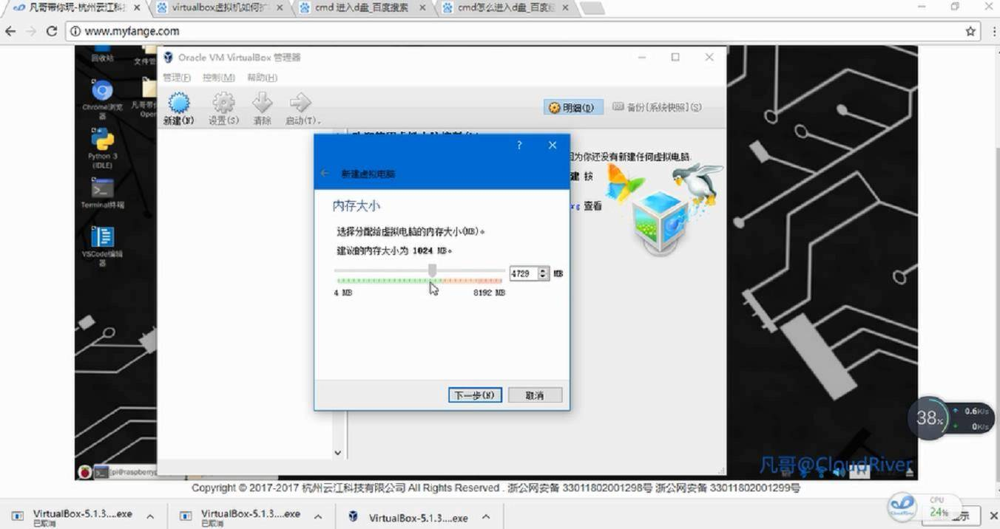

> 这里还要吐槽一下VirtualBox, 在运行VirtualBox虚拟机的时候, 会占满你分配给虚拟机的内存空间.

### 虚拟硬盘文件类型

这里我们选择默认选项 `VirtualBox 磁盘映像`

### 存储在物理硬盘上

这里我们选择动态分配， 用多少申请多少。

### 文件位置跟大小

给你的虚拟硬盘找个路径存放， 规划磁盘的大小， 我这里选了`30G` , 虚拟机可以随便删， 但是你在运行的时候， 如果空间满了就会很麻烦。

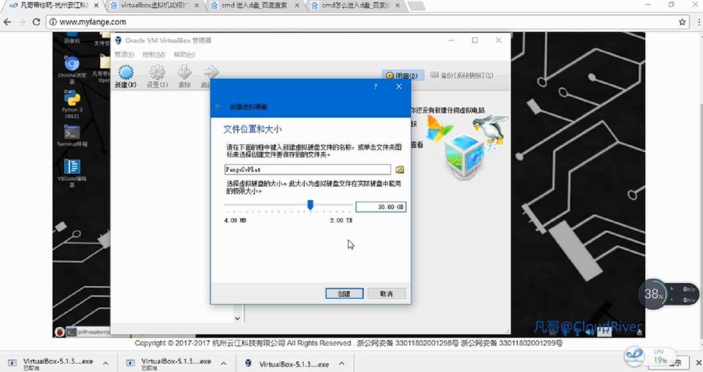

**如果你安装的是Ubuntu, 请至少保证20G-30G左有的磁盘空间. ** 

如果你之后在运行程序的时候, 发现`No Space Left` 相关的报错, 就是因为你没分配足空间.

而且动态分配也不会直接就占用你的硬盘空间, 虚拟的, 按需分配.

### 启动虚拟机

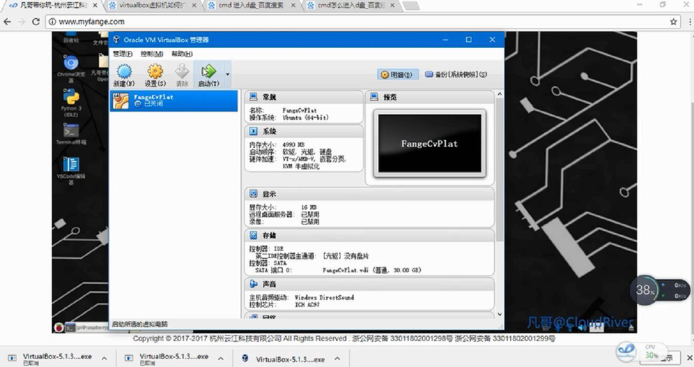

## 选择镜像文件进入安装程序

### 选择启动盘

这里我们就要找到之前我们下载的Ubuntu的ISO镜像文件。

点击文件夹的icon ， 找到它。

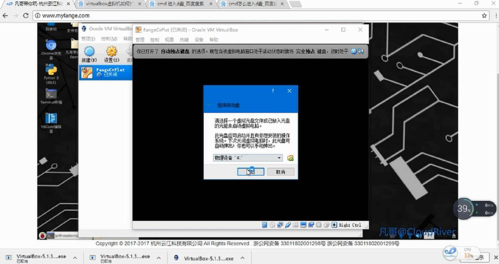

**镜像损坏问题**

如果你引入ISO镜像的时候, VirtualBox出现如下报错: 

或者安装过程中, 出现报错.

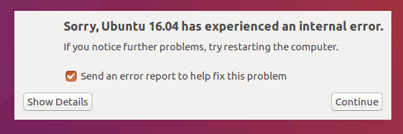

说明你的ISO镜像在上传跟下载过程中出现了损坏, 请去官网或者镜像站重新下载.

## Ubuntu安装进程

### 进入Ubuntu的安装界面

它在问你， 是尝试一下Ubuntu还是下载Ubuntu. 

这里我们选择后者， 安装Ubuntu。

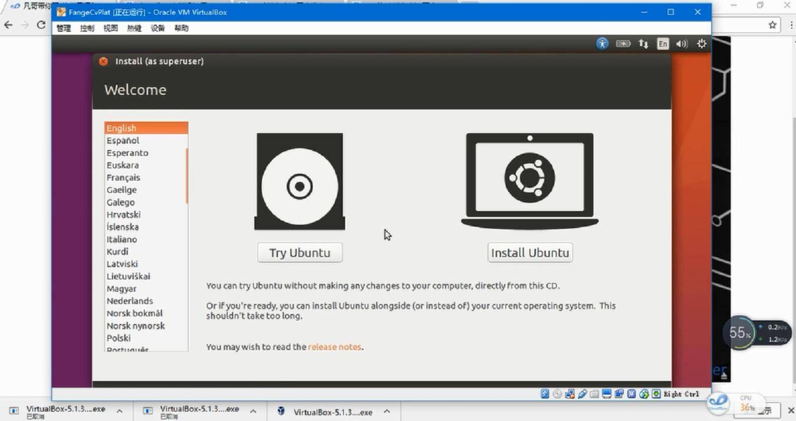

### 选择是否更新与第三方插件安装

我的习惯一般都是安装， 就是安装过程中会比较耗时。

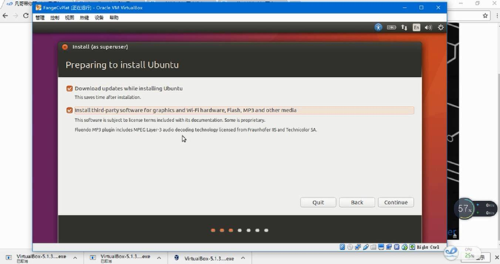

### 擦出整个磁盘

反正又没啥东西， 全部擦除。

确认

### 时区选择

选择时区为上海

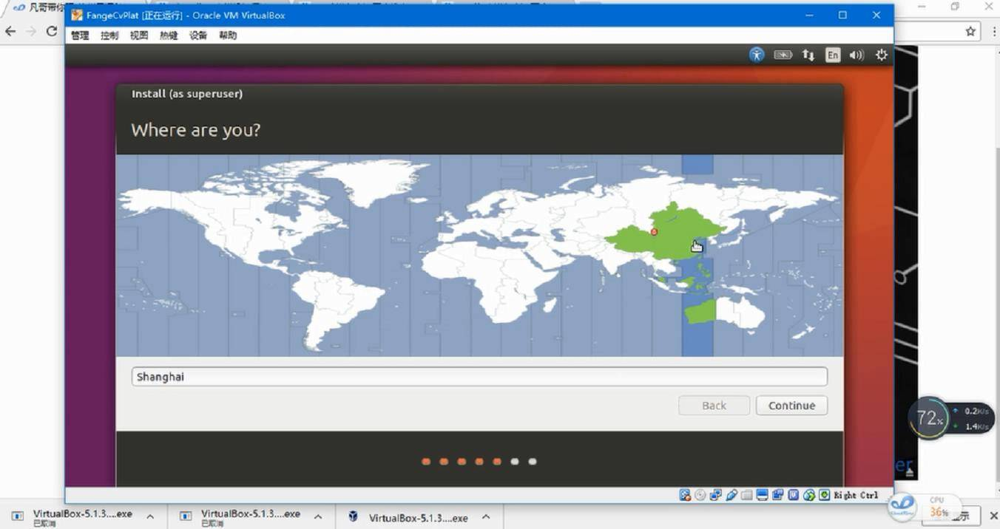

### 选择键盘布局

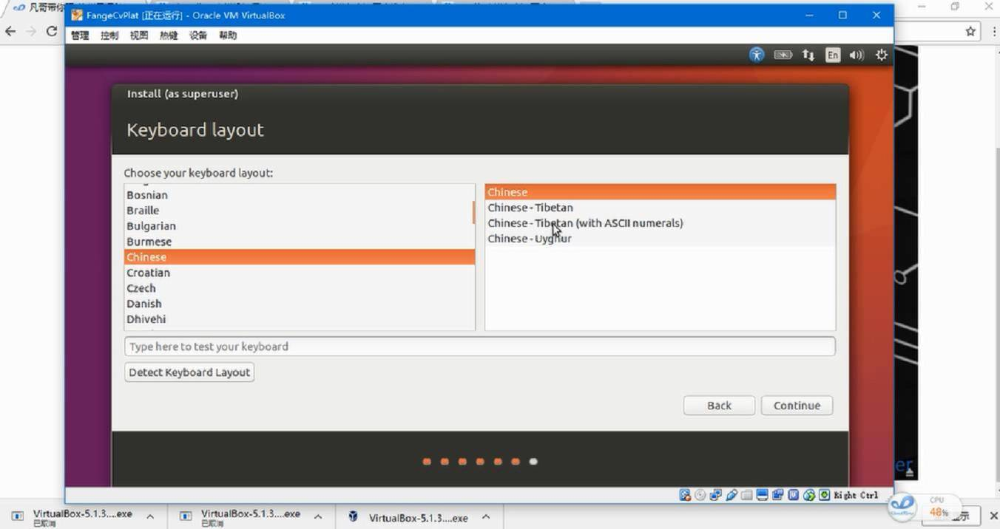

### 填入用户名与主机名

这里主机名称，阿凯用的是`CvPlat` , Computer Vision Platform的意思。

用户名 `fange`

密码 `fange`

密码别搞太复杂， 又没啥机密， 最后还是坑自己， 简单点好， 比如`fange`, 嘿嘿。

### 进入安装进程

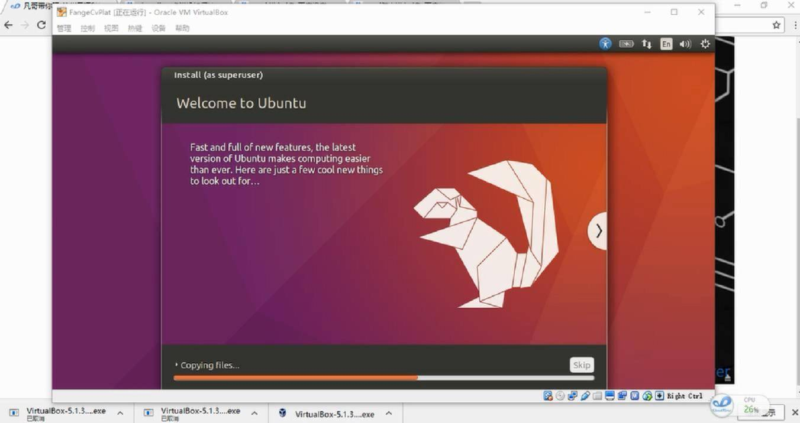

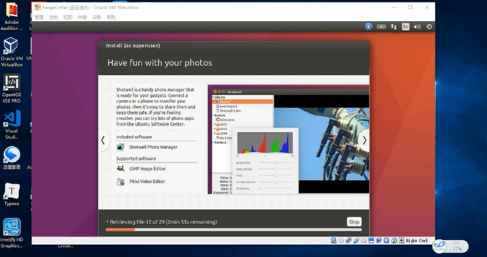

### 安装完成

这里提示， 请去除安装媒介， 这里我们直接点击工具栏的管理， 强制退出就好。

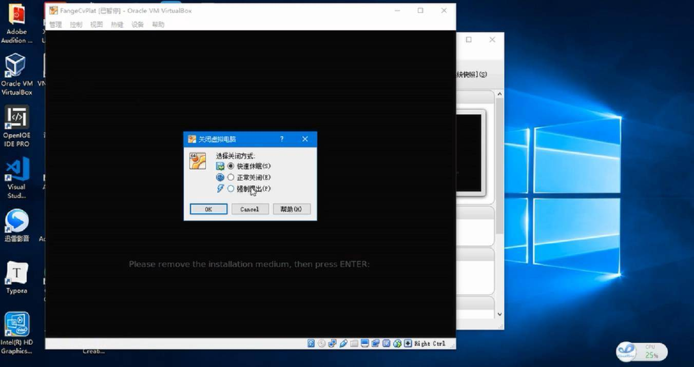

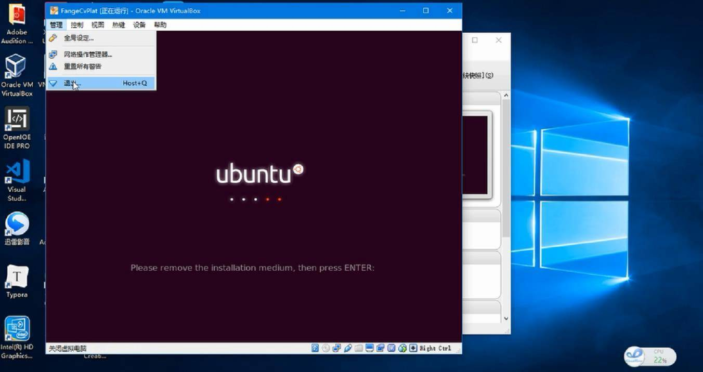

## 进入系统

### 登陆界面

填入密码`fange`

### 进入桌面

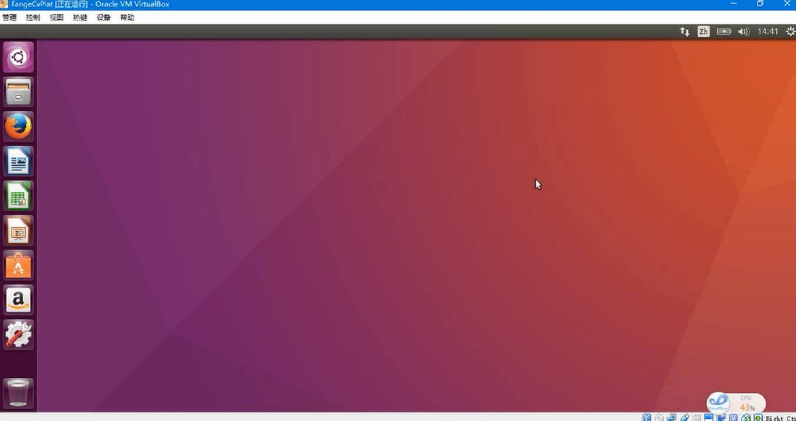

## VirtualBox增强功能

如果你向让你的Virtualbox更加易用, 还需要安装增强功能, 然后设置共享粘贴板, 文件拖拽与共享文件夹等操作. 

详情请见操作流程: 

[B站视频连接 VirtualBox增强包的安装与小机巧](https://www.bilibili.com/video/av18569702/?p=6) 
https://www.bilibili.com/video/av18569702/?p=6

<iframe id="myVideo" class="myvideo"  height="415" width="544" quality="high" allowfullscreen="true" src="http://static.hdslb.com/miniloader.swf?aid=18569702&p=6" frameborder="4"></iframe>

个人使用VirtualBox的共享粘贴板与文件拖拽的时候, 都遇到了问题. 这个可能跟他软件本身有关系. 

大家可以采用配置共享文件家的方式,进行文件传输. 关于VirtualBox共享文件夹的配置, 请自行搜索相关教程.

