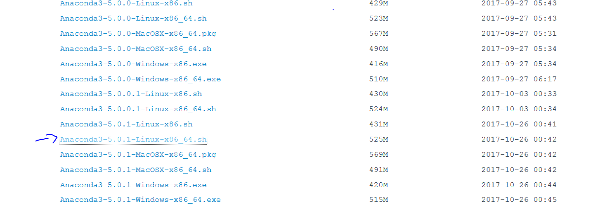
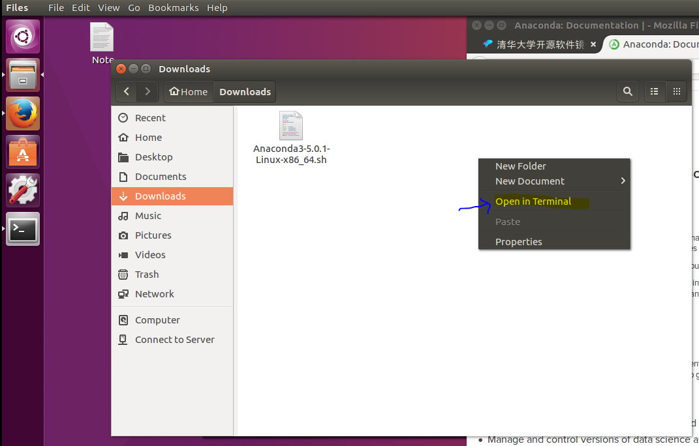
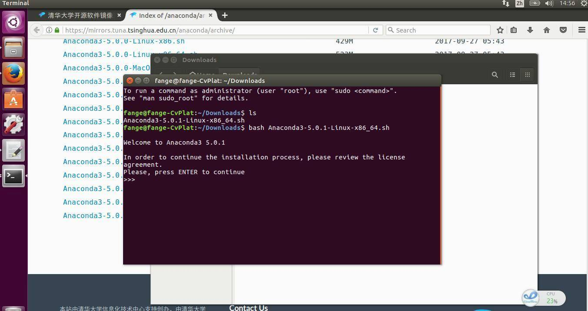
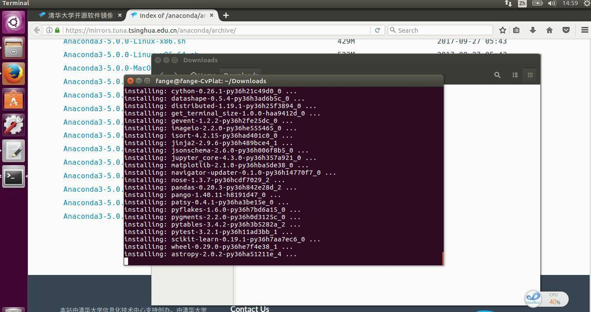
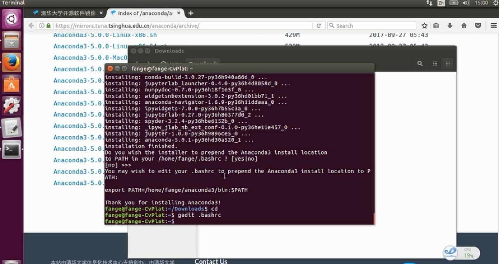
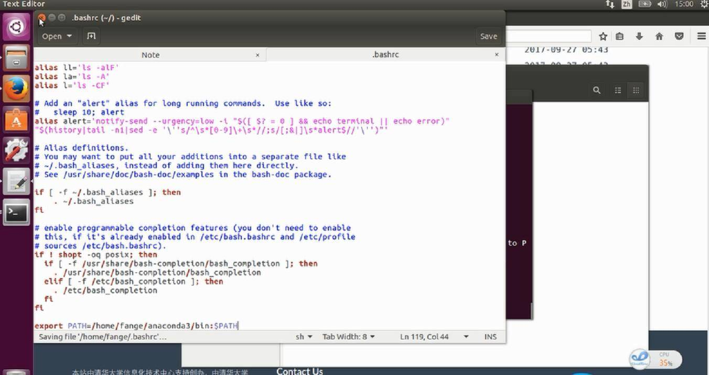
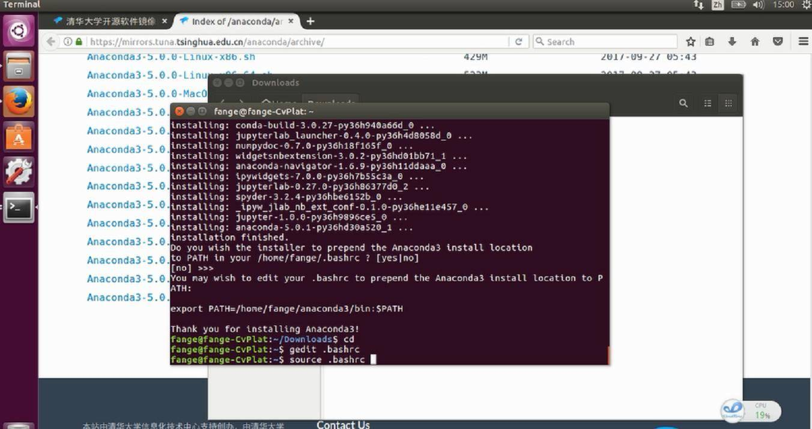
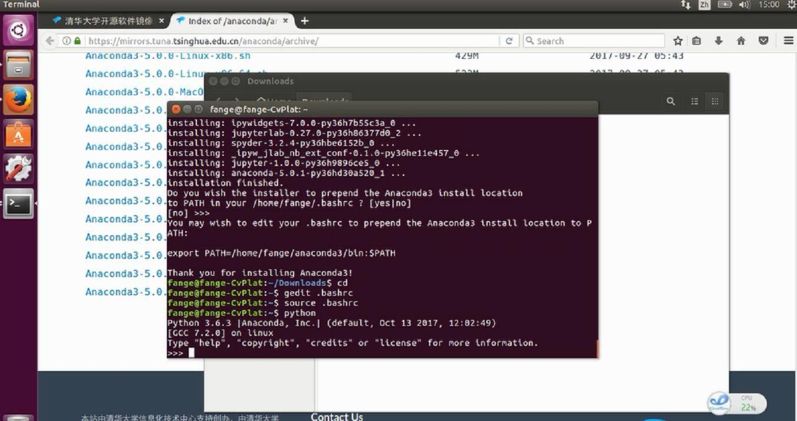
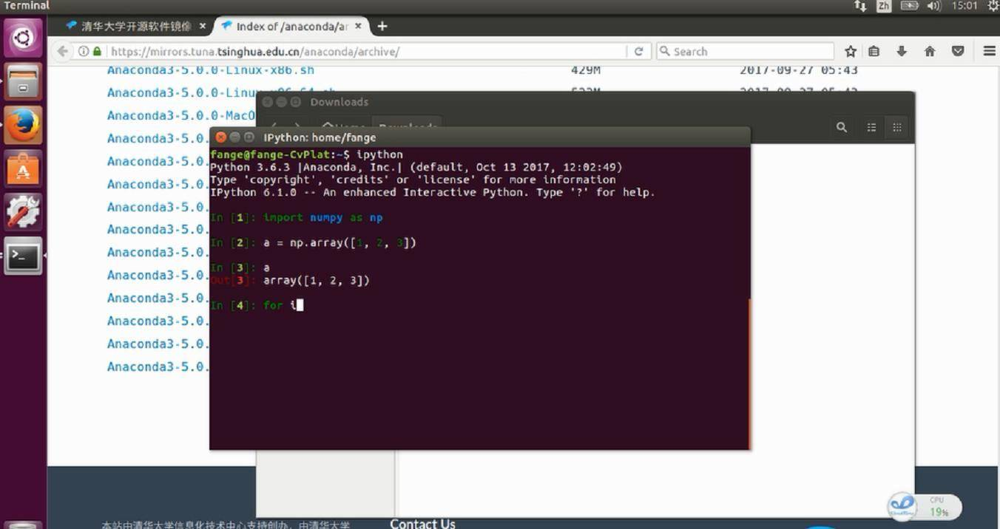

# 在Ubuntu下安装Anaconda科学计算包并运行python程序


## 概要

在这节课, 凡哥带大家从Anaconda的官网下载sh安装文件, 并在本地运行它.

安装完成之后, 需要添加环境变量PATH到.bashrc下, 接下来我们测试一下anaconda是否安装成功.

最后, 凡哥给大家演示了, 安装Anaconda之后运行IPython与Jupyter Notebook 交互式编程环境.


## 下载Anaconda的sh脚本

首先我们需要下载一个anaconda的sh脚本

我们可以从官网下载（https://www.anaconda.com/download/#linux）


在演示视频里， 凡哥是从清华的anaconda镜像里下载的。


https://mirrors.tuna.tsinghua.edu.cn/help/anaconda/

Anaconda的所有版本都可以在这个网站下获取，

https://mirrors.tuna.tsinghua.edu.cn/anaconda/archive/

这里我们需要用最新的版本， 页面翻到底部。



下载， 默认是保存在`Download` 文件夹下的。


## 执行脚本


我们进入下载路径。 `~/Downloads`

我们也可以进入到图形化界面的download文件夹， 右键， `Open In Terminal` , 然后就会打开终端， 并进入当前文件夹。




然后执行脚本

```bash
fange@fange-CvPlat:~/Downloads$ bash Anaconda3-5.0.1-Linux-x86_64.sh 
```

然后就会自动安装


前期你要同意一些协议， 键盘输入`yes`

翻阅协议使用`Enter` 键。



然后你就会看到下面的界面。




## 添加路径到用户目录下的.bashrc文件


进入到用户主目录， 使用gedit对.bashrc进行编辑， 添加系统环境变量PATH

```
cd
gedit .bashrc

```




在文件末尾添加一行

```
export PATH=/home/fange/anaconda3/bin:$PATH
```




刷新一下`source`


```
source .bashrc
```





## 测试Anaconda的安装

终端输入

```
python
```





如果显示如下， 就说明你安装成功了。

```
fange@fange-CvPlat:~$ python
Python 3.6.2 |Anaconda custom (64-bit)| (default, Jul 20 2017, 13:51:32) 
[GCC 4.4.7 20120313 (Red Hat 4.4.7-1)] on linux
Type "help", "copyright", "credits" or "license" for more information.
>>> 

```


## 尝试运行ipython与jupyter notebook

具体测试过程，请见视频。


### IPython




### Jupyter Notebook


视频最后，凡哥还给大家演示jupyter notebook 这个Web IDE的使用。

