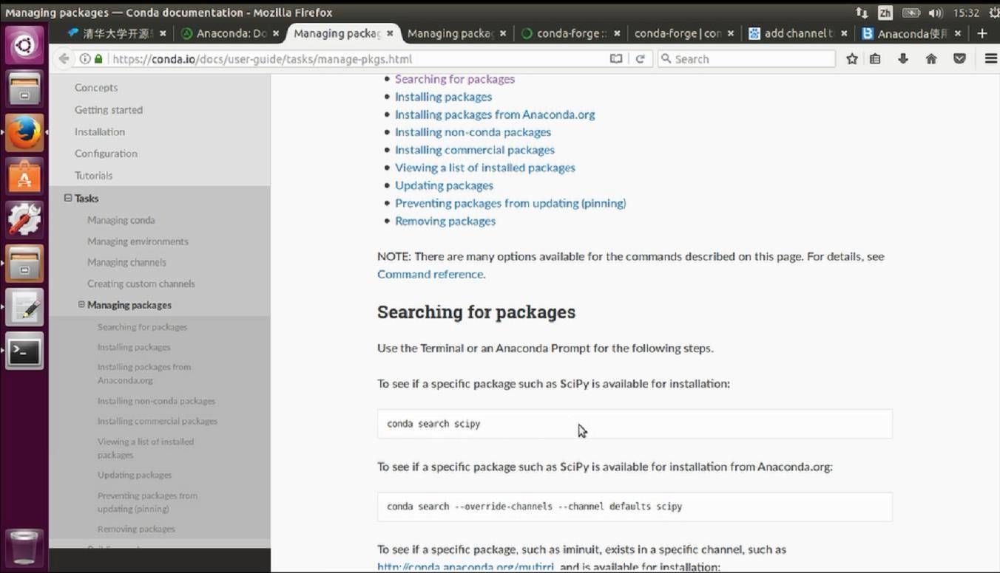
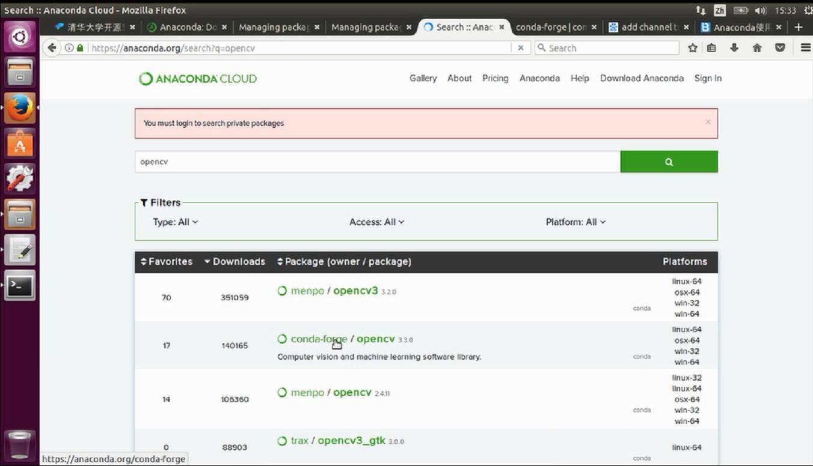
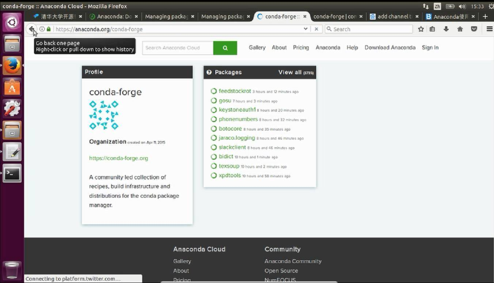
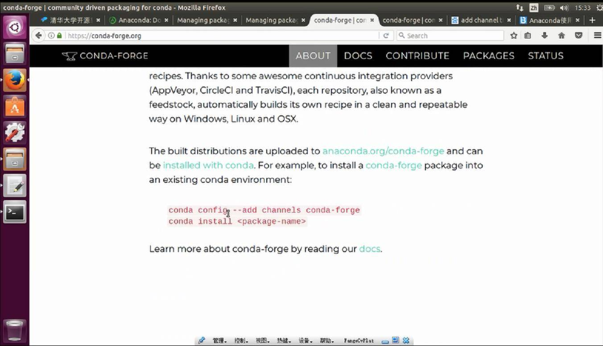
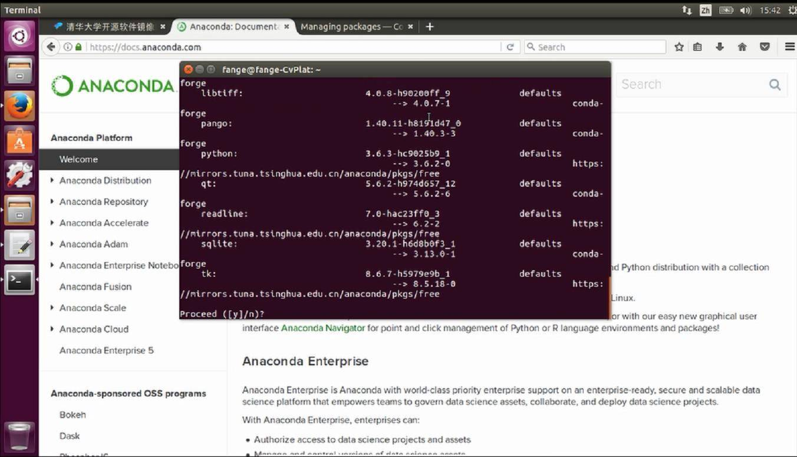
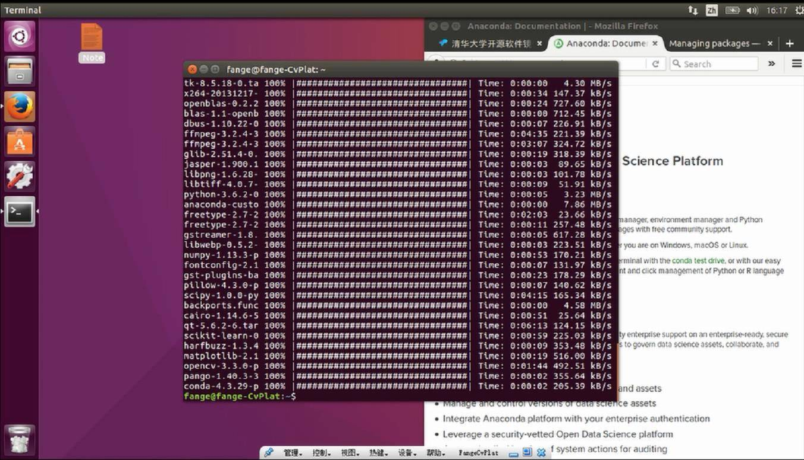

# 在Ubuntu下利用Anaconda安装python-opencv的过程


这篇文章一来教大家如何使用anaconda 来搜索包， 添加channel , 二来也演示配置opencv开发环境的过程。

我们安装来自conda-forge , 我们选择的opencv版本是opencv=3.3.0.

文章写的比较仓促, 为anaconda的指令讲解不是很详细, 你可以在拓展阅读学习更多.

另外, 当你安装完anaconda之后, 管理python包的工具就从pip转变为conda啦. 注意!!!


## 为什么为什么凡哥用conda不用pip?

`pip`是另外一款python的包管理工具, 有的同学问我, 为什么用conda而不用pip呢?

这个没有绝对的理由, 你也可以用`pip`. 使用`conda`的好处是, 会预装很多常用的科学计算包, 只有少量需要自己安装.

`pip`需要自己手动安装, 然而麻烦的地方在于, 有的包需要其他的包依赖, 然后还有版本号冲突的问题, 需要统一.

`conda` 就会极大规避这个问题, 另外`conda` 也由丰富的生态, 有大量别人预编译好的包. 例如我们今天用到的`opencv` 也是一键安装哦, 自己编译就会很麻烦.


最后, `conda` 可以管理不同的python版本的环境, 可以创建多个分离的干净的开发环境.  可以方便切换. 

例如`VSCode` 对py3.6的智能提示不是很好, 你可以方便地切换到py3.5的开发环境上. 

总之, 更多的功能还等待大家的探索, 我也只是用到了部分功能.


 ## 使用命令行conda搜索包

我们进入`conda` 的官方文档，https://conda.io/docs/

查询一下如何搜索包， 我们想搜索`opencv` 相关的包。



查阅文档我们得知， conda搜索opencv相关包的指令是：

> ps 如果你执行conda指令没有效果， 需要关闭所有的Terminal重新开启。

```bash
conda search opencv
```

我们来看一下执行效果

```

fange@fange-CvPlat:~$ conda search opencv
Fetching package metadata .................
opencv                       2.4.2                np15py26_0  defaults        
                             2.4.2                np15py27_0  defaults        
                             2.4.2                np16py26_0  defaults        
                             2.4.2                np16py27_0  defaults        
                             2.4.2                np17py26_0  defaults        
                             2.4.2                np17py27_0  defaults        
                             2.4.2                np15py26_1  defaults        
                             2.4.2                np15py27_1  defaults        
                             2.4.2                np16py26_1  defaults        
                             2.4.2                np16py27_1  defaults        
                             2.4.2                np17py26_1  defaults        
                             2.4.2                np17py27_1  defaults        

.....此处省略很多行......
```

我们可以看到conda支持的一堆opencv的版本。


## 进入Anaconda Cloud检索包


我们需要到Anaconda Cloud https://anaconda.org/ 上检索包。


这里我们选择这个来自`conda-forge` Channel的 opencv的包， 可以看到它支持的最新的opencv的版本号是`3.3.0`



我们点进





## 添加channel

接下来进入到conda-forge的官网上， 发现， 如果我们想用conda安装他们打的包， 就需要另外添加一个channel

```
conda config --add channels conda-forge
```

否则conda检索不到这个包。



## 安装opencv-python

接下来我们就安装`conda-forge`这个channel下的`opencv3`的包。

`-c` 代表 channels


```
conda install -c conda-forge opencv=3.3.0
```


确认安装



安装完成

