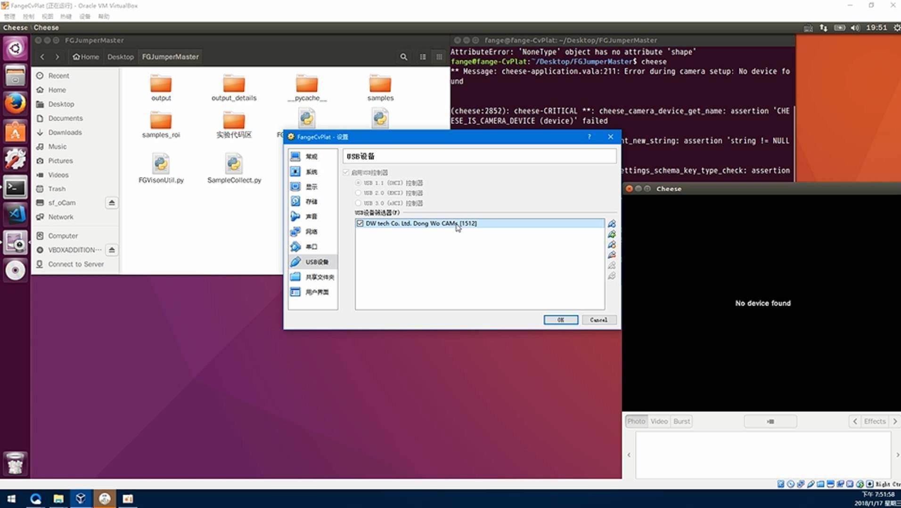
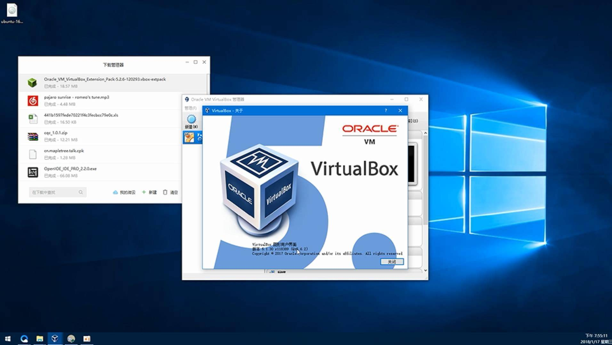
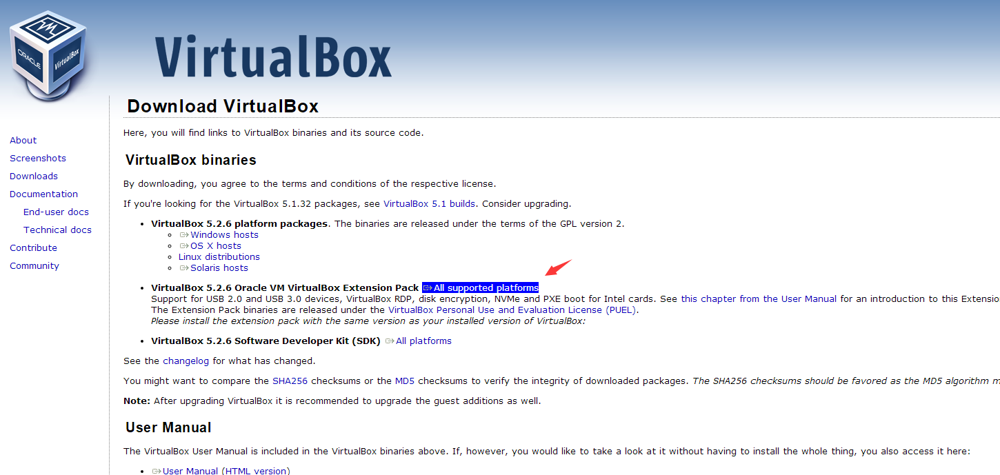
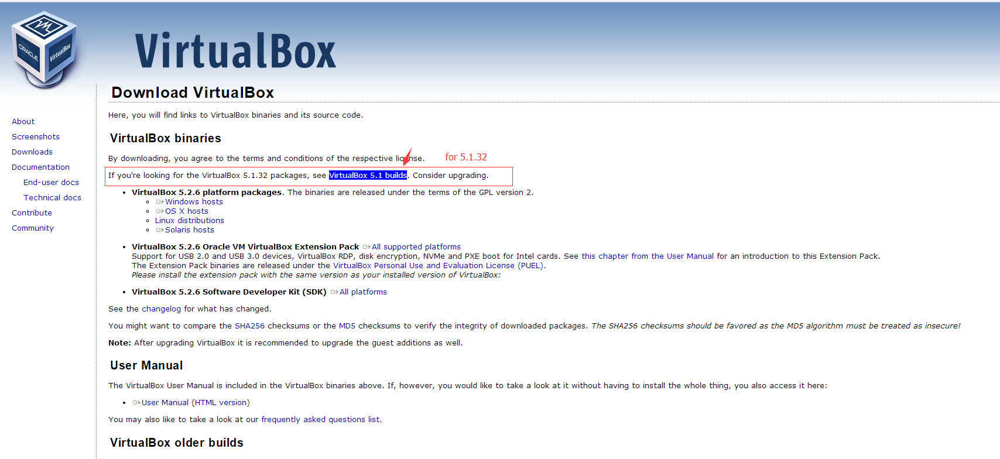
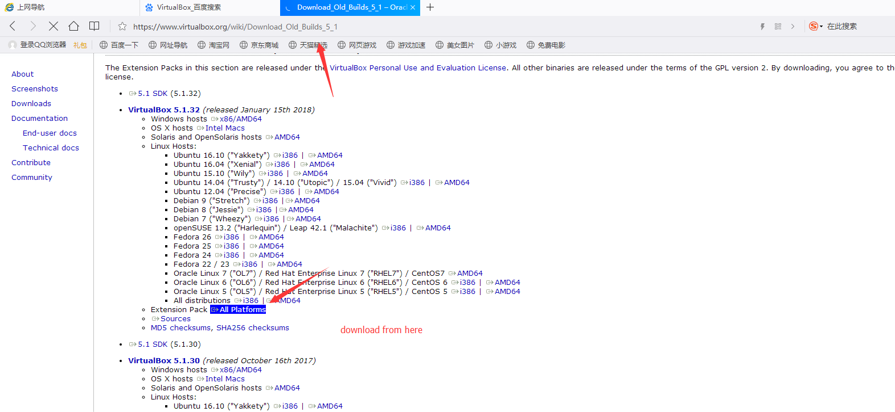
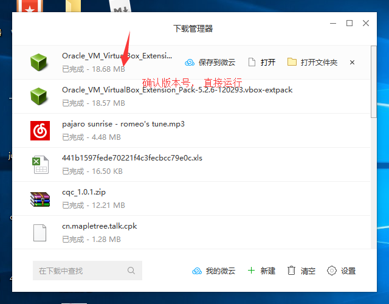
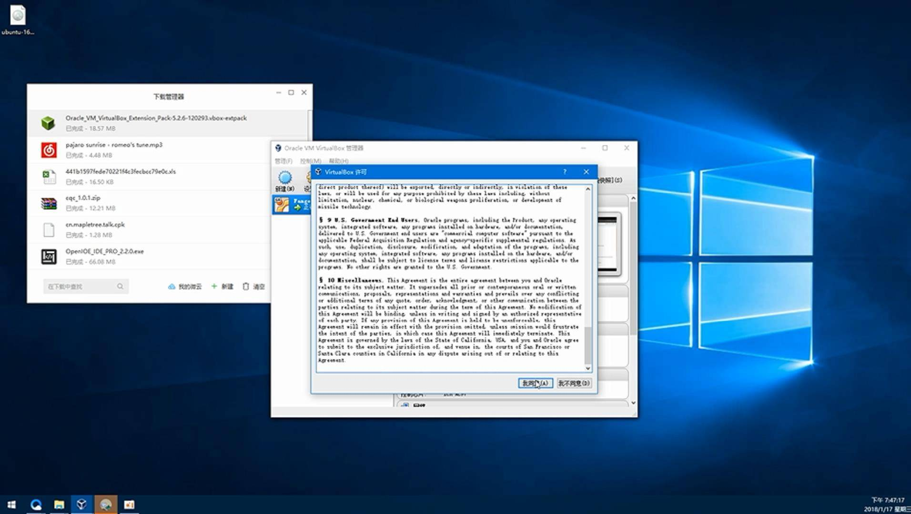
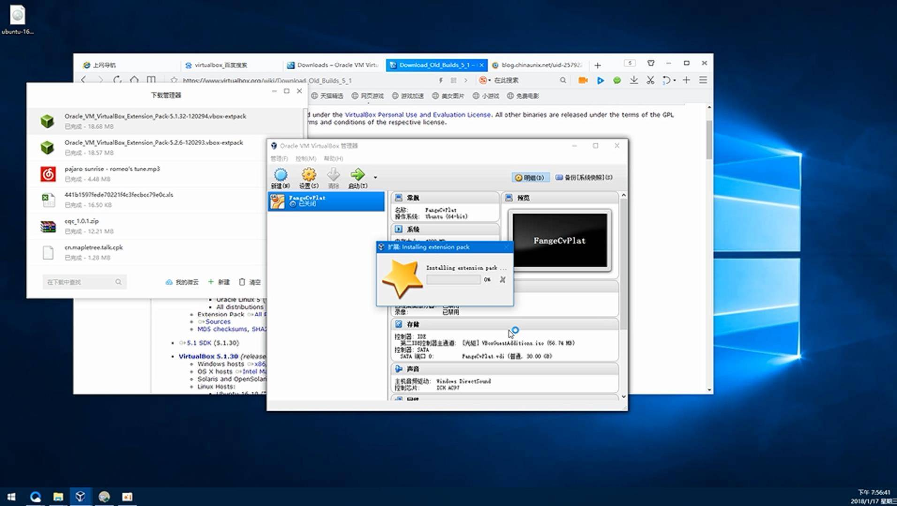
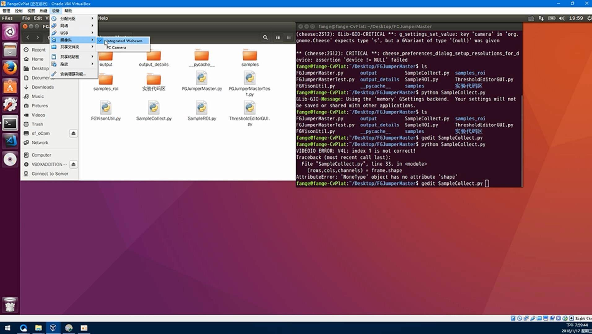
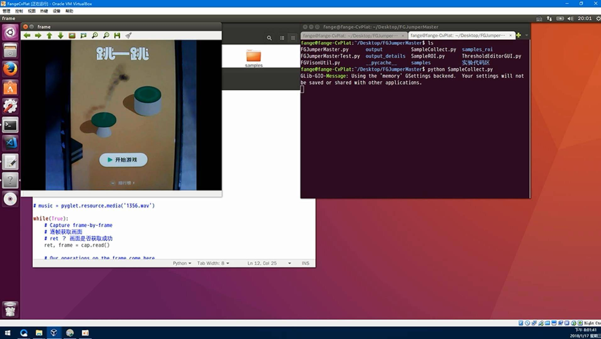

# 第4课-在VirtualBox虚拟机里使用Opencv获取USB摄像头的图像

在这一讲里， 阿凯将会带大家在virtualbox中运行opencv的程序， 并且读取usb摄像头的图像。
在运行程序之前, 你需要在VirtualBox上安装对应的拓展包. 然后, 阿凯还详细讲解了opencv中调用VideoCapture获取图像并展示在窗口的程序. 通过这篇文章的操作, 你可以检测你的USB设备是否可以在虚拟机里正常读取, 另外, 测试你配置的opencv开发环境是否正常.


## 不能读取USB设备的尴尬境地


首先你得有一个USB摄像头， 请不要问阿凯USB摄像头的选型。 能用就好， 最好免驱动。

我们点开VirtualBox的该虚拟机的管理页中的usb设备一栏中， 可以看到从usb1.0 到usb3.0我们统统不能选择。 




打开usb摄像头的软件 

```
cheese
```

我们看到也是黑漆漆的一片， 并没有图像读取出来。

## VirtualBox拓展插件的安装

原来， 如果要使用USB设备， 我们需要安装VirtualBox的拓展包。 

**拓展包的版本必须跟你的VirtualBox的版本一致。**


那么， 如何查看自己的VirtualBox的版本呢？

运行VirtualBox， 在菜单栏里选帮助， 点击`关于VirtualBox` 查看你当前的版本。




我们到官网上去下载拓展包。

https://www.virtualbox.org/wiki/Downloads

如果你用的VirtualBox的版本是5.2.6的话，直接下载首页的下载链接。




如果是5.1版本的， 需要跳转一下。



5.1版本下载链

https://www.virtualbox.org/wiki/Download_Old_Builds_5_1

找到拓展包`Extension Package`  如下图所示。





下载后， 点击即运行。



安装如果正常的话，就是这样的。




你得一直往下翻协议， 知道你可以点击` 我接受` .





## 选择USB摄像头


拓展包安装成功之后， 重启虚拟机。

然后在设备里面，选择你需要的摄像头设备。 （之前是没有的， 安装拓展才会显示出来）





## 创建一个脚本测试


> 这里， 不要求大家看懂所有的语句， 可以运行， 测试你的usb设备可以正常读取， 然后opencv安装正常， 那么说明就ok的。


阿凯配好的Ubuntu环境， 工程文件在Desktop上， 可以直接打开。

工程文件里面的`SampleCollect.py` 就是采集图像的程序。


另外， 如果你是另外单独创建这个文件的话， 请另外再创建一个叫`samples`的文件夹。


`SampleCollect.py`

```python
'''
获取部分测试样例
存放在./samples文件夹下.

'''

import numpy as np
import cv2
# 如果你选了多个摄像头的话， 需要设定VideoCapture序号， 1 or 0  or else。
# 0 : camera on my laptop
# 1 : usb camera
cap = cv2.VideoCapture(1)

# 这里可以设置画面的宽度跟高度
# cap.set(cv2.CAP_PROP_FRAME_WIDTH, 1280)
# cap.set(cv2.CAP_PROP_FRAME_HEIGHT, 720)
# 图像采集计数
img_count = 1

while(True):
    # Capture frame-by-frame
    # 逐帧获取画面
    # ret 画面是否获取成功
    # 	True 获取成功
    # 	False 获取失败
    ret, frame = cap.read()
    
    # 转变为灰度图
    # gray = cv2.cvtColor(frame, cv2.COLOR_BGR2GRAY)

    # 展示图片
    # 这里的'frame' 指代的是窗口名称为fram
    #cv2.imshow('frame', frame)
	# 镜像翻转， 你可能不需要
    cv2.flip(frame, -1)
    # 获取图片的行数 列数， 与通道数
    (rows,cols,channels) = frame.shape
	
    # 这里我旋转了一下图像， 因为我采集过来是横着的，所以需要旋转90度
    M = cv2.getRotationMatrix2D((cols/2,rows/2),90,1)
    dst = cv2.warpAffine(frame, M, (cols,rows))
	# 显示最终画面。
    cv2.imshow('frame', dst)
	# 等待按键按下， 最多等待1ms
    key = cv2.waitKey(1)
	# 如果按键等于q （小写q）
    if key == ord('q'):
        # 退出程序
        break
    elif key == ord('c'):
        # 如果按键是c 说明需要捕捉画面
        cv2.imwrite("{}.png".format(img_count), dst)
        # 画面计数+1
        img_count += 1

# 程序退出的时候
# 释放VideoCapture
cap.release()
# 关闭所有窗口
cv2.destroyAllWindows()
```


说明， 如果要退出的话， 需要按小写`q` . 

如果你按小写`q` 还是没有反应， 点击一下opencv的窗口（任意一个） 然后按`q`就好了。


## 成功获取图像


**显示效果**





