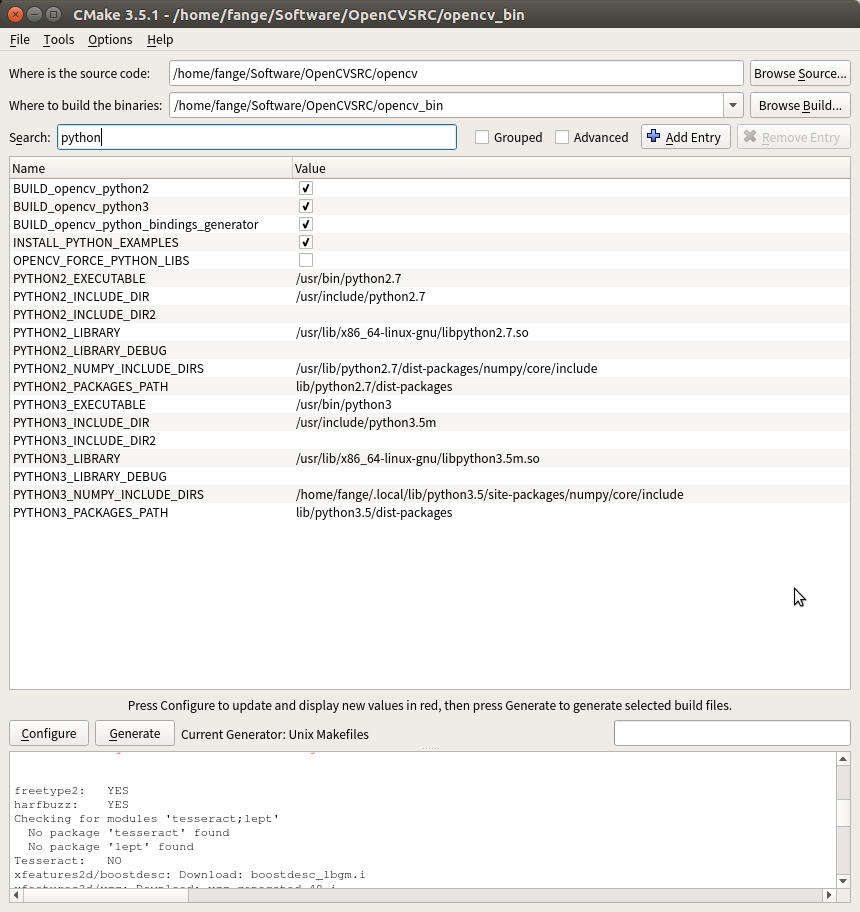
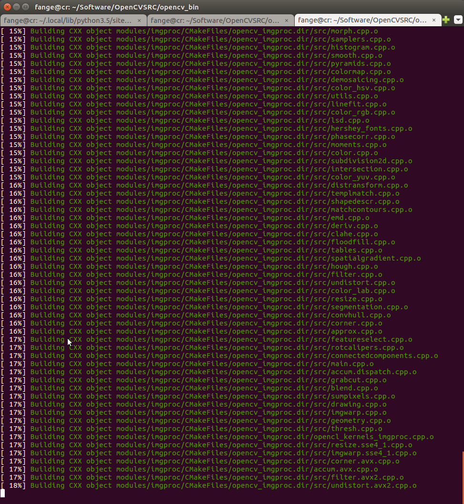
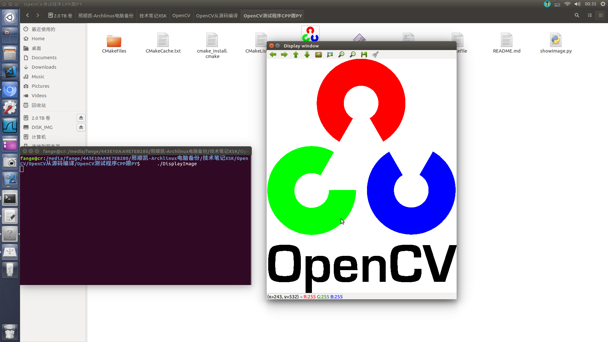

# 在Ubuntu下从源码编译OpenCV


## 下载源码


下载下面的两个包.

https://github.com/opencv/opencv

https://github.com/opencv/opencv_contrib

`opencv_contrib` 包里面放着一些`opencv` 中的非免费包, 不能用于商业.

有专利保护. 比如`xfeature2d` 就是在`opencv_contrib`中的.


```bash
$ git clone https://github.com/opencv/opencv.git
$ git clone https://github.com/opencv/opencv_contrib.git
```


## 安装依赖

阅读OpenCV 编译的官方文档

安装需要的第三方包.

https://docs.opencv.org/trunk/d7/d9f/tutorial_linux_install.html


```bash
[安装编译器] sudo apt-get install build-essential
[必须依赖] sudo apt-get install cmake git libgtk2.0-dev pkg-config libavcodec-dev libavformat-dev libswscale-dev
[可选依赖] sudo apt-get install python-dev python-numpy libtbb2 libtbb-dev libjpeg-dev libpng-dev libtiff-dev libjasper-dev libdc1394-22-dev
```

可选依赖，如果安装python-opencv还是需要的。


可能还有别的依赖, 后续, 如果不全的话会报错. 继续装就是了. 


**注意, 还有python3的numpy 也要装**

`安装Numpy`

分别给python2 跟python3 通过`pip/pip3` 安装`numpy`

`numpy`是`opencv` 必须要依赖的包.


**python3 安装numpy**

提前装好,免得后面麻烦.

```
sudo  apt-get install python3-numpy
```

或者使用`pip3`进行安装. 

```
sudo pip3 install numpy
```

**不过他们的安装路径不太一样**

可以通过如下的方式获取包的安装路径

```python
import numpy
numpy.__path__
```

如果是python2的话也类似

```bash
 sudo apt-get install python-numpy
```


**使用Anaconda的朋友, 可能需要自己在后续的CMakeGUI那自行配置一下python3的相关路径**

## CMakeGUI

这里是视频教程.

Youtube - TaiWan - how to build opencv on Ubuntu Linux
https://www.youtube.com/watch?v=NcZpA55ISzo


安装**cmake-gui**  也就是`cmake`的图形化界面, 配置起来更方便一些.

```
sudo apt-get install cmake-qt-gui
```

运行

> 以管理员身份

```
sudo cmake-gui
```


利用cmake 打开`opencv` 源码所在的文件夹.

`where is the source code`  -> opencv的路径

为产生的二进制文件,单独创建一个文件夹`opencv_bin`


配置`configure`

设定默认配置 Unix xxxx


然后就会加载出一系列需要选择的参数. 


**直接在搜索框中搜索你想要查询的参数.**





**`OPENCV_EXTRA_MOUDLES_PATH`**  这个参数是最重要, 需要填入第三方拓展包的路径

```
/home/fange/XXXX/opencv_contrib/modules
```

**注意 后面是子文件夹`modules`的路径哦!!!**

 

首先是,python2 跟python3的系列参数, 如果使用系统默认的python, 都会被自动检测到.

* PYTHON3_EXECUTABLE
* PYTHON3_INCLUDE_DIR
* PYTHON3_LIBRARY_DIR
* ......

接下来,是查看python2/python3的numpy路径是否正确. `PYTHON3_NUMPY_INCLUDE_DIRS`

查看路径的方式也比较简单: 

```python
import numpy
numpy.__path__
```


如果你还有其他需求可以自行配置.

例如跟OpenCV的`Tensorflow`扩展,`PyTorch` 拓展等等, 需要自己配置路径.

 

## Generate生成安装用的二进制文件

在CMAKEGUI中配置好了之后, 可以点击`Generate` 按钮, 如果你的环境不满足依赖, 需要根据提示, 安装对应的包. 

如果满足依赖, 则可以成功的编译出安装所需的二进制文件.


不出意外,这里可能会卡你一下, 因为下载确实慢

```
data: Download: face_landmark_model.dat
```

需要下载很多数据, 中间可能会断开, 没关系 **多试几次**.  

**生成日志如下**

```
Looking for ccache - not found
Found ZLIB: /usr/lib/x86_64-linux-gnu/libz.so (found suitable version "1.2.8", minimum required is "1.2.3") 
Found ZLIB: /usr/lib/x86_64-linux-gnu/libz.so (found version "1.2.8") 
Checking for module 'gtk+-3.0'
  No package 'gtk+-3.0' found
Checking for module 'gstreamer-base-1.0'
  No package 'gstreamer-base-1.0' found
Checking for module 'gstreamer-video-1.0'
  No package 'gstreamer-video-1.0' found
Checking for module 'gstreamer-app-1.0'
  No package 'gstreamer-app-1.0' found
Checking for module 'gstreamer-riff-1.0'
  No package 'gstreamer-riff-1.0' found
Checking for module 'gstreamer-pbutils-1.0'
  No package 'gstreamer-pbutils-1.0' found
Checking for module 'gstreamer-base-0.10'
  No package 'gstreamer-base-0.10' found
Checking for module 'gstreamer-video-0.10'
  No package 'gstreamer-video-0.10' found
Checking for module 'gstreamer-app-0.10'
  No package 'gstreamer-app-0.10' found
Checking for module 'gstreamer-riff-0.10'
  No package 'gstreamer-riff-0.10' found
Checking for module 'gstreamer-pbutils-0.10'
  No package 'gstreamer-pbutils-0.10' found
Looking for linux/videodev.h
Looking for linux/videodev.h - not found
Looking for linux/videodev2.h
Looking for linux/videodev2.h - found
Looking for sys/videoio.h
Looking for sys/videoio.h - not found
Checking for module 'libavresample'
  No package 'libavresample' found
Checking for module 'libgphoto2'
  No package 'libgphoto2' found
found Intel IPP (ICV version): 2017.0.3 [2017.0.3]
at: /home/fange/Software/OpenCVSRC/opencv_bin/3rdparty/ippicv/ippicv_lnx
found Intel IPP IW sources: 2017.0.3
at: /home/fange/Software/OpenCVSRC/opencv_bin/3rdparty/ippicv/ippiw_lnx
Could not find OpenBLAS lib. Turning OpenBLAS_FOUND off
Could NOT find Atlas (missing:  Atlas_CLAPACK_INCLUDE_DIR Atlas_CBLAS_LIBRARY Atlas_BLAS_LIBRARY) 
A library with BLAS API found.
A library with LAPACK API found.
Could NOT find JNI (missing:  JAVA_AWT_LIBRARY JAVA_JVM_LIBRARY JAVA_INCLUDE_PATH JAVA_INCLUDE_PATH2 JAVA_AWT_INCLUDE_PATH) 
Could NOT find Matlab (missing:  MATLAB_MEX_SCRIPT MATLAB_INCLUDE_DIRS MATLAB_ROOT_DIR MATLAB_LIBRARIES MATLAB_LIBRARY_DIRS MATLAB_MEXEXT MATLAB_ARCH MATLAB_BIN) 
The imported target "vtkRenderingPythonTkWidgets" references the file
   "/usr/lib/x86_64-linux-gnu/libvtkRenderingPythonTkWidgets.so"
but this file does not exist.  Possible reasons include:
* The file was deleted, renamed, or moved to another location.
* An install or uninstall procedure did not complete successfully.
* The installation package was faulty and contained
   "/usr/lib/cmake/vtk-6.2/VTKTargets.cmake"
but not all the files it references.

The imported target "vtk" references the file
   "/usr/bin/vtk"
but this file does not exist.  Possible reasons include:
* The file was deleted, renamed, or moved to another location.
* An install or uninstall procedure did not complete successfully.
* The installation package was faulty and contained
   "/usr/lib/cmake/vtk-6.2/VTKTargets.cmake"
but not all the files it references.

Found VTK 6.2.0 (/usr/lib/cmake/vtk-6.2/UseVTK.cmake)
Caffe:   NO
Protobuf:   NO
Glog:   NO
freetype2:   YES
harfbuzz:    YES
No preference for use of exported gflags CMake configuration set, and no hints for include/library directories provided. Defaulting to preferring an installed/exported gflags CMake configuration if available.
Failed to find installed gflags CMake configuration, searching for gflags build directories exported with CMake.
Failed to find gflags - Failed to find an installed/exported CMake configuration for gflags, will perform search for installed gflags components.
Failed to find gflags - Could not find gflags include directory, set GFLAGS_INCLUDE_DIR to directory containing gflags/gflags.h
Failed to find glog - Could not find glog include directory, set GLOG_INCLUDE_DIR to directory containing glog/logging.h
Module opencv_sfm disabled because the following dependencies are not found: Glog/Gflags
Module opencv_ovis disabled because OGRE3D was not found
data: Download: face_landmark_model.dat
CMake Warning at /home/fange/Software/OpenCVSRC/opencv/cmake/OpenCVDownload.cmake:190 (message):
  data: Download failed: 28;"Timeout was reached"

  For details please refer to the download log file:

  /home/fange/Software/OpenCVSRC/opencv_bin/CMakeDownloadLog.txt

Call Stack (most recent call first):
  /home/fange/Software/OpenCVSRC/opencv_contrib/modules/face/CMakeLists.txt:13 (ocv_download)


CMake Warning at /home/fange/Software/OpenCVSRC/opencv_contrib/modules/face/CMakeLists.txt:26 (message):
  Face: Can't get model file for face alignment.


freetype2:   YES
harfbuzz:    YES
Checking for modules 'tesseract;lept'
  No package 'tesseract' found
  No package 'lept' found
Tesseract:   NO
xfeatures2d/boostdesc: Download: boostdesc_lbgm.i
xfeatures2d/vgg: Download: vgg_generated_48.i
xfeatures2d/vgg: Download: vgg_generated_64.i
xfeatures2d/vgg: Download: vgg_generated_80.i
xfeatures2d/vgg: Download: vgg_generated_120.i

General configuration for OpenCV 4.0.0-pre =====================================
  Version control:               3.4.1-410-g84b3b5b

  Extra modules:
    Location (extra):            /home/fange/Software/OpenCVSRC/opencv_contrib/modules
    Version control (extra):     3.4.1-85-gfbc4d82

  Platform:
    Timestamp:                   2018-04-30T13:33:51Z
    Host:                        Linux 4.13.0-39-generic x86_64
    CMake:                       3.5.1
    CMake generator:             Unix Makefiles
    CMake build tool:            /usr/bin/make
    Configuration:               Release

  CPU/HW features:
    Baseline:                    SSE SSE2 SSE3
      requested:                 SSE3
    Dispatched code generation:  SSE4_1 SSE4_2 FP16 AVX AVX2 AVX512_SKX
      requested:                 SSE4_1 SSE4_2 AVX FP16 AVX2 AVX512_SKX
      SSE4_1 (3 files):          + SSSE3 SSE4_1
      SSE4_2 (1 files):          + SSSE3 SSE4_1 POPCNT SSE4_2
      FP16 (2 files):            + SSSE3 SSE4_1 POPCNT SSE4_2 FP16 AVX
      AVX (5 files):             + SSSE3 SSE4_1 POPCNT SSE4_2 AVX
      AVX2 (9 files):            + SSSE3 SSE4_1 POPCNT SSE4_2 FP16 FMA3 AVX AVX2
      AVX512_SKX (1 files):      + SSSE3 SSE4_1 POPCNT SSE4_2 FP16 FMA3 AVX AVX2 AVX_512F AVX512_SKX

  C/C++:
    Built as dynamic libs?:      YES
    C++ Compiler:                /usr/bin/c++  (ver 5.4.0)
    C++ flags (Release):         -fsigned-char -W -Wall -Werror=return-type -Werror=non-virtual-dtor -Werror=address -Werror=sequence-point -Wformat -Werror=format-security -Wmissing-declarations -Wundef -Winit-self -Wpointer-arith -Wshadow -Wsign-promo -Wuninitialized -Winit-self -Wsuggest-override -Wno-narrowing -Wno-delete-non-virtual-dtor -Wno-comment -fdiagnostics-show-option -Wno-long-long -pthread -fomit-frame-pointer -ffunction-sections -fdata-sections  -msse -msse2 -msse3 -fvisibility=hidden -fvisibility-inlines-hidden -O3 -DNDEBUG  -DNDEBUG
    C++ flags (Debug):           -fsigned-char -W -Wall -Werror=return-type -Werror=non-virtual-dtor -Werror=address -Werror=sequence-point -Wformat -Werror=format-security -Wmissing-declarations -Wundef -Winit-self -Wpointer-arith -Wshadow -Wsign-promo -Wuninitialized -Winit-self -Wsuggest-override -Wno-narrowing -Wno-delete-non-virtual-dtor -Wno-comment -fdiagnostics-show-option -Wno-long-long -pthread -fomit-frame-pointer -ffunction-sections -fdata-sections  -msse -msse2 -msse3 -fvisibility=hidden -fvisibility-inlines-hidden -g  -O0 -DDEBUG -D_DEBUG
    C Compiler:                  /usr/bin/cc
    C flags (Release):           -fsigned-char -W -Wall -Werror=return-type -Werror=non-virtual-dtor -Werror=address -Werror=sequence-point -Wformat -Werror=format-security -Wmissing-declarations -Wmissing-prototypes -Wstrict-prototypes -Wundef -Winit-self -Wpointer-arith -Wshadow -Wuninitialized -Winit-self -Wno-narrowing -Wno-comment -fdiagnostics-show-option -Wno-long-long -pthread -fomit-frame-pointer -ffunction-sections -fdata-sections  -msse -msse2 -msse3 -fvisibility=hidden -O3 -DNDEBUG  -DNDEBUG
    C flags (Debug):             -fsigned-char -W -Wall -Werror=return-type -Werror=non-virtual-dtor -Werror=address -Werror=sequence-point -Wformat -Werror=format-security -Wmissing-declarations -Wmissing-prototypes -Wstrict-prototypes -Wundef -Winit-self -Wpointer-arith -Wshadow -Wuninitialized -Winit-self -Wno-narrowing -Wno-comment -fdiagnostics-show-option -Wno-long-long -pthread -fomit-frame-pointer -ffunction-sections -fdata-sections  -msse -msse2 -msse3 -fvisibility=hidden -g  -O0 -DDEBUG -D_DEBUG
    Linker flags (Release):      
    Linker flags (Debug):        
    ccache:                      NO
    Precompiled headers:         YES
    Extra dependencies:          dl m pthread rt
    3rdparty dependencies:

  OpenCV modules:
    To be built:                 aruco bgsegm bioinspired calib3d ccalib core datasets dnn dnn_objdetect dpm face features2d flann freetype fuzzy hdf hfs highgui img_hash imgcodecs imgproc java_bindings_generator line_descriptor ml objdetect optflow phase_unwrapping photo plot python2 python3 python_bindings_generator reg rgbd saliency shape stereo stitching structured_light superres surface_matching text tracking ts video videoio videostab viz xfeatures2d ximgproc xobjdetect xphoto
    Disabled:                    js world
    Disabled by dependency:      -
    Unavailable:                 cnn_3dobj cudaarithm cudabgsegm cudacodec cudafeatures2d cudafilters cudaimgproc cudalegacy cudaobjdetect cudaoptflow cudastereo cudawarping cudev cvv java matlab ovis sfm
    Applications:                tests perf_tests apps
    Documentation:               NO
    Non-free algorithms:         NO

  GUI: 
    GTK+:                        YES (ver 2.24.30)
      GThread :                  YES (ver 2.48.2)
      GtkGlExt:                  NO
    VTK support:                 YES (ver 6.2.0)

  Media I/O: 
    ZLib:                        /usr/lib/x86_64-linux-gnu/libz.so (ver 1.2.8)
    JPEG:                        /usr/lib/x86_64-linux-gnu/libjpeg.so (ver )
    WEBP:                        /usr/lib/x86_64-linux-gnu/libwebp.so (ver encoder: 0x0202)
    PNG:                         /usr/lib/x86_64-linux-gnu/libpng.so (ver 1.2.54)
    TIFF:                        /usr/lib/x86_64-linux-gnu/libtiff.so (ver 42 / 4.0.6)
    JPEG 2000:                   /usr/lib/x86_64-linux-gnu/libjasper.so (ver 1.900.1)
    OpenEXR:                     build (ver 1.7.1)

  Video I/O:
    DC1394:                      YES (ver 2.2.4)
    FFMPEG:                      YES
      avcodec:                   YES (ver 56.60.100)
      avformat:                  YES (ver 56.40.101)
      avutil:                    YES (ver 54.31.100)
      swscale:                   YES (ver 3.1.101)
      avresample:                NO
    GStreamer:                   NO
    libv4l/libv4l2:              NO
    v4l/v4l2:                    linux/videodev2.h
    gPhoto2:                     NO

  Parallel framework:            pthreads

  Trace:                         YES (with Intel ITT)

  Other third-party libraries:
    Intel IPP:                   2017.0.3 [2017.0.3]
           at:                   /home/fange/Software/OpenCVSRC/opencv_bin/3rdparty/ippicv/ippicv_lnx
    Intel IPP IW:                sources (2017.0.3)
              at:                /home/fange/Software/OpenCVSRC/opencv_bin/3rdparty/ippicv/ippiw_lnx
    Lapack:                      NO
    Eigen:                       YES (ver 3.2.92)
    Custom HAL:                  NO
    Protobuf:                    build (3.5.1)

  OpenCL:                        YES (no extra features)
    Include path:                /home/fange/Software/OpenCVSRC/opencv/3rdparty/include/opencl/1.2
    Link libraries:              Dynamic load

  Python 2:
    Interpreter:                 /usr/bin/python2.7 (ver 2.7.12)
    Libraries:                   /usr/lib/x86_64-linux-gnu/libpython2.7.so (ver 2.7.12)
    numpy:                       /usr/lib/python2.7/dist-packages/numpy/core/include (ver 1.11.0)
    packages path:               lib/python2.7/dist-packages

  Python 3:
    Interpreter:                 /usr/bin/python3 (ver 3.5.2)
    Libraries:                   /usr/lib/x86_64-linux-gnu/libpython3.5m.so (ver 3.5.2)
    numpy:                       /home/fange/.local/lib/python3.5/site-packages/numpy/core/include (ver )
    packages path:               lib/python3.5/dist-packages

  Python (for build):            /usr/bin/python2.7

  Java:                          
    ant:                         NO
    JNI:                         NO
    Java wrappers:               NO
    Java tests:                  NO

  Matlab:                        NO

  Install to:                    /usr/local
-----------------------------------------------------------------

Configuring done
Generating done
```


通过这份文件, 我们可以清楚的知道, 那些包/功能, 是可以并将会安装的.

并告知你, opencv的安装路径是`/usr/local`


## 安装OpenCV


进入到生成的二进制文件夹内执行

```python
$ sudo make install
```


编译时间较长, **请耐心等待**. 




## 测试代码


代码与运行代码的方式,写在了文件夹 `OpenCV测试程序CPP跟PY`

`CPP` 需要编写对应的`CMakeList.txt`


比较简单的方式是

```bash
$ python
```

```python
>>> import cv2
>>> cv2.__version__
```


最后的展示效果


