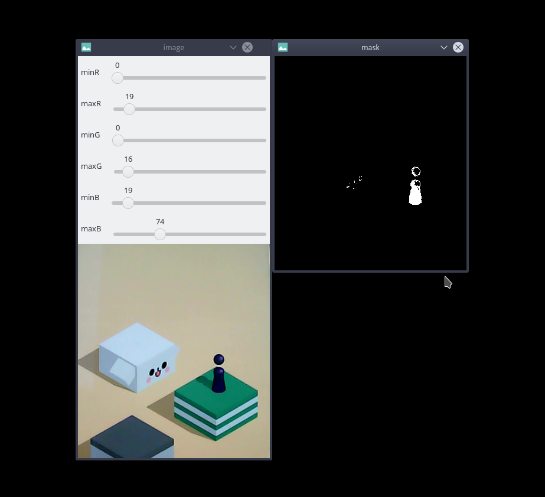

# 什么是HighGUI 

我们在测试算法，查看算法效果的时候， 需要用到可视化。 动态调整阈值， 实时看到反馈的时候， 也需要用到图像化的界面去编辑， 所以这里我们就需要用到opencv中的`HighGUI`

`HighGUI` 是opencv中的图形化（GUI）组件， 我们可以通过`HighGUI` 开发一些简易的上位机。

**OpenCV的`HighGUI`  都提供了哪些接口呢？**

主要提供以下几种功能

* 创建多个窗口（Windows）， 在窗口中显示图像
* 创建按钮，滑块等简单交互组件， 并获取其取值
* 监听鼠标事件语言按键事件

凡哥在跳一跳图像处理的程序中， 调节阈值，计算棋子的颜色范围， 使用的就是opencv自带的`HighGUI`做的一个上位机。 在接下来的系列教程中，凡哥会教大家用`opencv` 的`HighGUI` 组件，做出自己的上位机。

# TODO
HighGUI是怎么来的(QT),为什么做图像处理的库里面要嵌入上位机开发工具?
我们为什么要用HighGUI,可以使用HighGUI做些什么?
GUI功能主要是方便人机交互
* 样本标注
...

Matplotlib显示图片与HighGUI最大的不同在于:
    Matplotlib是静态的 HighGUI是动态的,可以进行交互
HighGUI有那些局限性
