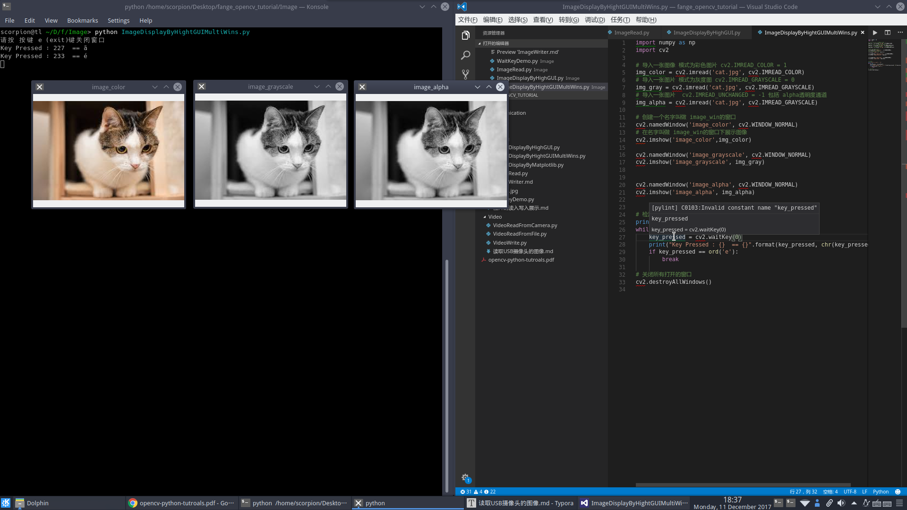

# 综合实验-窗口显示图像
## 综合实验1 - 单个窗口展示图像

这里我们设计一个综合实验， 组合这节我们所学到的知识。

```python
import numpy as np
import cv2

# 导入一张图像 模式为彩色图片
img = cv2.imread('cat.jpg', cv2.IMREAD_COLOR)

# 展示图像
cv2.imshow('image',img)
# 等待按键摁下 最多5s钟
# 如果超时key_pressed 就会等于-1
key_pressed = cv2.waitKey(5000)
print("有按键摁下或者已超时")
# 使用chr() 
print("Key Pressed : {}  == {}".format(key_pressed, chr(key_pressed)))

# 关闭所有窗口
cv2.destroyAllWindows()
# 或者是这样， 销毁创建的单个窗口
# cv2.destroyWindow('image')
```

**展示效果**


## 综合实验2 -  同时展示多个窗口


我们读入小猫的图片, 将其分别转换为`IMREAD_COLOR ` 与 `IMREAD_UNCHANGED`

这里稍稍讲解一下`IMREAD_UNCHANGED` , 我们普通的图片BGR格式, 每个像素点的取值是从0-255, 用8bit的位去存储像素点的值.  而市面上大多数SLR 相机, 可以支持更高的颜色分辨率(颜色深度 , depth) , 可以使用16-bit来存储单个通道像素点的值(PNG图片或者TIFF图片)


同时将三者通过窗口展示.

**源代码** `CH1.3_ImageDisplayByHightGUIMultiWins.py`

```python
import numpy as np
import cv2

# 导入一张图像 模式为彩色图片 cv2.IMREAD_COLOR = 1
img_color = cv2.imread('cat.jpg', cv2.IMREAD_COLOR)
# 导入一张图片 模式为灰度图 cv2.IMREAD_GRAYSCALE = 0
img_gray = cv2.imread('cat.jpg', cv2.IMREAD_GRAYSCALE)
# 导入一张图片  cv2.IMREAD_UNCHANGED = -1 包括 alpha透明度通道 
img_alpha = cv2.imread('cat.jpg', cv2.IMREAD_UNCHANGED)

# 创建一个名字叫做 image_color 的窗口 窗口可拉伸
cv2.namedWindow('image_color', cv2.WINDOW_NORMAL)
# 在名字叫做 image_color 的窗口下展示图像 
cv2.imshow('image_color',img_color)

cv2.namedWindow('image_grayscale', cv2.WINDOW_NORMAL)
cv2.imshow('image_grayscale', img_gray)


cv2.namedWindow('image_alpha', cv2.WINDOW_NORMAL)
cv2.imshow('image_alpha', img_alpha)


# 检测按下的按钮
print("请按 按键 e (exit)键关闭窗口")
while True:
    key_pressed = cv2.waitKey(100)
    if key_pressed >= 0:
        # 打印一下按键记录
        print("Key Pressed : {}  == {}".format(key_pressed, chr(key_pressed)))
    # 匹配为e后 跳出 while循环
    if key_pressed == ord('e'):
        break

# 关闭所有打开的窗口
cv2.destroyAllWindows()


'''
输出

请按 按键 e (exit)键关闭窗口
Key Pressed : 101  == e
'''
```


**展示效果**




