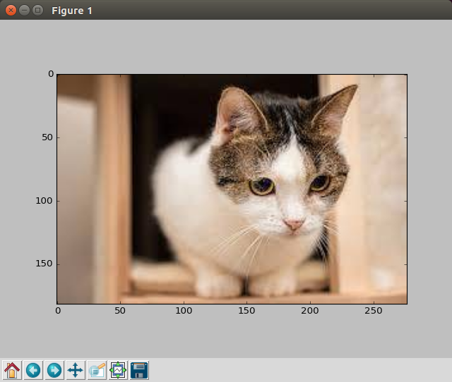

# 使用Matplotlib显示图片


在`akai_cv_utils.py`工具包中，阿凯声明了一个函数`display_image`，传入image对象，代码会自动判断图像是灰度图还是BGR彩图， 然后通过matplotlib显示图像。 


```python
# -*- coding: utf-8 -*- 
import cv2
from akai_cv_utils import display_image

if __name__ == "__main__":
    # 读入图片 默认是BGR格式
    image = cv2.imread("demo_img.png")
    # 读入图片 灰度图 
    # image = cv2.imread("demo_img.png", cv2.IMREAD_GRAYSCALE)
    display_image(image)
```

