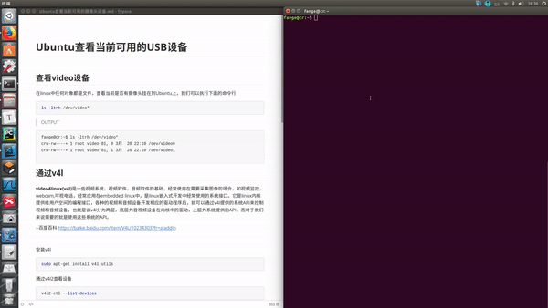
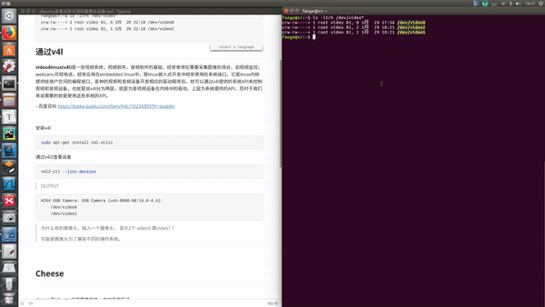
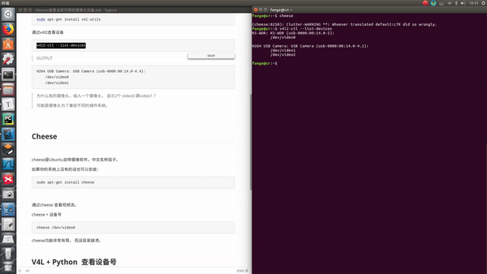

# 【OpenCV与USB摄像头】1. Ubuntu下查看USB摄像头设备列表与视频读取


## 0. 概述

我们想要从USB摄像头获取图片，然后在opencv中进行处理。

在用opencv编写获取USB摄像头图片的代码之前，我们最好先在Ubuntu下查看一下USB摄像头的列表与对应的编号。另外我们可以通过`v4l`查看摄像头所支持的视频压缩格式. 最后我们通过Ubuntu内置的`Cheese`软件读取实时的视频流数据。

如果你使用的不是Ubuntu系统，可以跳过此教程。


## 1. 查看video设备




在linux中任何对象都是文件，查看当前是否有摄像头挂载到Ubuntu上，我们可以执行下面的命令行

```bash
ls -ltrh /dev/video*
```

> OUTPUT
```
fange@cr:~$ ls -ltrh /dev/video*
crw-rw----+ 1 root video 81, 0 3月  28 22:10 /dev/video0
crw-rw----+ 1 root video 81, 1 3月  28 22:10 /dev/video1
```


## 2. 通过video4linux查看设备




**video4linux(v4l)**是一些视频系统，视频软件，音频软件的基础，经常使用在需要采集图像的场合，如视频监控，webcam,可视电话，经常应用在embedded linux中，是linux嵌入式开发中经常使用的系统接口。它是linux内核提供给用户空间的编程接口，各种的视频和音频设备开发相应的驱动程序后，就可以通过v4l提供的系统API来控制视频和音频设备，也就是说v4l分为两层，底层为音视频设备在内核中的驱动，上层为系统提供的API，而对于我们来说需要的就是使用这些系统的API。

--百度百科 https://baike.baidu.com/item/V4L/10234303?fr=aladdin


安装v4l
```bash
sudo apt-get install v4l-utils
```

通过v4l2查看设备
```bash
v4l2-ctl --list-devices
```


>OUTPUT
```
KS-WDR: KS-WDR (usb-0000:00:14.0-1):
	/dev/video0
```


查看当前摄像头支持的视频压缩格式

```
v4l2-ctl -d /dev/video0 --list-formats
```

> OUTPUT

```python
ioctl: VIDIOC_ENUM_FMT
	Index       : 0
	Type        : Video Capture
	Pixel Format: 'MJPG' (compressed)
	Name        : Motion-JPEG

	Index       : 1
	Type        : Video Capture
	Pixel Format: 'YUYV'
	Name        : YUYV 4:2:2

```

可以看到摄像头，支持两种格式


## 3. V4L + Python  查看设备号

在python里面我们可以借助`v4l-utils` 跟python

```python
#-*- coding: UTF-8 -*-
'''
根据设备名称获取相机设备号

使用前需要先安装v4l-utils

Installing v4l-utils (debian) gives one the handy v4l2-ctl command:
$ v4l2-ctl --list-devices

KS-WDR: KS-WDR (usb-0000:00:14.0-2):
	/dev/video0

H264 USB Camera: USB Camera (usb-0000:00:14.0-4.1):
	/dev/video1
	/dev/video2

所以我们可以根据设备名称去检索摄像头对应的序号
'''
from subprocess import PIPE,Popen

def find_cam(cam):
    cmd = ["/usr/bin/v4l2-ctl", "--list-devices"]
    out, err = Popen(cmd, stdout=PIPE, stderr=PIPE).communicate()
    out = out.strip()
    # 降byte类型转换为string
    # out = str(out)
    for dev_name, dev_idx in [i.split(b"\n\t") for i in out.split(b"\n\n")]:
        if cam in dev_name:
            return dev_idx.decode('utf8')
    return None
    
if __name__ == "__main__":
    # 这里修改设备名称
    cam= b"KS-WDR"
    # 寻找设备编号
    dev_idx = find_cam(cam)
    if dev_idx is None:
        print("设备没有找到")
    else:
        print("设备编号： {}".format(dev_idx))
```


## 4. 通过cheese 查看视频流 




cheese是Ubuntu自带摄像软件，中文名称茄子。

如果你的系统上没有的话也可以安装：

```
sudo apt-get install cheese
```


通过cheese 查看视频流。

cheese + 设备号

```
cheese /dev/video0
```

cheese功能非常有限， 而且容易崩溃。


