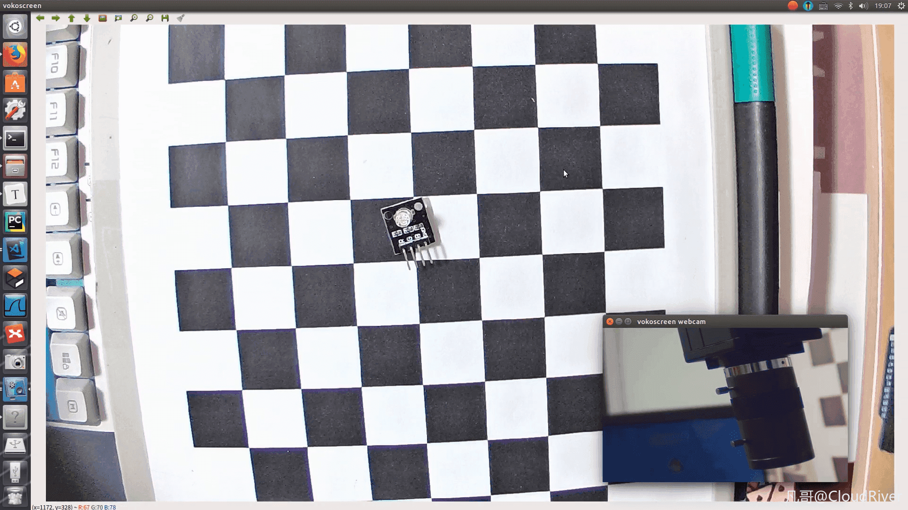
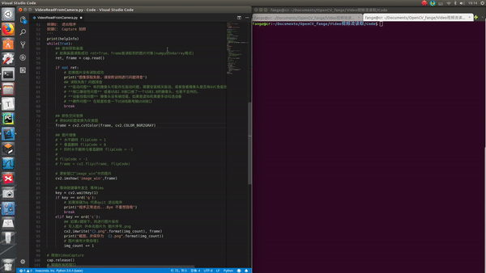
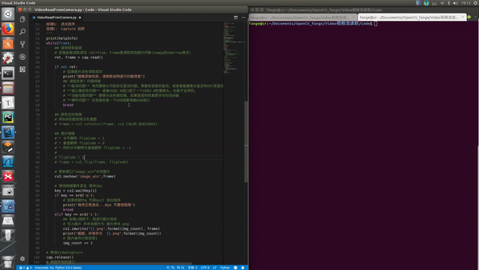

# 【OpenCV与USB摄像头】2. OpenCV读入USB摄像头拍摄的画面


## 0. 概述

本文演示了使用opencv从USB摄像头读取视频流，并通过HighGUI实时显示画面。

opencv读取usb摄像头的视频流， 需要用到`VideoCapture` 类, 此文章提供了VideoCapture的基础操作。如果你在操作过程中，摄像头读取失败， 阿凯还为你提供了**问题排查手册**。 




## 1.完整源代码与演示效果


```python
#-*- coding: UTF-8 -*-
'''
代码功能描述
    从摄像头逐帧(frame-by-frame)读入图片并通过HighGUI展示
作者
    阿凯@1Z实验室
教程网站
    www.1zlab.com(网站备案中)
相关课程
    * 通过HIGH GUI展示图片
    http://www.1zlab.com(网站备案中)/p/opencv-highgui-imshow
    * 图像基础变换(仿射变换)
'''

import numpy as np # 引入numpy 用于矩阵运算
import cv2 # 引入opencv库函数

## VideCapture里面的序号
# 0 : 默认为笔记本上的摄像头(如果有的话) / USB摄像头 webcam
# 1 : USB摄像头2
# 2 ：USB摄像头3 以此类推
# -1：代表最新插入的USB设备 

# 创建一个video capture的实例
cap = cv2.VideoCapture(0)

# 查看Video Capture是否已经打开
print("摄像头是否已经打开 ？ {}".format(cap.isOpened()))

## 设置画面的尺寸
# 画面宽度设定为 1920
cap.set(cv2.CAP_PROP_FRAME_WIDTH, 1920)
# 画面高度度设定为 1080
cap.set(cv2.CAP_PROP_FRAME_HEIGHT, 1080)

## 创建一个名字叫做 “image_win” 的窗口
# 窗口属性 flags
#   * WINDOW_NORMAL：窗口可以放缩
#   * WINDOW_KEEPRATIO：窗口缩放的过程中保持比率
#   * WINDOW_GUI_EXPANDED： 使用新版本功能增强的GUI窗口
cv2.namedWindow('image_win',flags=cv2.WINDOW_NORMAL | cv2.WINDOW_KEEPRATIO | cv2.WINDOW_GUI_EXPANDED)

# 图像计数 从1开始
img_count = 1

# 帮助信息
helpInfo = '''
=======阿凯贴心小助手=======
提示-按键前需要选中当前画面显示的窗口

按键Q： 退出程序
按键C： Capture 拍照
'''
print(helpInfo)
while(True):
    ## 逐帧获取画面
    # 如果画面读取成功 ret=True，frame是读取到的图片对象(numpy的ndarray格式)
    ret, frame = cap.read()
    
    if not ret:
        # 如果图片没有读取成功
        print("图像获取失败，请按照说明进行问题排查")
        ## 读取失败？问题排查
        # **驱动问题** 有的摄像头可能存在驱动问题，需要安装相关驱动，或者查看摄像头是否有UVC免驱协议
        # **接口兼容性问题** 或者USB2.0接口接了一个USB3.0的摄像头，也是不支持的。
        # **设备挂载问题** 摄像头没有被挂载，如果是虚拟机需要手动勾选设备
        # **硬件问题** 在就是检查一下USB线跟电脑USB接口
        break
    
    ## 颜色空间变换
    # 将BGR彩图变换为灰度图
    # frame = cv2.cvtColor(frame, cv2.COLOR_BGR2GRAY)

    ## 图片镜像
    # * 水平翻转 flipCode = 1
    # * 垂直翻转 flipCode = 0
    # * 同时水平翻转与垂直翻转 flipCode = -1
    # 
    # flipCode = -1
    # frame = cv2.flip(frame, flipCode)
    
    # 更新窗口“image_win”中的图片
    cv2.imshow('image_win',frame)
    
    # 等待按键事件发生 等待1ms
    key = cv2.waitKey(1)
    if key == ord('q'):
        # 如果按键为q 代表quit 退出程序
        print("程序正常退出...Bye 不要想我哦")
        break
    elif key == ord('c'):
        ## 如果c键按下，则进行图片保存
        # 写入图片 并命名图片为 图片序号.png
        cv2.imwrite("{}.png".format(img_count), frame)
        print("截图，并保存为  {}.png".format(img_count))
        # 图片编号计数自增1
        img_count += 1

# 释放VideoCapture
cap.release()
# 销毁所有的窗口
cv2.destroyAllWindows()

```


## 2. VideoCapture的实例化与释放

opencv读取usb摄像头的视频流， 需要用到`VideoCapture` 类。

创建`VideoCapture` 对象的时候，我们需要传入一个合适的摄像头编号。 

编号参照上一篇文章：**Ubuntu下查看USB摄像头设备列表与视频读取**

```python
## VideCapture里面的序号
# 0 : 默认为笔记本上的摄像头(如果有的话) / USB摄像头 webcam
# 1 : USB摄像头2
# 2 ：USB摄像头3 以此类推
# -1：代表最新插入的USB设备 

# 创建一个video capture的实例
cap = cv2.VideoCapture(0)
```


在代码最后，需要释放`VideoCapture`

```python
# 释放VideoCapture
cap.release()
```


## 3. VideoCapture属性简单设置

`VideoCapture`一共有18个属性可以查看或者修改。 一部分是读取视频流的, 另一部分是读取视频的。

这里我们只用到了两个基本的设定， 设定获取图像分辨率。 

阿凯查看手中的200万宽动态摄像头]的参数，查到摄像头支持的最高分辨率是1920*1080， 所以我们设定参数的时候设成最大值，也就是最清晰的模式。


```python
## 设置画面的尺寸
# 画面宽度设定为 1920
cap.set(cv2.CAP_PROP_FRAME_WIDTH, 1920)
# 画面高度度设定为 1080
cap.set(cv2.CAP_PROP_FRAME_HEIGHT, 1080)
```

分辨率的设定会影响帧率，分辨率越大，帧率也就越低， 所以需要在两者之间进行权衡。


## 4. 读入图片read

```python
## 逐帧获取画面
# 如果画面读取成功 ret=True，frame是读取到的图片对象(numpy的ndarray格式)
ret, frame = cap.read()
```


根据ret我们可以知道图片有没有被正确读入。

如果失败，我们可以选择跳过(也有可能是图片传输有损)，或者直接退出程序。

```python
if not ret:
    # 如果图片没有读取成功
    print("图像获取失败，请按照说明进行问题排查")
    break
```


## 5.摄像头读取失败-问题排查

如果你运行上文的源代码的时候，出现报错。

你可以按照下面提供的思路自行检查一下。

1. **驱动问题** 有的摄像头可能存在驱动问题，需要安装相关驱动，或者查看摄像头是否具有**UAC免驱协议**.
2. **USB接口兼容性问题** 或者USB2.0接口接了一个USB3.0的摄像头，也是不支持的。
3. **设备挂载问题** 摄像头没有被挂载，如果是虚拟机需要手动勾选设备
4. **硬件问题** 在就是检查一下USB线跟电脑USB接口
5. **视频压缩格式的问题** 部分视频压缩格式在OpenCV中不支持。

如果还是没有解决，可以在文章下方给我留言, **问题排查手册**会根据学员的反馈持续更新。


## 6.HighGUI窗口与键盘事件

HighGUI的部分，均可以在**阿凯带你玩转OpenCV的基础课程**中学习。

[CH1.3-通过HighGUI展示图片](http://www.1zlab.com(网站备案中)/p/opencv-highgui-imshow)

[CH1.4-图片保存imwrite](http://www.1zlab.com(网站备案中)/p/opencv-image-copy-and-compress)

具体包括：

* 窗口创建命名与属性设置
* 窗口图片更新
* 键盘事件响应与事件监听
* 图片保存
* 窗口销毁


## 7.灰度图




图片数据的基础格式（BGR）与属性，可以在[CH1.1-读入图片并显示图片的相关属性](http://www.1zlab.com(网站备案中)/p/opencv-imread-propoerty) 中查阅。

图片颜色空间变换，例如转换为灰度图(Grayscale), 需要借助 `cvtColor` 函数， 可以在[CH1.2-通过Matplotlib展示图片](http://www.1zlab.com(网站备案中)/p/opencv-matplotlib-image-show) 中学习。

转换代码如下

```python
## 颜色空间变换
# 将BGR彩图变换为灰度图
frame = cv2.cvtColor(frame, cv2.COLOR_BGR2GRAY)
```


## 8.图片镜像翻转




由于镜头的空间摆放方向的不同，可能需要对摄像头拍摄的画面进行镜像操作。

镜像**flip** 属于基本的2D仿射变换中的一种。

```python
## 图片镜像
# * 水平翻转 flipCode = 1
# * 垂直翻转 flipCode = 0
# * 同时水平翻转与垂直翻转 flipCode = -1
# 
flipCode = -1
frame = cv2.flip(frame, flipCode)
```

如果像要了解更多的2D仿射变换可以学习阿凯带你玩转OpenCV中的**CH5.3_图像基础变换**.


