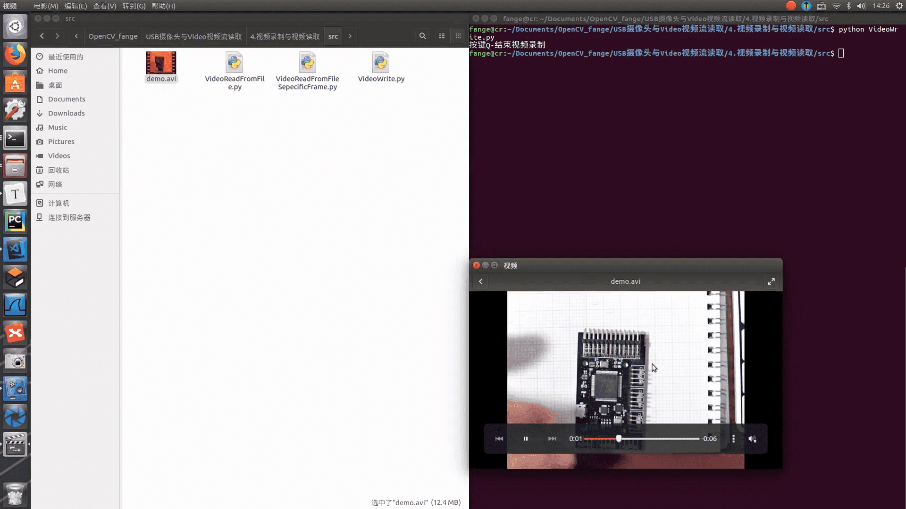
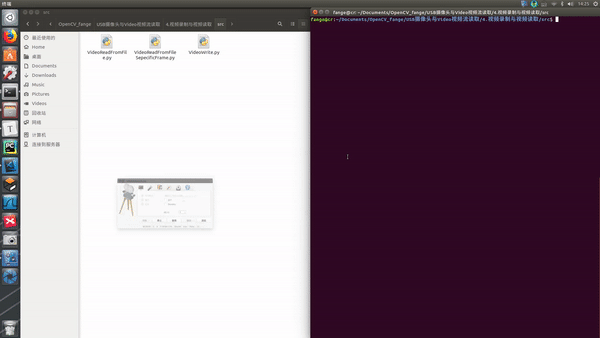
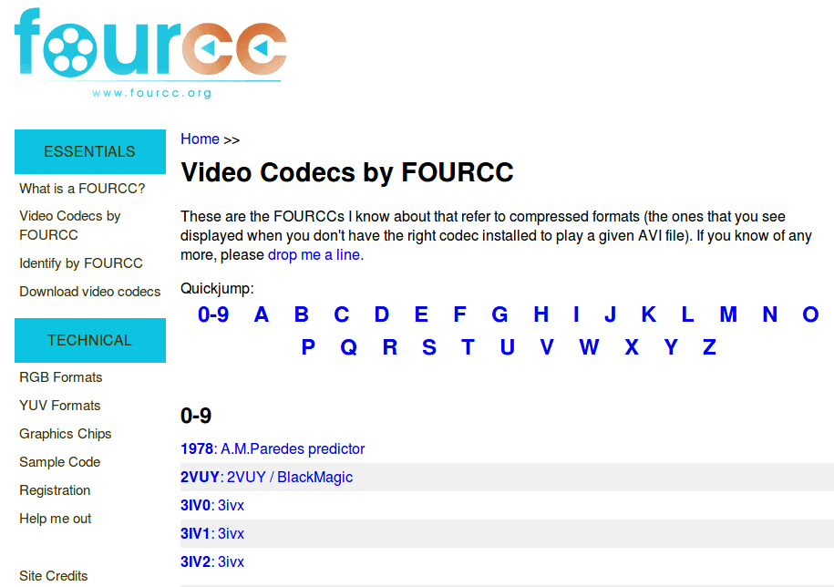
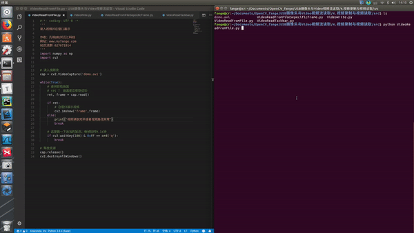

# 【OpenCV与USB摄像头】4. 视频录制与视频读取




## 0. 概要

本期阿凯讲解了使用opencv录制视频与视频读取的相关操作。主要涉及opencv的`VideoWrite`对象的讲解。

注意OpenCV只支持avi的格式，而且生成的视频文件不能大于2GB，而且不能添加音频。


## 1. 视频录制Write


### 1.1 效果演示效果

完整代码，请查看下文**【源码】视频录制**, 复制到本地，并命名为`VideoWrite.py`




后续内容是对此代码的详细讲解， 可跳过。


### 1.2 VideoWriter

**录制视频的第一步要实例化一个`VideoCapture`对象。** 用于从USB摄像头读入图片。

```python
# 创建一个VideoCapture对象
cap = cv2.VideoCapture(0)
```


**opencv中视频录制需要借助`VideoWriter`对象， 将从`VideoCapture` 中读入图片，不断地写入到`VideoWrite`的数据流中。** 

```python
# 指定视频编解码方式为MJPG
codec = cv2.VideoWriter_fourcc(*'MJPG')
fps = 20.0 # 指定写入帧率为20
frameSize = (640, 480) # 指定窗口大小
# 创建 VideoWriter对象
out = cv2.VideoWriter('video_record.avi', codec, fps, frameSize)
```


### 1.3 视频录制的插件依赖

opencv的视频录制依赖第三方插件，在不同的操作系统使用的视频录制插件如下

| 操作系统    | 视频录制插件      |
| ------- | ----------- |
| Linux   | FFMPEG      |
| Windows | FFMPEG ,VFW |
| MacOSX  | QTKit       |

这些都在opencv中封装好了，所以我们不需要去了解底层的内容。


### 1.4 视频编解码格式

在写入视频的时候， 我们必须指定**视频的编解码格式**,这里我们指定为`MJPG`格式。

```python
codec = cv2.VideoWriter_fourcc(*'MJPG')
```

**关于FourCC**

FourCC全称Four-Character Codes，代表四字符代码 (four character code),  它是一个32位的标示符，其实就是`typedef unsigned int FOURCC;`, 是一种独立标示视频数据流格式的四字符代码。

FourCC支持的所有视频编解码的格式都可以在[FourCC官网](http://www.fourcc.org/codecs.php)上查阅。




同时，我们还需要指定视频的帧率跟窗口大小。

```python
fps = 20.0 # 指定写入帧率为20
frameSize = (640, 480) # 指定窗口大小
```

初始化`VideoWriter`的时候，将这些参数传入到其中。并指定输出视频文件的名称**video_record.avi**

```python
# 创建 VideoWriter对象
out = cv2.VideoWriter('video_record.avi', codec, fps, frameSize)
```


### 1.5 追加帧

接下来，就是要不断的从`VideoCapture` 中读入图片，然后写入到`VideoWrite`的数据流中。

```python
# 不断的向视频输出流写入帧图像
out.write(frame)
```


### 1.6 资源释放

在录制结束后，我们要释放资源：

```python
# 释放资源
cap.release()
out.release()
```


### 1.7【源码】视频录制

`VideoWrite.py`

```python
#-*- coding: UTF-8 -*-
'''
功能描述：视频录制演示代码

作者：阿凯@1Z实验室
网站：www.1zlab.com(网站备案中)
QQ交流群 218214240
'''
import numpy as np
import cv2

# 创建一个VideoCapture对象
cap = cv2.VideoCapture(0)

# 指定视频编解码方式为MJPG
codec = cv2.VideoWriter_fourcc(*'MJPG')
fps = 20.0 # 指定写入帧率为20
frameSize = (640, 480) # 指定窗口大小
# 创建 VideoWriter对象
out = cv2.VideoWriter('video_record.avi', codec, fps, frameSize)

print("按键Q-结束视频录制")
while(cap.isOpened()):
    
    ret, frame = cap.read()
    # 如果帧获取正常
    if ret==True:
        # 镜像反转 flip
        # frame = cv2.flip(frame, -1)
        
        # 不断的向视频输出流写入帧图像
        out.write(frame)
        # 在窗口中展示画面
        cv2.imshow('frame',frame)
        if cv2.waitKey(1) == ord('q'):
            break
    else:
        break

# 释放资源
cap.release()
out.release()
cv2.destroyAllWindows()
```


## 2. 视频读取 Read

读入视频的时候，我们仍然需要使用`VideoCapture` 对象，只不过传入的不再是USB摄像头的ID了，需要改成视频文件的路径。

```python
# 读入视频流
cap = cv2.VideoCapture('demo.avi')
```


### 2.1 读取视频


#### 2.1.1 效果演示



#### 2.1.2 【源码】视频读取

`VideoReadFromFile.py`

```python
#-*- coding: UTF-8 -*-
'''
读入视频并在窗口展示

作者：阿凯@1Z实验室
网站：www.1zlab.com(网站备案中)
QQ交流群 218214240
'''
import numpy as np
import cv2


# 读入视频流
cap = cv2.VideoCapture('demo.avi')

while(True):
    # 逐帧获取画面
    # ret ？ 画面是否获取成功
    ret, frame = cap.read()
    
    if ret:
        # 在窗口展示视频
        cv2.imshow('frame',frame)
    else:
        print("视频读取完毕或者视频路径异常")
        break

    # 这里做一下适当的延迟，每帧延时0.1s钟
    if cv2.waitKey(100) & 0xFF == ord('q'):
        break

# 释放资源
cap.release()
cv2.destroyAllWindows()
```


### 2.2 读取特定帧


#### 2.2.1 效果演示


#### 2.2.2【源码】读取视频的特定帧

`VideoReadFromFileSepecificFrame.py`

```python
#-*- coding: UTF-8 -*-
'''
获取特定帧数的照片

作者：阿凯@1Z实验室
网站：www.1zlab.com(网站备案中)
QQ交流群 218214240
'''

import numpy as np
import cv2

# 读取视频流
cap = cv2.VideoCapture('demo.avi')
# 获取视频所有的帧数
amount_of_frames = cap.get(cv2.CAP_PROP_FRAME_COUNT)
# 设置当前帧的位置 amount_of_frames-1 代表最后一帧
cap.set(cv2.CAP_PROP_POS_FRAMES, amount_of_frames-1)

ret, img = cap.read()

if ret:
    cv2.imwrite('last_frame.png', img)

```